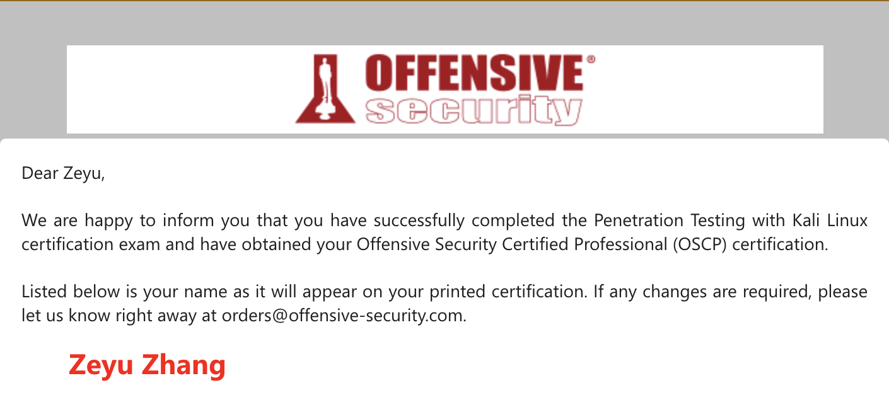
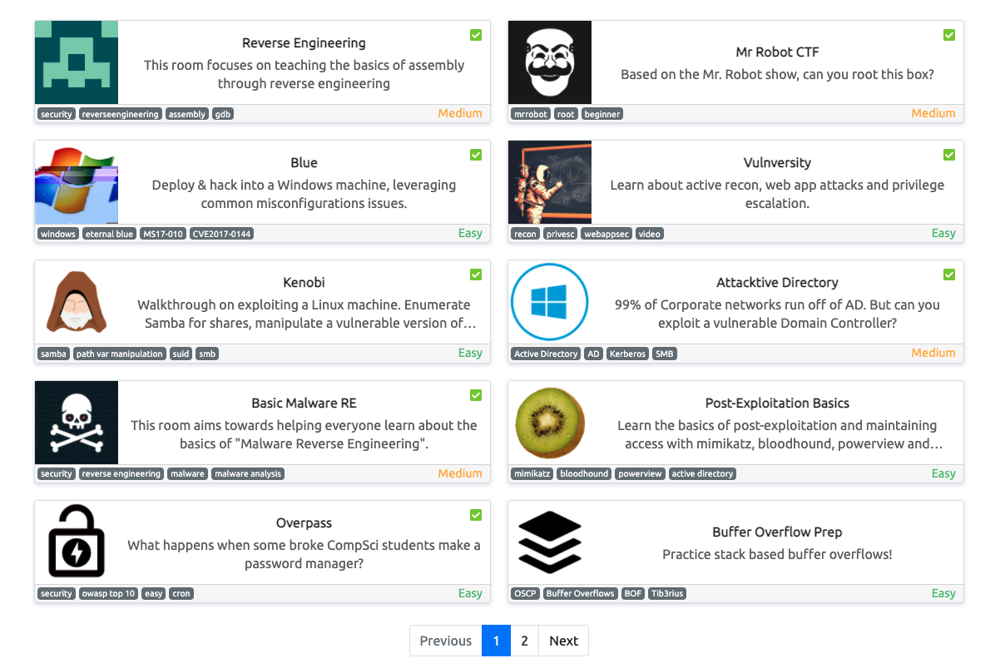
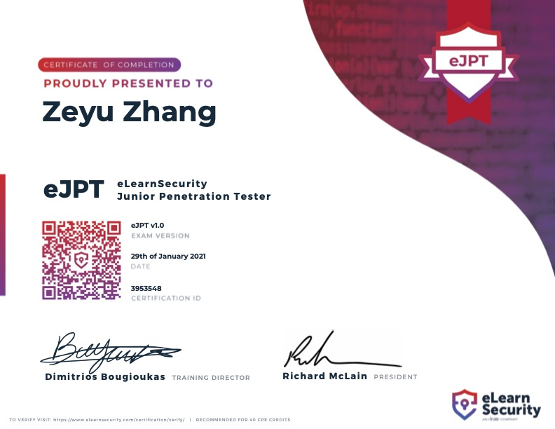
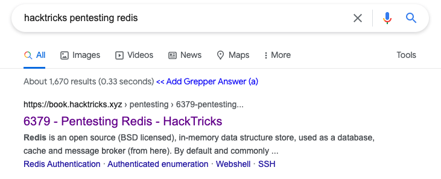
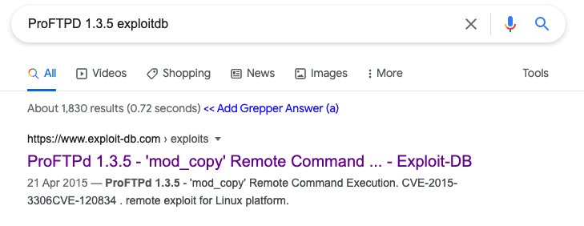
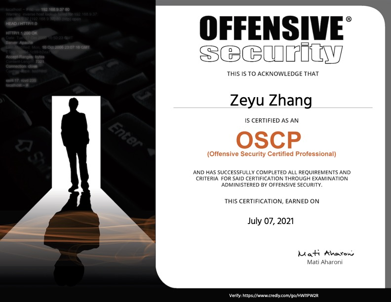
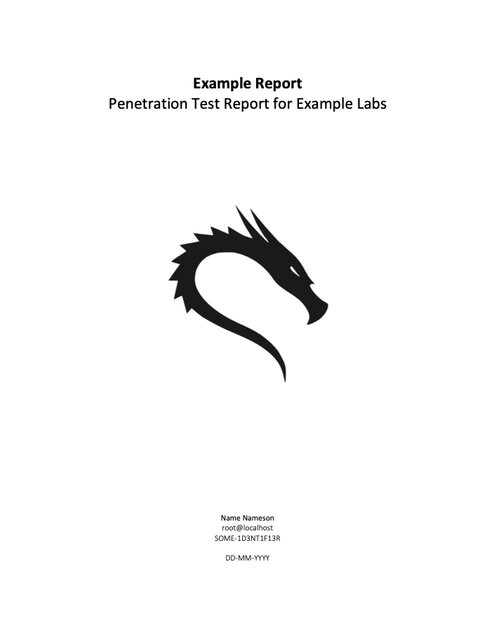
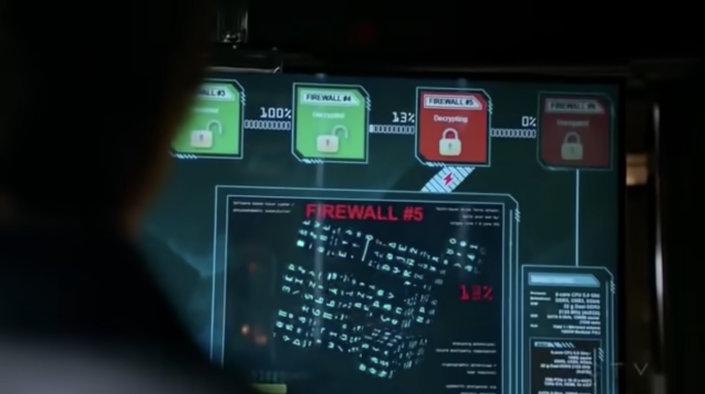

# My OSCP Journey: How I Tried Harder

## Background

Last week, I sat for and passed the Offensive Security Certified Professional \(OSCP\) exam from Offensive Security. I managed to root 4 out of 5 of the boxes, and achieve 90 out of 100 possible points \(70 were required to pass\).

As a newcomer in the field of penetration testing, this was a major milestone for me. This post outlines my experience with the [Penetration Testing with Kali Linux \(PWK\)](https://www.offensive-security.com/pwk-oscp/) course and the OSCP exam, as well as some advice I wish I had been given before embarking on this journey.

## Pre-PWK

I'm a high school graduate and an incoming Computer Science undergraduate.

While I had prior experience in programming and Computer Science, my first encounter with red teaming came in January, when I decided to try out [TryHackMe](https://tryhackme.com/) for the first time. It was also around that time when I first started playing CTFs, a hobby that has since grown into a pretty competitive sport for me. 

### Recommendation: TryHackMe

If you're like me and just starting out in this field, I highly recommend TryHackMe. You could do the free rooms to get a feel for the kind of things you would be doing in the PWK course.



Here are the rooms I did:

Start with the easy rooms like Vulnversity \(which will take you through the basics of pentesting methodology\), then as you get more comfortable, try to take on rooms like Mr. Robot CTF and perform a full "pentest". You can always watch the walkthroughs if you get stuck - don't worry about referring to hints and reading walkthroughs at this early stage in your learning. What's important here is not really the technical skills, but rather getting a feel for the _methodology_ and _process_ of performing a penetration test.

### Recommendation: eLearnSecurity PTS / eJPT

After doing a few TryHackMe rooms, I got really interested in red teaming \(although at the time, it still seemed rather alien to me\). I wanted to learn more, but didn't necessarily want to jump straight into OSCP just yet. I came across the eJPT certification, which was the certification for eLearnSecurity's Penetration Testing Student \(PTS\) course. 

**The course is free**, but you can get certified for $200 if you want.



The course teaches you all the basics:

* Computer networking
* Performing simple `nmap` scans
* Simple web exploitation using Burp Suite
* Using Metasploit for exploiting known vulnerabilities

Most importantly, it makes sure you fully understand the penetration testing **methodology**. It is **not** __a technically demanding certification at all - in fact, there are no restrictions on auto-exploiters like Metasploit and SQLMap, which the OSCP exam forbids.

I passed the certification on the 29th of January, a few weeks after I started the course.

### Misc

Before starting the course in February, I started participating in CTF competitions. At first, it was daunting. I remember my first CTF competition back in December 2020, where I was barely able to solve any challenges, save a few OSINT ones.

Even after passing the eJPT, I was equally clueless - CTF challenges are much more technically demanding, and don't necessarily require a penetration testing workflow. However, the skills you learn from them can be quite useful when exploiting similar vulnerabilities in the future.

The key thing with CTFs is to never give up. It definitely feels demoralizing not being able to solve any challenges, but the process of googling vulnerabilities and exploiting them is exactly what you would need going into something like OSCP. As I participated in more and more CTF competitions, I eventually got better at them and drew connections between new challenges and past challenges I've solved. 

I'm quite proud of my team, Social Engineering Experts, which came from \(mostly\) 0 and went on to win prizes for a local CTF and come quite close to winning some international CTFs as well.

## PWK Course

In mid-February, I decided to sign up for the PWK course.

### Lab Exercises / Lab Report

You can get 5 bonus points for the OSCP exam if you complete **all** course exercises accurately and submit a lab report documenting the course exercises and 10 lab machines.

Personally, I do **not** think this is worth the effort. For the first few weeks, I tried to work through the course material and aimed to complete all the course exercises. **It was simply too time-consuming** and that time could have been used more productively pwning lab machines. Eventually, I gave up on it.

To a certain degree, the 5 bonus points do help. You could run through the outcomes - there are plenty in which you end up with 65 points. In fact, on my passing attempt, I was initially at 65 points and stuck on the 25 point machine that would eventually secure my points to pass. If you are stuck on 65 points, the 5 bonus points could be the difference between passing and failing the exam.

Yet, such a comparison would be unfair - the time spent on the course exercises, if spent wisely on practising the lab machines, would have more than likely yielded a better performance during the exam.‌

### Buffer Overflow

If you don't have a solid foundation in assembly, you might find this section difficult. Yet, it is **absolutely necessary** to master, given that the OSCP exam consists of a 25 point buffer overflow machine. This is a giveaway machine because it is extremely predictable, and you should aim to root this machine within 1-2 hours.

While the course material on buffer overflow should be relatively entry-level, and I think that Offsec did a great job explaining it, I have seen some users say that this section of the course was the hardest for them. In this case, I recommend the TryHackMe Reverse Engineering rooms to help you nail down the basics of assembly, and this room by [Tib3rius](https://tryhackme.com/p/Tib3rius) to practice for the actual buffer overflow challenge:



The room is geared towards preparing for the OSCP buffer overflow challenges, and I personally practised it the day before my exam attempts to ensure that I could do it within an hour.

### PWK Labs

#### The Good

There are no walkthroughs. This is great for cultivating the Try Harder mindset, and I think I learnt a lot by trying different things and seeing for myself what worked and what didn't.

#### The Bad

Personally, I felt that the PWK labs can be a bit outdated. There are machines with old exploits that you likely won't find on the OSCP exam.

Additionally, many of the machines are 'chained', i.e. you need to solve one machine before you can solve another. It is not made clear what is the intended sequence these machines are meant to be solved in, and I found myself at one point spending hours on a lab machine only to realise that it is part of an exploitation chain and I was supposed to solve another machine first.

#### The Verdict

Hey, you paid for them, so you might as well use them. Start with the 11 machines in the [Learning Path](https://help.offensive-security.com/hc/en-us/articles/360050473812-PWK-Labs-Learning-Path) to nail down your methodology. Then, move on to other, more unguided machines and look for help in the forum if you get stuck.

‌I did around 15 lab machines before my first attempt. When I took my first attempt, I felt like I was biting off more than I could chew. Being on my own and without the forums to guide me, the exam was much more difficult than anticipated. In comparison to the old exploits in the PWK labs, the vulnerabilities in the exam were also quite different. I ended up with only 35 points on my first attempt.

### Recommendation: Proving Grounds

[Offensive Security Proving Grounds](https://www.offensive-security.com/labs/) is a platform for virtual pentesting labs, **made by Offsec**. As a result, the machines there are quite similar to what you might expect in the OSCP exam.



#### The Good

The machines, especially those made by Offsec, are extremely realistic and are "OSCP-like". They are also grouped into 10, 20, and 25 point machines, just like the OSCP. 

There are walkthroughs for each machine, but these are limited to 1 per day. You'll mostly be using hints, of which you are entitled to 3 per day.  Using these hints and walkthroughs decreases the points you can get from a machine, and while these points have no real meaning, the gamified system does to some degree cultivate the Try Harder mindset.

I personally like the way the hints are given. Compared to the PWK labs where you are mostly left on your own, the hints nudge you in the right direction while allowing you sufficient room to learn and figure things out on your own. I found myself becoming less reliant on them as I went along, and eventually I was able to solve community-rated Intermediate and Hard machines independently.

#### The Bad

The connection can sometimes be a bit unstable, and the platform is still new. However, it is evident that Offsec is doing its best to improve the platform.

Some machines are user-submitted, while the rest are made by Offsec. Some of the user-submitted machines _can_ be a bit too "CTF-y", and less "OSCP-like".

#### The Verdict

This was one of my best purchases, hands down. It was only $20 a month, and I subscribed for 2 months. During this time I did ~30 boxes, and I'm highly certain that this is what contributed to me being able to pass the exam the second time around.

### Other Resources

Some helpful resources that I found myself regularly referring to:

* [PayloadsAllTheThings Reverse Shell Cheatsheet](https://github.com/swisskyrepo/PayloadsAllTheThings/blob/master/Methodology%20and%20Resources/Reverse%20Shell%20Cheatsheet.md): Use a payload from here when you discover an RCE vulnerability.
* [HackTricks](https://book.hacktricks.xyz): When you are dealing with unfamiliar protocols, HackTricks probably has a checklist for you.

* [ExploitDB](https://www.exploit-db.com/): Pretty much all the CVEs you come across during the PWK labs will have an exploit on here.

* [GTFOBins](https://gtfobins.github.io/): When performing Linux privilege escalation, you will likely find yourself referring to this for SUID and Sudo misconfiguration exploits.
* [LinPEAS and WinPEAS](https://github.com/carlospolop/privilege-escalation-awesome-scripts-suite): Great for privilege escalation enumeration, but don't forget your basics!
* [Transferring Files from Linux to Windows](https://blog.ropnop.com/transferring-files-from-kali-to-windows/): Make sure you know this.
* [Upgrading Netcat Shell with Python](https://zsecure.uk/guides/upgrade-nc-shell-with-python-3/): Make sure you know this.

## The Exam

### First Attempt

My first attempt at the exam, on the 28th of April, was not great - I only managed to get 35 out of the 70 required points to pass. It was definitely demoralizing, but this attempt made me realise several gaps in my methodology, particularly my enumeration strategy.

For the next two months, I worked on Proving Grounds boxes, while continuing to juggle my other commitments, including my CTF team \(during this time, we did quite a few CTFs, including Pwn2Win, a DEFCON qualifier\).

### Second Attempt

This time, I made sure it was different.

* I stopped over-relying on automatic enumeration scripts, and instead made sure I understood what I was enumerating.
* I took note of all the times I got stuck. After referring to hints and figuring out the correct techniques, I added the technique to a "Troubleshooting Checklist" I made for myself. I'm not sharing this here because I'm not a huge fan of following other people's checklists. This checklist worked for me precisely because it was filling in _my_ gaps in knowledge**.**
* I improved my note-taking strategy. I used [Joplin](https://joplinapp.org/) to easily take notes in Markdown, and structured my notes so that I covered every service running on the machine - no gaps this time.
* The day before the exam, I reviewed the notes I took on each of my practice machines. I took note of how I enumerated and found the initial foothold, and how I found the privilege escalation vector.

My second attempt was on 6th July - this time, I managed to root all but one of the boxes and achieved 90 points.

Less than 24 hours after I submitted my exam report, I received confirmation that I have passed the exam. I'm officially an OSCP.

## Misc Tips

### Reporting

Don't underestimate this. You've spent 24 hours pwning the boxes - make sure you write a good report to secure your certification! After writing a high-quality report with neat formatting, you will feel personally satisfied as well. This is the culmination of all your hard work!

I used [whoisflynn's template](https://github.com/noraj/OSCP-Exam-Report-Template-Markdown/blob/master/src/OSCP-exam-report-template_whoisflynn_v3.2.md), but modified it slightly for my style of reporting. For the styling, I used [chvancooten's template](https://github.com/chvancooten/OSCP-MarkdownReportingTemplates) to generate neat-looking reports from the Markdown document.

When working on the machines, screenshot every major milestone. **Make sure that someone else can easily replicate the attack by following your screenshots**. If it's clear and easily replicable, I bet that Offsec would have a much easier time grading your report too. If you miss out details in your report, Offsec may have to ask you for additional information etc., which can slow down the grading process or even result in a fail.

### During the Exam

**Remember to take breaks.** I cannot stress this enough. I found that taking breaks and walking out of my room often cleared up my mind and helped me to make better progress when I returned. If you've been stuck for 1 to 2 hours, I'd advise you to go for a walk and come back refreshed.

**Get sufficient rest.** I factored in 4 hours of sleep during the exam. I slept for 4 hours, then woke up early in the morning to complete the exam. Those 4 hours of sleep helped a lot. At that point, I was at 65 points and stuck with the initial foothold for the 25 point machine. It was midnight and I was tired from racking my brains all day. I probably spent 3-4 hours on that machine with no progress. When I woke up the next morning, I realised I've missed something rather trivial - I got the full 25 points less than an hour later.

**Be wary of rabbit holes.** Just because you find an exploit for it doesn't mean it's exploitable. Make sure you understand which conditions make the service exploitable. Have a mental checklist of what to do when encountering common services like FTP - if you've run through the entire checklist and nothing's there, then nothing's there. Stop yourself when you find yourself running the same commands over and over again expecting to find something new.

## Post-Exam

I'm glad that this chapter of my life has finally come to a satisfying conclusion. 

Perhaps the best thing I've gained from this is that hacking no longer feels like a mystery to me. It is certainly not what it looks like on TV:

To be honest, I don't feel much different now that I have the certification. The course has taught me a lot, and I've seen my skills improve in not just the OSCP exam, but also in CTFs and understanding the mindset of an attacker in general. If I had failed again, at the very least I would know that I've improved a lot since my last attempt.

More importantly, I'm finally finding myself less busy, with one less commitment off my table. I will probably take a good break, focus on other equally important things in my life \(such as family and friends\) for a bit, and then come back again for either the OSWE or OSED next year.

That's all for now. All the best if you're taking, or planning to take the OSCP!

